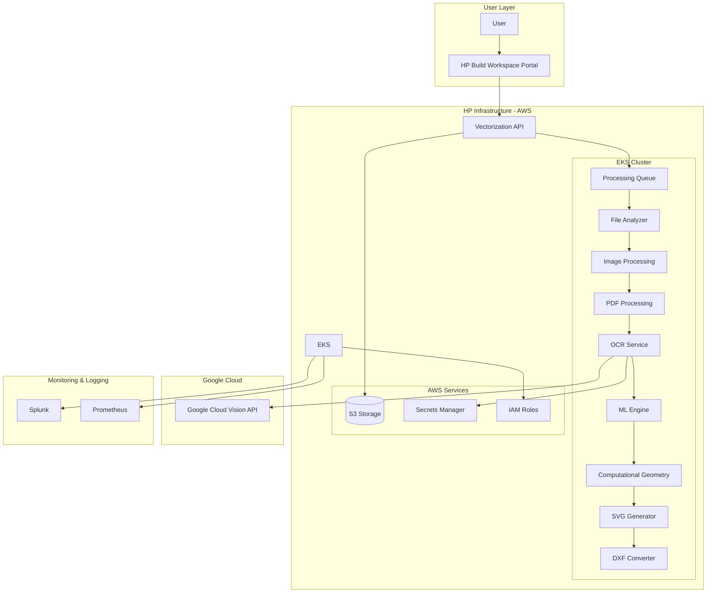
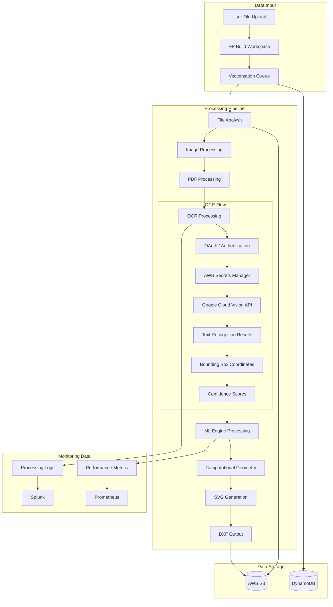

# Smart Digitization OCR with Google Cloud Vision API Cyber Readiness Preparation

**Architect Oversight**: Naroa Gonzalez

**JIRA Link**: [ARCH-2172](https://hp-jira.external.hp.com/browse/ARCH-2172)

**ARCH OnePager**: [ARCH-2172](https://pages.github.azc.ext.hp.com/SW-R-D-Architecture/architecture/ARCH-2172/one-pager/)

**ARCH Design**: [ARCH-2172](https://pages.github.azc.ext.hp.com/SW-R-D-Architecture/architecture/ARCH-2172/design/)

**ARCH DSR**: [ARCH-2172](https://pages.github.azc.ext.hp.com/SW-R-D-Architecture/architecture/ARCH-2172/data-science-review/)

## Executive Summary

The Smart Digitization OCR solution integrates Google Cloud Vision API to extract text from AEC (Architecture, Engineering, Construction) documents as part of HP's AI Vectorize pipeline. This integration enables the conversion of raster and PDF-based technical documents into editable CAD drawings, supporting 30+ languages and handling complex document layouts including rotated and handwritten text. The solution is deployed on AWS EKS infrastructure and processes approximately 1.3K files per month, with projected growth to 61K files by Q4 2026.

## System Overview

The Smart Digitization OCR system consists of the following major components:

- **HP Build Workspace Portal**: Web-based interface for users to submit vectorization requests
- **AI Vectorize Pipeline**: Core processing engine deployed on AWS EKS with GPU support
- **Google Cloud Vision API**: Third-party OCR service for text extraction
- **File Processing Components**: Image processing, PDF processing, and file analysis modules
- **ML Engine**: Deep learning models for geometric element detection and vectorization
- **Storage Layer**: AWS S3 buckets for file storage and processing

**Technology Stack**:
- **Cloud Platform**: AWS (EKS, S3, IAM, Secrets Manager)
- **Container Orchestration**: Kubernetes on AWS EKS
- **Programming Language**: Python
- **External API**: Google Cloud Vision API (OAuth2 authentication)
- **Monitoring**: Splunk, Prometheus
- **Security**: AWS IAM roles, encryption at rest and in transit

**Deployment Environment**: AWS cloud infrastructure with EKS cluster supporting auto-scaling based on processing demand.

## Scope

### In Scope
- Integration of Google Cloud Vision API within AI Vectorize pipeline
- Text extraction from AEC documents (floorplans, mechanical drawings, elevation plans)
- Support for 30+ languages including Latin, Cyrillic, Arabic, and East Asian scripts
- OAuth2 authentication with Google Cloud services
- Secure credential management via AWS Secrets Manager
- Processing of rotated and handwritten text
- Full paragraph and sentence recognition
- Mixed-language content support
- Quality evaluation and monitoring integration
- Compliance with HP cybersecurity and privacy standards

### Out of Scope
- Custom OCR model training or fine-tuning
- Alternative OCR service implementations
- Direct user identity management (handled by HP Build Workspace)
- Training data collection from processed files
- Real-time processing requirements beyond current pipeline capabilities

## C4 Architecture Diagram

## Data Flow Diagram (DFD)

## Network Interfaces

- **HP Build Workspace Portal**: Port 443 (HTTPS) - User interface access
- **Vectorization API**: Port 443 (HTTPS) - Internal API communication
- **Google Cloud Vision API**: Port 443 (HTTPS) - External OCR service calls
- **AWS EKS Cluster**: Internal cluster networking with service mesh
- **AWS S3**: Port 443 (HTTPS) - File storage access
- **AWS Secrets Manager**: Port 443 (HTTPS) - Credential retrieval
- **Splunk**: Port 443 (HTTPS) - Log aggregation
- **Prometheus**: Internal metrics collection ports

## Security Configurations

- **Authentication**: OAuth2 integration with Google Cloud Vision API using service account credentials
- **Credential Management**: AWS Secrets Manager for secure storage of Google Cloud service account keys
- **Access Control**: AWS IAM roles with least privilege principle for EKS cluster access
- **Network Security**: VPC isolation with security groups restricting traffic to necessary ports only
- **Container Security**: Trivy, Veracode, and SonarQube scanning for vulnerability detection
- **API Security**: Rate limiting and input validation for all external API calls
- **Code Quality**: 80%+ unit test coverage, linting with Ruff, Black, and Mypy
- **Compliance**: SOLID design principles adherence and security review completion

## Data Protection

- **Encryption at Rest**: AES-256 encryption for all data stored in AWS S3 buckets
- **Encryption in Transit**: TLS 1.3 enforced for all communications including Google Cloud Vision API calls
- **Data Anonymization**: Customer files are anonymized before any training or evaluation use
- **Volatile Processing**: Google Cloud Vision API processes files in volatile memory with immediate deletion post-processing
- **Data Retention**: No long-term storage of processed content; files deleted after vectorization completion
- **Privacy Compliance**: GDPR and CCPA compliance through HP Build Workspace terms and conditions
- **Key Management**: Enterprise PKI for certificate management with 90-day rotation cycle

## Authentication and Authorization

- **User Authentication**: SSO via HP Build Workspace portal using HP OneUID/SAML 2.0
- **Service Authentication**: OAuth2 service account authentication for Google Cloud Vision API access
- **Role-Based Access Control (RBAC)**: AWS IAM roles enforced at infrastructure and application layers
- **API Authorization**: Service-to-service authentication using AWS IAM roles and policies
- **Credential Rotation**: Automated rotation of Google Cloud service account keys stored in AWS Secrets Manager
- **Audit Logging**: All authentication and authorization events logged to Splunk for compliance monitoring
- **Principle of Least Privilege**: Minimal required permissions granted to each service component