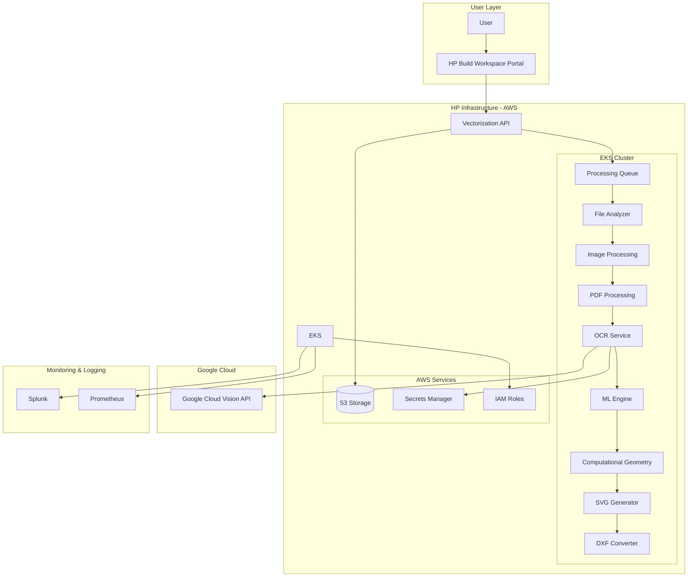
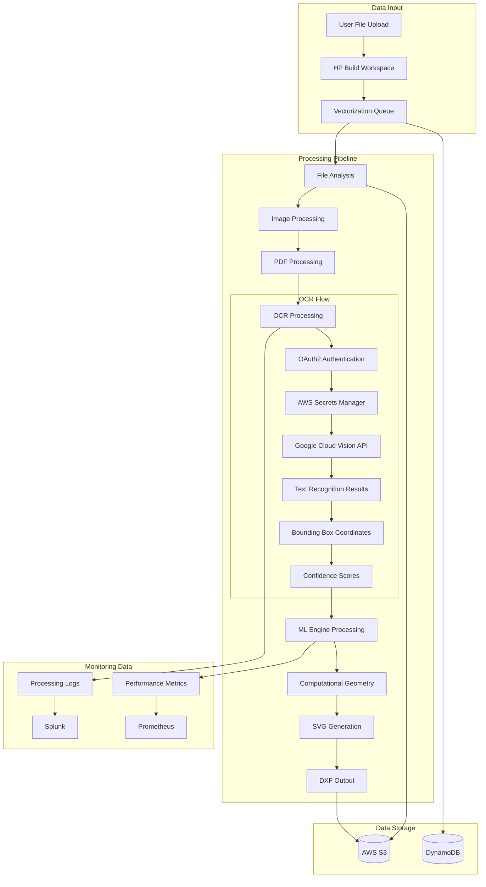
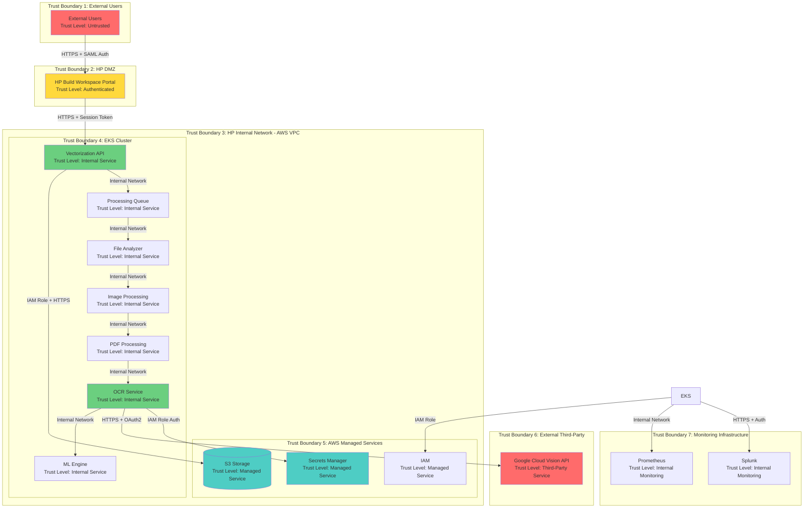
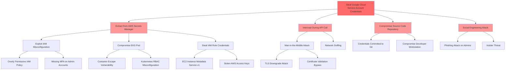

# Smart Digitization OCR with Google Cloud Vision API - Cyber Readiness Preparation

**Architect Oversight**: Naroa Gonzalez  
**JIRA Link**: [ARCH-2172](https://hp-jira.external.hp.com/browse/ARCH-2172)  
**Document Classification**: HP Internal - Confidential  
**Version**: 2.0  
**Last Updated**: 2024  

## Executive Summary

The Smart Digitization OCR solution integrates Google Cloud Vision API to extract text from AEC (Architecture, Engineering, Construction) documents as part of HP's AI Vectorize pipeline. This integration enables the conversion of raster and PDF-based technical documents into editable CAD drawings, supporting 30+ languages and handling complex document layouts including rotated and handwritten text. The solution is deployed on AWS EKS infrastructure and processes approximately 1.3K files per month, with projected growth to 61K files by Q4 2026.

This cybersecurity architecture document provides comprehensive threat modeling, security requirements, and compliance mappings based on STRIDE methodology, ensuring enterprise-grade security controls across all system components. The analysis identified 27 distinct security threats with corresponding mitigation strategies aligned to NIST SP 800-53, OWASP frameworks, and MITRE ATT&CK techniques.

## System Overview

The Smart Digitization OCR system consists of the following major components:

- **HP Build Workspace Portal**: Web-based interface for users to submit vectorization requests
- **AI Vectorize Pipeline**: Core processing engine deployed on AWS EKS with GPU support
- **Google Cloud Vision API**: Third-party OCR service for text extraction
- **File Processing Components**: Image processing, PDF processing, and file analysis modules
- **ML Engine**: Deep learning models for geometric element detection and vectorization
- **Storage Layer**: AWS S3 buckets for file storage and processing

**Technology Stack**:
- **Cloud Platform**: AWS (EKS, S3, IAM, Secrets Manager)
- **Container Orchestration**: Kubernetes on AWS EKS
- **Programming Language**: Python
- **External API**: Google Cloud Vision API (OAuth2 authentication)
- **Monitoring**: Splunk, Prometheus
- **Security**: AWS IAM roles, encryption at rest and in transit

## Scope

### In Scope
- Integration of Google Cloud Vision API within AI Vectorize pipeline
- Text extraction from AEC documents (floorplans, mechanical drawings, elevation plans)
- Support for 30+ languages including Latin, Cyrillic, Arabic, and East Asian scripts
- OAuth2 authentication with Google Cloud services
- Secure credential management via AWS Secrets Manager
- Processing of rotated and handwritten text
- Full paragraph and sentence recognition
- Mixed-language content support
- Quality evaluation and monitoring integration
- Compliance with HP cybersecurity and privacy standards

### Out of Scope
- Custom OCR model training or fine-tuning
- Alternative OCR service implementations
- Direct user identity management (handled by HP Build Workspace)
- Training data collection from processed files
- Real-time processing requirements beyond current pipeline capabilities

## Architecture (C4 - Mermaid)

## Data Flow Diagram (Mermaid)

## Trust Boundaries (Mermaid)

## Threat Model (STRIDE Table)

| Component/Data Flow | Threat ID | STRIDE Category | Threat Description | Risk Level | Security Requirement |
|---------------------|-----------|-----------------|-------------------|------------|---------------------|
| HP Build Workspace Portal → Vectorization API | T-001 | Spoofing | Attacker impersonates legitimate user to submit malicious files | High | Implement strong multi-factor authentication for all user access |
| HP Build Workspace Portal → Vectorization API | T-002 | Tampering | Man-in-the-middle attack modifying file upload requests | High | Enforce encrypted communications with certificate validation |
| Vectorization API → Processing Queue | T-003 | Repudiation | User denies submitting malicious or inappropriate content | Medium | Implement comprehensive audit logging with non-repudiation controls |
| Processing Queue → File Analyzer | T-004 | Information Disclosure | Sensitive document content exposed through insecure queue messages | High | Encrypt all data in transit and at rest within processing pipeline |
| OCR Service → AWS Secrets Manager | T-005 | Spoofing | Unauthorized service attempts to retrieve Google Cloud credentials | Critical | Enforce service identity verification and least privilege access |
| OCR Service → Google Cloud Vision API | T-006 | Tampering | API request/response intercepted and modified in transit | High | Ensure integrity and authenticity of API communications |
| OCR Service → Google Cloud Vision API | T-007 | Information Disclosure | Sensitive document content exposed during API transmission | Critical | Protect data confidentiality during third-party API calls |
| Google Cloud Vision API | T-008 | Denial of Service | API rate limits exceeded causing service disruption | Medium | Implement rate limiting and request throttling controls |
| AWS Secrets Manager | T-009 | Elevation of Privilege | Compromised IAM role gains access to service account credentials | Critical | Implement least privilege access and credential rotation |
| S3 Storage | T-010 | Information Disclosure | Unauthorized access to processed files and customer documents | High | Implement defense-in-depth access controls for object storage |
| S3 Storage | T-011 | Tampering | Malicious modification of stored files or processing results | High | Ensure integrity and immutability of stored data |
| EKS Cluster | T-012 | Elevation of Privilege | Container escape leading to node compromise | High | Harden container runtime and implement defense-in-depth |
| EKS Cluster → External Services | T-013 | Spoofing | Rogue service impersonates legitimate cluster component | High | Implement mutual authentication for service-to-service communication |
| ML Engine Processing | T-014 | Tampering | Malicious input designed to poison ML model or extract training data | Medium | Implement input validation and ML security controls |
| Splunk Logging | T-015 | Repudiation | Logs tampered with to hide malicious activity | High | Ensure log integrity and immutability |
| Prometheus Metrics | T-016 | Information Disclosure | Sensitive operational data exposed through metrics endpoints | Medium | Secure monitoring endpoints and sanitize metrics |
| User File Upload | T-017 | Denial of Service | Large file uploads or malicious files causing resource exhaustion | Medium | Implement file validation and resource limits |
| OAuth2 Authentication Flow | T-018 | Spoofing | Stolen or leaked service account credentials used for unauthorized API access | Critical | Implement secure credential management and monitoring |
| PDF Processing Component | T-019 | Tampering | Malicious PDF exploiting parser vulnerabilities | High | Implement secure file processing with sandboxing |
| Image Processing Component | T-020 | Denial of Service | Image bombs or malicious images causing memory exhaustion | Medium | Implement image validation and resource controls |
| DXF Output Generation | T-021 | Tampering | Malicious code injection into generated DXF files | Medium | Ensure output integrity and prevent injection attacks |
| Cross-Region Data Transfer | T-022 | Information Disclosure | Data intercepted during S3 cross-region replication | Medium | Encrypt data during replication and transit |
| API Rate Limiting | T-023 | Denial of Service | Distributed attack bypassing rate limiting controls | Medium | Implement multi-layer rate limiting and DDoS protection |
| Kubernetes API Server | T-024 | Elevation of Privilege | Unauthorized access to cluster management functions | Critical | Secure Kubernetes control plane access |
| Container Registry | T-025 | Tampering | Malicious container images deployed to production | High | Implement container image security and supply chain controls |
| Service-to-Service Communication | T-026 | Spoofing | Internal service impersonation within EKS cluster | High | Implement zero-trust networking within cluster |
| All Components | T-027 | Information Disclosure | Sensitive data exposure through application logs or error messages | Medium | Implement secure logging practices and data sanitization |

## Attack Trees (Mermaid)

### Attack Tree 1: Compromise Google Cloud Vision API Credentials

### Attack Tree 2: Exfiltrate Sensitive Document Data

```mermaid
graph TD
    ROOT[Exfiltrate Customer<br/>Document Data]
    
    ROOT --> A1[Access S3 Buckets Directly]
    ROOT --> A2[Intercept API Communication]
    ROOT --> A3[Compromise Processing Pipeline]
    ROOT --> A4[Exploit Logging/Monitoring]
    
    A1 --> B1[Exploit S3 Bucket Misconfiguration]
    A1 --> B2[Steal AWS Credentials]
    A1 --> B3[Exploit S3 Access Logging Gap]
    
    B1 --> C1[Public Bucket Access]
    B1 --> C2[Overly Permissive Bucket Policy]
    
    B2 --> C3[Phishing Attack]
    B2 --> C4[Credential Stuffing]
    
    A2 --> D1[Man-in-the-Middle on User Upload]
    A2 --> D2[Intercept Google Cloud Vision API Call]
    
    D1 --> E1[Compromise TLS Certificate]
    D1 --> E2[DNS Hijacking]
    
    D2 --> E3[Network Tap in AWS VPC]
    D2 --> E4[Compromise VPC Flow Logs]
    
    A3 --> F1[Inject Malicious Container]
    A3 --> F2[Exploit Processing Component Vulnerability]
    A3 --> F3[Compromise Kubernetes Secrets]
    
    F1 --> G1[Supply Chain Attack]
    F1 --> G2[Compromise Container Registry]
    
    F2 --> G3[PDF Parser Vulnerability]
    F2 --> G4[Image Processing Buffer Overflow]
    
    A4 --> H1[Access Splunk Logs with Document Content]
    A4 --> H2[Exploit Prometheus Metrics Exposure]
    
    H1 --> I1[Stolen Splunk Credentials]
    H1 --> I2[Splunk Query Injection]
    
    style ROOT fill:#ff6b6b
    style A1 fill:#ff9999
    style A2 fill:#ff9999
    style A3 fill:#ff9999
    style A4 fill:#ff9999
```

## Security Requirements

### Identity and Access Management
- **REQ-IAM-001**: Implement multi-factor authentication (MFA) for all user access to HP Build Workspace Portal using HP OneUID/SAML 2.0
- **REQ-IAM-002**: Enforce least privilege IAM policies for all AWS services with explicit deny statements for unauthorized actions
- **REQ-IAM-003**: Implement role-based access control (RBAC) in Kubernetes with no cluster-admin privileges for application workloads
- **REQ-IAM-004**: Use IAM roles for service accounts (IRSA) in EKS for pod-level AWS service authentication
- **REQ-IAM-005**: Implement automated credential rotation every 90 days for all service accounts
- **REQ-IAM-006**: Enable AWS CloudTrail logging for all IAM role assumption and privilege escalation events
- **REQ-IAM-007**: Require MFA for all administrative access to AWS console, EKS cluster, and Secrets Manager
- **REQ-IAM-008**: Implement session management with secure session tokens, 15-minute idle timeout, and 8-hour maximum session duration

### API Security
- **REQ-API-001**: Implement OAuth2 authentication for Google Cloud Vision API access using service account credentials
- **REQ-API-002**: Enforce TLS 1.3 for all API communications with strong cipher suites only
- **REQ-API-003**: Implement comprehensive input validation for all API endpoints using schema validation
- **REQ-API-004**: Deploy multi-layer rate limiting: per-user (10 req/min), per-IP (50 req/min), global (1000 req/min)
- **REQ-API-005**: Implement API request signing and response integrity verification
- **REQ-API-006**: Enforce file size limits: 20MB for images, 2000 pages for PDFs
- **REQ-API-007**: Implement API timeout controls: 30 seconds for external API calls, 5 minutes for file processing
- **REQ-API-008**: Deploy circuit breaker pattern for Google Cloud Vision API with 5-minute cooldown after 5 consecutive failures

### Data Protection
- **REQ-DATA-001**: Enforce TLS 1.3 encryption for all data in transit with HSTS headers (1-year max-age)
- **REQ-DATA-002**: Implement encryption at rest for all S3 buckets using AWS KMS customer-managed keys
- **REQ-DATA-003**: Enable encryption at rest for AWS SQS queues using AWS KMS
- **REQ-DATA-004**: Encrypt all queue message payloads before submission to processing queue
- **REQ-DATA-005**: Implement data classification tagging for all stored documents (Public, Internal, Confidential, Restricted)
- **REQ-DATA-006**: Enable S3 versioning with MFA delete protection for all document storage buckets
- **REQ-DATA-007**: Implement S3 Object Lock in compliance mode with 7-year retention for audit-critical documents
- **REQ-DATA-008**: Use AWS KMS automatic key rotation (annual) for all encryption keys

### Container Security
- **REQ-K8S-001**: Implement Pod Security Standards with restricted profile enforcement
- **REQ-K8S-002**: Enforce non-root containers (runAsNonRoot: true) for all workloads
- **REQ-K8S-003**: Enable SELinux or AppArmor profiles for all containers
- **REQ-K8S-004**: Implement read-only root filesystems for all containers where possible
- **REQ-K8S-005**: Deploy seccomp profiles restricting system calls to minimum required set
- **REQ-K8S-006**: Scan all container images with Trivy blocking HIGH and CRITICAL vulnerabilities
- **REQ-K8S-007**: Sign all container images using Docker Content Trust or Cosign
- **REQ-K8S-008**: Implement resource quotas and limit ranges for all namespaces

## Security Control Categories

### Authentication and Authorization
- Multi-factor authentication using HP OneUID/SAML 2.0
- Least privilege IAM policies with explicit deny statements
- Role-based access control (RBAC) in Kubernetes
- Service account authentication with token projection
- Automated credential rotation every 90 days
- Session management with secure tokens and timeouts

### Network Security
- VPC network segmentation with security groups
- Kubernetes NetworkPolicies with default deny
- Service mesh with mutual TLS (Istio/Linkerd)
- VPC endpoints for AWS service access
- Network intrusion detection using AWS GuardDuty
- Private EKS API endpoints

### Data Encryption
- TLS 1.3 for all communications
- S3 bucket encryption using AWS KMS
- SQS queue encryption at rest
- Message payload encryption before queuing
- Certificate management with AWS Certificate Manager
- Key rotation and lifecycle management

### Container Security
- Pod Security Standards enforcement
- Non-root container execution
- Container image scanning and signing
- Resource quotas and limits
- Runtime security monitoring
- Supply chain security controls

### Logging and Monitoring
- Centralized logging to Splunk
- Structured JSON logging format
- Security event monitoring and alerting
- Audit trails for privileged operations
- Performance monitoring with Prometheus
- Compliance logging and reporting

## Compliance Mapping Matrix

| Threat ID | Security Requirement | NIST SP 800-53 Control | OWASP Reference | MITRE ATT&CK Technique |
|-----------|---------------------|----------------------|-----------------|----------------------|
| T-001 | Implement strong multi-factor authentication | IA-2: Identification and Authentication IA-2(1): Multi-Factor Authentication | OWASP Top 10 2021 A07: Identification and Authentication Failures OWASP ASVS v4.0 2.1: Password Security | T1078: Valid Accounts T1110: Brute Force |
| T-002 | Enforce encrypted communications | SC-8: Transmission Confidentiality and Integrity SC-13: Cryptographic Protection | OWASP Top 10 2021 A02: Cryptographic Failures OWASP ASVS v4.0 9.1: Communication Security | T1040: Network Sniffing T1557: Adversary-in-the-Middle |
| T-003 | Implement comprehensive audit logging | AU-2: Event Logging AU-3: Content of Audit Records AU-10: Non-repudiation | OWASP Top 10 2021 A09: Security Logging and Monitoring Failures OWASP ASVS v4.0 7.1: Log Content | T1070: Indicator Removal T1562: Impair Defenses |
| T-004 | Encrypt data in transit and at rest | SC-8: Transmission Confidentiality and Integrity SC-28: Protection of Information at Rest | OWASP Top 10 2021 A02: Cryptographic Failures OWASP ASVS v4.0 8.1: General Data Protection | T1530: Data from Cloud Storage T1213: Data from Information Repositories |
| T-005 | Enforce service identity verification | IA-3: Device Identification and Authentication AC-6: Least Privilege | OWASP Top 10 2021 A07: Identification and Authentication Failures OWASP ASVS v4.0 2.7: Out of Band Verifier | T1078: Valid Accounts T1528: Steal Application Access Token |
| T-006 | Ensure API communication integrity | SC-8: Transmission Confidentiality and Integrity SI-7: Software, Firmware, and Information Integrity | OWASP Top 10 2021 A02: Cryptographic Failures OWASP API Security Top 10 2023 API2: Broken Authentication | T1557: Adversary-in-the-Middle T1565: Data Manipulation |
| T-007 | Protect data confidentiality during API calls | SC-8: Transmission Confidentiality and Integrity AC-20: Use of External Systems | OWASP Top 10 2021 A02: Cryptographic Failures OWASP ASVS v4.0 8.3: Sensitive Private Data | T1041: Exfiltration Over C2 Channel T1567: Exfiltration Over Web Service |
| T-008 | Implement rate limiting controls | SC-5: Denial of Service Protection SI-10: Information Input Validation | OWASP API Security Top 10 2023 API4: Unrestricted Resource Consumption OWASP ASVS v4.0 11.1: Business Logic Security | T1499: Endpoint Denial of Service T1498: Network Denial of Service |
| T-009 | Implement least privilege access | AC-6: Least Privilege IA-5: Authenticator Management | OWASP Top 10 2021 A07: Identification and Authentication Failures OWASP API Security Top 10 2023 API2: Broken Authentication | T1078: Valid Accounts T1552: Unsecured Credentials |
| T-010 | Implement defense-in-depth access controls | AC-3: Access Enforcement AC-4: Information Flow Enforcement | OWASP Top 10 2021 A01: Broken Access Control OWASP API Security Top 10 2023 API1: Broken Object Level Authorization | T1530: Data from Cloud Storage T1213: Data from Information Repositories |

## Security Configurations

### AWS Security Configuration
- **VPC Configuration**: Three-tier network architecture with public, private, and data subnets
- **Security Groups**: Least privilege rules with deny-by-default and explicit allow
- **IAM Policies**: Least privilege with explicit deny statements and regular access reviews
- **S3 Configuration**: Bucket encryption, versioning, access logging, and Block Public Access
- **Secrets Manager**: KMS encryption, automated rotation, and least privilege access
- **CloudTrail**: Enabled for all regions with log file validation and S3 storage

### Kubernetes Security Configuration
- **Pod Security Standards**: Restricted profile enforcement for all namespaces
- **RBAC**: Least privilege service accounts with namespace-scoped permissions
- **Network Policies**: Default deny with explicit allow for required communications
- **Resource Quotas**: CPU, memory, and storage limits per namespace
- **Admission Controllers**: PodSecurityPolicy, ResourceQuota, LimitRanger enabled
- **Container Security**: Non-root execution, read-only filesystems, seccomp profiles

### Application Security Configuration
- **TLS Configuration**: TLS 1.3 with strong cipher suites, HSTS headers enabled
- **Authentication**: HP OneUID/SAML 2.0 with MFA requirement
- **Session Management**: Secure tokens, 15-minute idle timeout, HttpOnly cookies
- **Input Validation**: Schema-based validation for all API endpoints
- **Error Handling**: Sanitized error messages without sensitive information exposure
- **Logging**: Structured JSON format with PII sanitization

## Logging & Monitoring

### Centralized Logging
- **Log Aggregation**: Fluentd/Fluent Bit forwarding to Splunk over TLS
- **Log Format**: Structured JSON with timestamp, severity, service, correlation ID
- **Log Retention**: 90-day hot storage, 1-year cold storage for security logs
- **Log Integrity**: Write-once storage with cryptographic verification
- **Audit Logging**: All authentication, authorization, and privileged operations

### Security Monitoring
- **SIEM Integration**: Splunk Enterprise Security with correlation rules
- **Alerting**: Automated alerts for critical security events via PagerDuty
- **Dashboards**: Real-time security metrics and incident status
- **Anomaly Detection**: User behavior analytics and ML-based detection
- **Threat Intelligence**: Integration with threat feeds and IOC matching

### Performance Monitoring
- **Metrics Collection**: Prometheus for application and infrastructure metrics
- **Visualization**: Grafana dashboards for performance and capacity metrics
- **Alerting**: Performance degradation and capacity threshold alerts
- **Distributed Tracing**: Jaeger for request flow analysis
- **Health Checks**: Kubernetes liveness and readiness probes

## Testing & Validation

### Security Testing
- **Penetration Testing**: Annual third-party testing of external interfaces
- **Vulnerability Scanning**: Weekly infrastructure and container image scanning
- **SAST/DAST**: Static and dynamic application security testing in CI/CD
- **Configuration Testing**: Quarterly AWS and Kubernetes security reviews
- **API Security Testing**: OWASP API Security Top 10 validation

### Compliance Testing
- **GDPR Compliance**: Data minimization, right to erasure validation
- **CCPA Compliance**: Data disclosure and opt-out mechanism testing
- **HP Standards**: Internal cybersecurity policy compliance validation
- **Framework Alignment**: NIST, OWASP, and MITRE ATT&CK mapping verification

### Operational Testing
- **Disaster Recovery**: Quarterly backup and restore testing
- **Incident Response**: Semi-annual tabletop exercises
- **Capacity Testing**: Load testing with projected file volumes
- **Integration Testing**: End-to-end pipeline validation with sample documents

## Traceability Matrix

| PRD Component | Threat ID | Security Requirement | NIST Control | OWASP Reference | MITRE Technique | Implementation Status |
|---------------|-----------|---------------------|--------------|-----------------|-----------------|---------------------|
| HP Build Workspace Portal | T-001 | Multi-factor authentication | IA-2, IA-2(1) | A07, ASVS 2.1 | T1078, T1110 | Required |
| Vectorization API | T-002 | TLS 1.3 encryption | SC-8, SC-13 | A02, ASVS 9.1 | T1040, T1557 | Required |
| Processing Queue | T-003 | Audit logging | AU-2, AU-3 | A09, ASVS 7.1 | T1070, T1562 | Required |
| File Analyzer | T-004 | Data encryption | SC-8, SC-28 | A02, ASVS 8.1 | T1530, T1213 | Required |
| OCR Service | T-005 | Service authentication | IA-3, AC-6 | A07, ASVS 2.7 | T1078, T1528 | Required |
| Google Cloud Vision API | T-006 | API integrity | SC-8, SI-7 | A02, API2 | T1557, T1565 | Required |
| Google Cloud Vision API | T-007 | Data confidentiality | SC-8, AC-20 | A02, ASVS 8.3 | T1041, T1567 | Required |
| Rate Limiting | T-008 | DoS protection | SC-5, SI-10 | API4, ASVS 11.1 | T1499, T1498 | Required |
| AWS Secrets Manager | T-009 | Least privilege | AC-6, IA-5 | A07, API2 | T1078, T1552 | Required |
| S3 Storage | T-010 | Access controls | AC-3, AC-4 | A01, API1 | T1530, T1213 | Required |
