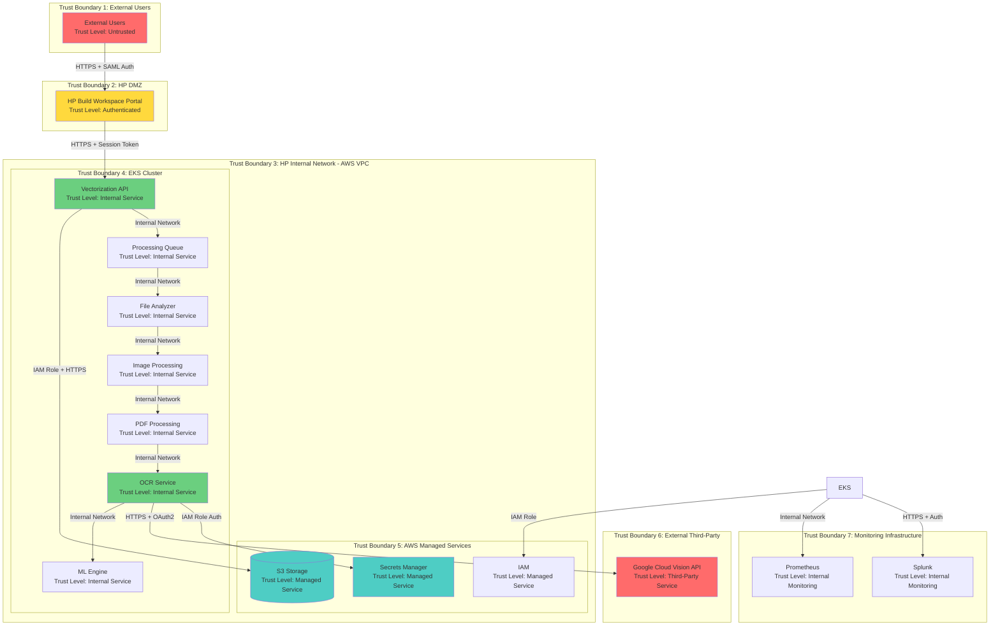
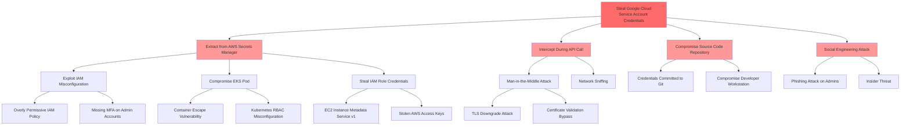

# STRIDE-Based Threat Modeling Analysis

## STRIDE-Based Threat Analysis

| Component/Data Flow | Threat Category | Threat Description | Risk Level | Mitigation Strategy |
|---------------------|-----------------|-------------------|------------|---------------------|
| HP Build Workspace Portal → Vectorization API | Spoofing | Attacker impersonates legitimate user to submit malicious files | High | Enforce HP OneUID/SAML 2.0 authentication, implement MFA, log all authentication attempts |
| HP Build Workspace Portal → Vectorization API | Tampering | Man-in-the-middle attack modifying file upload requests | High | Enforce TLS 1.3 for all communications, implement certificate pinning, use HSTS headers |
| Vectorization API → Processing Queue | Repudiation | User denies submitting malicious or inappropriate content | Medium | Implement comprehensive audit logging with user identity, timestamp, and file hash in Splunk |
| Processing Queue → File Analyzer | Information Disclosure | Sensitive document content exposed through insecure queue messages | High | Encrypt queue messages, use AWS SQS with encryption at rest, implement IAM policies for queue access |
| OCR Service → AWS Secrets Manager | Spoofing | Unauthorized service attempts to retrieve Google Cloud credentials | Critical | Enforce IAM role-based authentication, implement service identity verification, enable CloudTrail logging |
| OCR Service → Google Cloud Vision API | Tampering | API request/response intercepted and modified in transit | High | Enforce TLS 1.3 with certificate validation, implement request signing, validate response integrity |
| OCR Service → Google Cloud Vision API | Information Disclosure | Sensitive document content exposed to unauthorized parties during API transmission | Critical | Use TLS 1.3 encryption, validate Google Cloud Vision API data handling policies, implement data classification tagging |
| Google Cloud Vision API | Denial of Service | API rate limits exceeded causing service disruption | Medium | Implement request throttling (1800 req/min limit), circuit breaker pattern, exponential backoff, queue-based processing |
| AWS Secrets Manager | Elevation of Privilege | Compromised IAM role gains access to service account credentials | Critical | Implement least privilege IAM policies, enable MFA for credential rotation, audit access logs, rotate credentials every 90 days |
| S3 Storage | Information Disclosure | Unauthorized access to processed files and customer documents | High | Enforce S3 bucket policies with deny-by-default, enable S3 access logging, implement VPC endpoints, use pre-signed URLs with expiration |
| S3 Storage | Tampering | Malicious modification of stored files or processing results | High | Enable S3 versioning, implement object lock for critical files, use S3 bucket encryption with KMS, enable CloudTrail for S3 data events |
| EKS Cluster | Elevation of Privilege | Container escape leading to node compromise | High | Implement Pod Security Standards, use non-root containers, enable SELinux/AppArmor, scan images with Trivy, apply security patches |
| EKS Cluster → External Services | Spoofing | Rogue service impersonates legitimate cluster component | High | Implement service mesh with mutual TLS (Istio/Linkerd), use Kubernetes service accounts, enforce network policies |
| ML Engine Processing | Tampering | Malicious input designed to poison ML model or extract training data | Medium | Implement input validation and sanitization, use confidence score thresholds, isolate ML processing, monitor for adversarial inputs |
| Splunk Logging | Repudiation | Logs tampered with to hide malicious activity | High | Use write-once log storage, implement log integrity verification, enforce TLS for log transmission, restrict log modification access |
| Prometheus Metrics | Information Disclosure | Sensitive operational data exposed through metrics endpoints | Medium | Implement authentication for metrics endpoints, sanitize metric labels, use network policies to restrict access |
| User File Upload | Denial of Service | Large file uploads or malicious files causing resource exhaustion | Medium | Implement file size limits (20MB images, 2000 pages PDF), validate file types, use antivirus scanning, implement rate limiting per user |
| OAuth2 Authentication Flow | Spoofing | Stolen or leaked service account credentials used for unauthorized API access | Critical | Store credentials in AWS Secrets Manager with encryption, implement automated rotation, monitor for unusual API usage patterns, use short-lived tokens |
| PDF Processing Component | Tampering | Malicious PDF exploiting parser vulnerabilities | High | Use sandboxed PDF processing, validate PDF structure, implement resource limits, scan with antivirus, update PDF libraries regularly |
| Image Processing Component | Denial of Service | Image bombs or malicious images causing memory exhaustion | Medium | Implement image size validation, use resource limits, process in isolated containers, implement timeout mechanisms |
| DXF Output Generation | Tampering | Malicious code injection into generated DXF files | Medium | Validate output format, sanitize text content, implement output scanning, use secure serialization libraries |
| Cross-Region Data Transfer | Information Disclosure | Data intercepted during S3 cross-region replication | Medium | Use S3 replication with encryption, enable S3 bucket versioning, implement VPC endpoints for replication traffic |
| API Rate Limiting | Denial of Service | Distributed attack bypassing rate limiting controls | Medium | Implement multi-layer rate limiting (per-user, per-IP, global), use AWS WAF, implement CAPTCHA for suspicious patterns |
| Kubernetes API Server | Elevation of Privilege | Unauthorized access to cluster management functions | Critical | Enable RBAC with least privilege, implement API server audit logging, use private API endpoints, enable admission controllers |
| Container Registry | Tampering | Malicious container images deployed to production | High | Sign container images, implement image scanning in CI/CD, use private registry with access controls, enable vulnerability scanning |
| Service-to-Service Communication | Spoofing | Internal service impersonation within EKS cluster | High | Implement service mesh with mutual TLS, use Kubernetes NetworkPolicies, enforce pod identity, implement zero-trust networking |

## Trust Boundaries Diagram

**Trust Boundary Descriptions:**

1. **External Users (Untrusted)**: Public internet users accessing the system through HP Build Workspace Portal. All input must be validated and authenticated.

2. **HP DMZ (Authenticated)**: HP Build Workspace Portal with user authentication via HP OneUID/SAML 2.0. Users are authenticated but not fully trusted.

3. **HP Internal Network - AWS VPC (Internal)**: AWS Virtual Private Cloud hosting the application infrastructure. Protected by security groups and network ACLs.

4. **EKS Cluster (Internal Service)**: Kubernetes cluster running application containers. Services communicate internally with service mesh security.

5. **AWS Managed Services (Managed Service)**: AWS-managed services (S3, Secrets Manager, IAM) with AWS security controls and HP-configured policies.

6. **External Third-Party (Third-Party Service)**: Google Cloud Vision API operated by Google. Data leaves HP control boundary.

7. **Monitoring Infrastructure (Internal Monitoring)**: Logging and monitoring systems with read-only access to application data.

**Critical Trust Boundary Crossings:**
- User → HP Portal: Authentication required
- HP Portal → AWS VPC: Session validation required
- EKS → Google Cloud: OAuth2 authentication + TLS encryption required
- EKS → AWS Secrets Manager: IAM role authentication required
- Any component → S3: IAM policies + encryption required

## Attack Trees

### Attack Tree 1: Compromise Google Cloud Vision API Credentials

### Attack Tree 2: Exfiltrate Sensitive Document Data

```mermaid
graph TD
    ROOT[Exfiltrate Customer<br/>Document Data]
    
    ROOT --> A1[Access S3 Buckets Directly]
    ROOT --> A2[Intercept API Communication]
    ROOT --> A3[Compromise Processing Pipeline]
    ROOT --> A4[Exploit Logging/Monitoring]
    
    A1 --> B1[Exploit S3 Bucket Misconfiguration]
    A1 --> B2[Steal AWS Credentials]
    A1 --> B3[Exploit S3 Access Logging Gap]
    
    B1 --> C1[Public Bucket Access]
    B1 --> C2[Overly Permissive Bucket Policy]
    
    B2 --> C3[Phishing Attack]
    B2 --> C4[Credential Stuffing]
    
    A2 --> D1[Man-in-the-Middle on User Upload]
    A2 --> D2[Intercept Google Cloud Vision API Call]
    
    D1 --> E1[Compromise TLS Certificate]
    D1 --> E2[DNS Hijacking]
    
    D2 --> E3[Network Tap in AWS VPC]
    D2 --> E4[Compromise VPC Flow Logs]
    
    A3 --> F1[Inject Malicious Container]
    A3 --> F2[Exploit Processing Component Vulnerability]
    A3 --> F3[Compromise Kubernetes Secrets]
    
    F1 --> G1[Supply Chain Attack]
    F1 --> G2[Compromise Container Registry]
    
    F2 --> G3[PDF Parser Vulnerability]
    F2 --> G4[Image Processing Buffer Overflow]
    
    A4 --> H1[Access Splunk Logs with Document Content]
    A4 --> H2[Exploit Prometheus Metrics Exposure]
    
    H1 --> I1[Stolen Splunk Credentials]
    H1 --> I2[Splunk Query Injection]
    
    style ROOT fill:#ff6b6b
    style A1 fill:#ff9999
    style A2 fill:#ff9999
    style A3 fill:#ff9999
    style A4 fill:#ff9999
```

### Attack Tree 3: Denial of Service Attack

```mermaid
graph TD
    ROOT[Disrupt OCR Processing Service]
    
    ROOT --> A1[Exhaust Google Cloud Vision API Quota]
    ROOT --> A2[Overwhelm EKS Cluster Resources]
    ROOT --> A3[Flood Processing Queue]
    ROOT --> A4[Exploit Application Vulnerabilities]
    
    A1 --> B1[Bypass Rate Limiting]
    A1 --> B2[Distributed Request Attack]
    A1 --> B3[Exhaust Monthly Budget]
    
    B1 --> C1[Multiple User Accounts]
    B1 --> C2[Stolen API Credentials]
    
    B2 --> C3[Botnet Attack]
    B2 --> C4[Amplification Attack]
    
    A2 --> D1[Resource Exhaustion Attack]
    A2 --> D2[Container Bomb Attack]
    
    D1 --> E1[Large File Upload Attack]
    D1 --> E2[Memory Leak Exploitation]
    
    D2 --> E3[Zip Bomb in PDF]
    D2 --> E4[Image Bomb Attack]
    
    A3 --> F1[Queue Flooding]
    A3 --> F2[Poison Message Attack]
    
    F1 --> G1[Automated Script Attack]
    F1 --> G2[Compromised User Account]
    
    F2 --> G3[Malformed Message Causing Crash]
    F2 --> G4[Infinite Processing Loop]
    
    A4 --> H1[Exploit PDF Processing Vulnerability]
    A4 --> H2[Exploit ML Engine Vulnerability]
    A4 --> H3[Kubernetes API Server DoS]
    
    H1 --> I1[Malicious PDF Structure]
    H1 --> I2[PDF Parser Crash]
    
    H2 --> I3[Adversarial Input Attack]
    H2 --> I4[Model Inference Slowdown]
    
    style ROOT fill:#ff6b6b
    style A1 fill:#ff9999
    style A2 fill:#ff9999
    style A3 fill:#ff9999
    style A4 fill:#ff9999
```

## Auditing and Logging Controls

### Authentication and Authorization Logging
- **User Authentication Events**: Log all HP OneUID/SAML authentication attempts (success and failure) with user identity, timestamp, source IP, and session ID to Splunk
- **Service Account Authentication**: Log all OAuth2 token requests to Google Cloud Vision API including service account identity, timestamp, and token expiration
- **IAM Role Assumption**: Enable AWS CloudTrail logging for all IAM role assumption events, especially for EKS pods accessing Secrets Manager
- **Failed Authentication Attempts**: Implement alerting for repeated failed authentication attempts (threshold: 5 failures in 5 minutes) with automatic account lockout
- **Privileged Access Logging**: Log all administrative access to EKS cluster, AWS console, and Secrets Manager with MFA verification status
- **Session Management**: Log session creation, renewal, and termination events with session duration and activity summary

### API Access Logging
- **Google Cloud Vision API Calls**: Log every API request including file hash, request timestamp, response time, confidence scores, error codes, and data volume processed
- **Internal API Gateway Logging**: Enable detailed logging for Vectorization API including request/response headers, payload size, processing time, and user context
- **API Rate Limiting Events**: Log all rate limiting triggers with user identity, request count, and time window
- **API Error Responses**: Log all 4xx and 5xx responses with full error details, stack traces (sanitized), and correlation IDs
- **Third-Party API Health**: Monitor and log Google Cloud Vision API availability, latency percentiles (p50, p95, p99), and error rates
- **API Key Rotation Events**: Log all service account credential rotation activities with old/new key IDs and rotation timestamp

### Anomaly Detection
- **Behavioral Analytics**: Implement user behavior analytics (UBA) in Splunk to detect unusual file upload patterns, processing volumes, or access times
- **API Usage Anomalies**: Alert on unusual Google Cloud Vision API usage patterns including sudden volume spikes (>200% baseline), unusual error rates (>5%), or off-hours activity
- **Data Exfiltration Detection**: Monitor for large-scale S3 downloads, unusual data transfer patterns, or access to multiple files in short time periods
- **Privilege Escalation Detection**: Alert on unexpected IAM role changes, new service account creations, or permission modifications
- **Network Anomalies**: Implement VPC Flow Log analysis to detect unusual network traffic patterns, unexpected external connections, or data transfer anomalies
- **Container Anomaly Detection**: Monitor for unexpected container behavior including unusual process execution, network connections, or file system modifications
- **ML Model Anomalies**: Track ML engine confidence score distributions and alert on significant deviations indicating potential adversarial inputs

### SIEM Integration
- **Centralized Log Aggregation**: Forward all application, infrastructure, and security logs to Splunk with structured JSON format and consistent timestamp format (ISO 8601)
- **Correlation Rules**: Implement SIEM correlation rules to detect multi-stage attacks including:
  - Failed authentication followed by successful authentication from different IP
  - Credential access followed by unusual API activity
  - Multiple failed S3 access attempts followed by successful access
  - Container escape indicators followed by privilege escalation
- **Security Dashboards**: Create real-time security dashboards displaying:
  - Authentication success/failure rates
  - API error rates and latency trends
  - Resource utilization and capacity metrics
  - Security event timeline and incident status
  - Compliance metrics and audit readiness indicators
- **Automated Incident Response**: Integrate Splunk with PagerDuty for automated alerting and incident creation for critical security events
- **Compliance Reporting**: Generate automated compliance reports for GDPR, CCPA, and HP internal security standards including data access logs, retention compliance, and security control effectiveness
- **Forensic Capabilities**: Maintain 90-day hot storage and 1-year cold storage of all security logs for incident investigation and forensic analysis
- **Log Integrity**: Implement write-once log storage with cryptographic hashing to ensure log integrity and prevent tampering

### Specific Monitoring Metrics
- **File Processing Metrics**: Track files processed per hour, average processing time, success/failure rates, and queue depth
- **OCR Quality Metrics**: Monitor confidence scores, language detection accuracy, and text extraction completeness
- **Cost Metrics**: Track Google Cloud Vision API costs per file, daily/monthly spend, and cost per successful vectorization
- **Security Metrics**: Monitor failed authentication attempts, unauthorized access attempts, encryption failures, and certificate expiration warnings
- **Performance Metrics**: Track API latency (p50, p95, p99), container CPU/memory utilization, and auto-scaling events
- **Availability Metrics**: Monitor service uptime, health check failures, and dependency availability (Google Cloud Vision API, AWS services)

## Security Testing Considerations

### Penetration Testing
- **External Penetration Testing**: Conduct annual third-party penetration testing of HP Build Workspace Portal and Vectorization API endpoints focusing on:
  - Authentication bypass attempts
  - Session management vulnerabilities
  - Input validation weaknesses
  - API security testing (OWASP API Security Top 10)
  - File upload vulnerabilities (malicious files, path traversal)
- **Internal Penetration Testing**: Perform semi-annual internal penetration testing of EKS cluster and AWS infrastructure including:
  - Lateral movement within VPC
  - Container escape attempts
  - Privilege escalation scenarios
  - Secrets Manager access attempts
  - S3 bucket enumeration and access testing
- **Cloud Configuration Testing**: Test AWS security group rules, IAM policies, S3 bucket policies, and network ACLs for misconfigurations
- **Third-Party Integration Testing**: Test OAuth2 authentication flow with Google Cloud Vision API for token theft, replay attacks, and authorization bypass
- **Social Engineering Testing**: Conduct phishing simulations targeting administrators with access to production credentials
- **Red Team Exercises**: Perform annual red team exercises simulating advanced persistent threat (APT) scenarios including multi-stage attacks

### Vulnerability Scanning
- **Container Image Scanning**: Implement automated scanning with Trivy in CI/CD pipeline for every container image build, blocking deployment of images with HIGH or CRITICAL vulnerabilities
- **Infrastructure Scanning**: Perform weekly vulnerability scans of EKS nodes, bastion hosts, and AWS infrastructure using AWS Inspector and third-party tools
- **Dependency Scanning**: Use Dependabot or Snyk to scan Python dependencies for known vulnerabilities with automated PR creation for updates
- **Static Application Security Testing (SAST)**: Integrate Veracode SAST scanning in CI/CD pipeline with quality gates blocking merges with security findings
- **Dynamic Application Security Testing (DAST)**: Perform monthly DAST scans of deployed applications in staging environment before production promotion
- **Secrets Scanning**: Implement git-secrets or TruffleHog to prevent credential commits to source code repositories
- **Configuration Scanning**: Use tools like kube-bench and kube-hunter to validate Kubernetes security configurations against CIS benchmarks

### API Security Testing
- **OWASP API Security Testing**: Test for OWASP API Security Top 10 vulnerabilities including:
  - Broken Object Level Authorization (BOLA)
  - Broken User Authentication
  - Excessive Data Exposure
  - Lack of Resources & Rate Limiting
  - Broken Function Level Authorization
  - Mass Assignment
  - Security Misconfiguration
  - Injection attacks
  - Improper Assets Management
  - Insufficient Logging & Monitoring
- **Authentication Testing**: Test OAuth2 implementation for token theft, token replay, authorization code interception, and PKCE bypass
- **Rate Limiting Testing**: Verify rate limiting effectiveness using automated tools to simulate distributed attacks and validate throttling mechanisms
- **Input Validation Testing**: Test file upload functionality with:
  - Oversized files (>20MB images, >2000 page PDFs)
  - Malformed files (corrupted headers, invalid structures)
  - Malicious files (zip bombs, image bombs, PDF exploits)
  - Path traversal attempts in filenames
  - Special characters and encoding attacks
- **API Fuzzing**: Use fuzzing tools (Burp Suite, OWASP ZAP) to test API endpoints with malformed requests, unexpected data types, and boundary conditions
- **Google Cloud Vision API Integration Testing**: Test error handling, timeout scenarios, rate limit responses, and credential rotation without service disruption

### Configuration Reviews
- **AWS Security Configuration Review**: Quarterly review of:
  - IAM policies and roles (least privilege validation)
  - Security group rules (principle of least access)
  - S3 bucket policies and ACLs
  - VPC configuration and network segmentation
  - CloudTrail and CloudWatch configuration
  - KMS key policies and rotation schedules
  - Secrets Manager access policies
- **Kubernetes Security Review**: Monthly review of:
  - RBAC policies and service accounts
  - Pod Security Standards enforcement
  - Network policies and service mesh configuration
  - Resource quotas and limit ranges
  - Admission controller policies
  - Container security contexts (non-root, read-only filesystem)
  - Image pull policies and registry access
- **Application Security Configuration**: Review of:
  - TLS configuration (cipher suites, protocol versions)
  - Certificate management and expiration monitoring
  - Logging levels and sensitive data sanitization
  - Error handling and information disclosure
  - Session management and timeout settings
  - CORS policies and allowed origins
- **Third-Party Integration Review**: Annual review of:
  - Google Cloud Vision API security controls and SLA compliance
  - Service account permissions and credential rotation
  - Data processing agreements and privacy compliance
  - Vendor security assessments and certifications
  - API versioning and deprecation notices
- **Compliance Configuration Review**: Quarterly validation of:
  - GDPR compliance controls (data minimization, right to erasure)
  - CCPA compliance controls (data disclosure, opt-out mechanisms)
  - HP cybersecurity standards compliance
  - Data retention and deletion policies
  - Encryption at rest and in transit validation
  - Audit log retention and integrity verification

### Security Testing Schedule
- **Continuous**: Container scanning, SAST, dependency scanning, secrets scanning (CI/CD integrated)
- **Weekly**: Infrastructure vulnerability scanning, configuration drift detection
- **Monthly**: DAST scanning, Kubernetes security review, API security testing
- **Quarterly**: AWS security configuration review, compliance configuration review, threat model review
- **Semi-Annual**: Internal penetration testing, red team exercises
- **Annual**: External penetration testing, third-party integration security review, disaster recovery testing

### Testing Documentation Requirements
- **Test Plans**: Document scope, methodology, tools, and success criteria for each security test
- **Test Results**: Maintain detailed reports including findings, severity ratings, affected components, and remediation recommendations
- **Remediation Tracking**: Track all security findings in JIRA with assigned owners, due dates, and verification status
- **Retest Validation**: Perform retesting of all HIGH and CRITICAL findings after remediation to validate fix effectiveness
- **Metrics and Trends**: Track security testing metrics including mean time to remediate (MTTR), vulnerability density, and test coverage
- **Lessons Learned**: Document lessons learned from security testing and incorporate findings into secure development practices

---

**Document Version**: 1.0  
**Last Updated**: 2024  
**Prepared By**: Senior Cybersecurity Threat Modeling Specialist  
**Review Status**: Pending Cybersecurity Review  
**Next Review Date**: Quarterly or upon significant architecture changes