# ARCHITECTURE SYNTHESIS: Smart Digitization OCR with Google Cloud Vision API

## EXECUTIVE SUMMARY

### System Purpose
The Smart Digitization OCR solution is a cloud-native, enterprise-grade document vectorization system that integrates Google Cloud Vision API to extract text from Architecture, Engineering, and Construction (AEC) documents. The system processes approximately 1.3K files per month with projected growth to 61K files by Q4 2026, supporting 30+ languages including Latin, Cyrillic, Arabic, and East Asian scripts. Deployed on AWS EKS infrastructure, the solution converts raster and PDF-based technical documents into editable CAD drawings through an AI-powered pipeline with GPU-accelerated machine learning.

### Security Posture

**Defense-in-Depth Architecture:**
The system implements a comprehensive multi-layered security architecture with 27 distinct security controls mapped to NIST SP 800-53 Rev 5, OWASP standards, and MITRE ATT&CK framework. Security is enforced at seven trust boundaries spanning from untrusted external users through authenticated HP DMZ, internal AWS VPC, EKS cluster isolation, AWS managed services, external third-party integrations, and monitoring infrastructure.

**Key Security Decisions:**

1. **Zero-Trust Authentication & Authorization:**
   - HP OneUID/SAML 2.0 with mandatory multi-factor authentication for all user access
   - OAuth2 service account authentication for Google Cloud Vision API with 90-day automated credential rotation
   - IAM roles for service accounts (IRSA) in EKS with least privilege enforcement
   - Kubernetes RBAC with namespace-level isolation and no cluster-admin privileges for applications
   - Service mesh (Istio/Linkerd) with mutual TLS for all service-to-service communication

2. **Comprehensive Data Protection:**
   - TLS 1.3 encryption enforced for all communications with HSTS headers (1-year max-age)
   - AES-256 encryption at rest for all S3 buckets using AWS KMS customer-managed keys
   - AWS Secrets Manager with KMS encryption for all credentials and service account keys
   - S3 Object Lock in compliance mode with 7-year retention for audit-critical documents
   - Data classification tagging (Public, Internal, Confidential, Restricted) with automated DLP controls

3. **Container & Kubernetes Hardening:**
   - Pod Security Standards with restricted profile (non-root containers, read-only filesystems, dropped capabilities)
   - Container image scanning with Trivy blocking HIGH/CRITICAL vulnerabilities in CI/CD pipeline
   - Image signing using Docker Content Trust/Cosign with provenance tracking and SBOM generation
   - Runtime security monitoring with Falco detecting container escape attempts and privilege escalation
   - Network policies with default deny and explicit allow rules for pod-to-pod communication

4. **API Security & Rate Limiting:**
   - Multi-layer rate limiting: per-user (10 req/min), per-IP (50 req/min), global (1000 req/min)
   - AWS WAF with managed rule sets for DDoS protection and OWASP Top 10 mitigation
   - Circuit breaker pattern for Google Cloud Vision API (5 consecutive failures trigger 5-minute cooldown)
   - Input validation using JSON Schema with file size limits (20MB images, 2000 pages PDFs)
   - Pre-signed URLs for S3 access with 15-minute expiration

5. **Comprehensive Logging & Monitoring:**
   - Centralized logging to Splunk with 90-day hot storage and 1-year cold storage for security logs
   - Write-once log storage with SHA-256 cryptographic integrity verification
   - AWS CloudTrail with log file validation for all API calls and IAM role assumptions
   - Real-time security event monitoring with automated alerting for critical threats
   - SIEM correlation rules detecting multi-stage attacks (credential theft → unusual API activity)

6. **Threat-Informed Defense:**
   - 27 STRIDE-based threats identified with corresponding mitigations mapped to 35 NIST controls
   - Attack tree analysis covering credential compromise, data exfiltration, and denial of service scenarios
   - MITRE ATT&CK technique coverage across 15 tactics including Initial Access, Privilege Escalation, Defense Evasion, and Exfiltration
   - Behavioral analytics and anomaly detection for unusual file upload patterns, API usage, and authentication attempts

### Architecture Highlights

**Cloud-Native Microservices Architecture:**
- AWS EKS cluster with auto-scaling based on processing demand (CPU/memory utilization)
- Kubernetes-orchestrated microservices: Vectorization API, File Analyzer, Image Processing, PDF Processing, OCR Service, ML Engine
- AWS managed services integration: S3 (storage), Secrets Manager (credentials), SQS (queue), CloudWatch (metrics)
- Service mesh with mutual TLS providing encrypted service-to-service communication and fine-grained authorization

**High Availability & Resilience:**
- Multi-AZ deployment with automatic failover for EKS control plane and worker nodes
- Circuit breaker pattern with exponential backoff (initial 1s, max 60s) for Google Cloud Vision API calls
- Queue-based asynchronous processing with retry logic and dead-letter queues
- Horizontal pod autoscaling (HPA) and cluster autoscaler for dynamic capacity management
- S3 cross-region replication with encryption for disaster recovery

**Compliance & Governance:**
- GDPR compliance: data minimization, right to erasure, consent management, 72-hour breach notification
- CCPA compliance: data disclosure capability, opt-out mechanisms, consumer rights request workflow
- NIST SP 800-53 Rev 5 control implementation across 12 control families
- Automated compliance monitoring with AWS Config Rules and quarterly audit reporting
- CIS Kubernetes Benchmark compliance validation with automated remediation

**Performance & Scalability:**
- Processing capacity: 1.3K files/month current, 61K files/month projected (Q4 2026)
- API response time: <5 seconds average for Google Cloud Vision API calls
- System availability: 99.5% uptime SLA with automated health checks and self-healing
- GPU-accelerated ML processing for geometric element detection and vectorization
- Prometheus metrics collection with Grafana dashboards for operational visibility

**Security Testing & Validation:**
- Continuous security scanning: SAST (Veracode), SCA (Snyk), container scanning (Trivy), secrets scanning (git-secrets)
- Monthly DAST scanning in staging environment with quality gates blocking production deployment
- Quarterly penetration testing (external) and semi-annual internal penetration testing
- Annual red team exercises simulating advanced persistent threat (APT) scenarios
- Vulnerability remediation SLA: HIGH/CRITICAL within 7 days, MEDIUM within 30 days

---

## FINAL ARCHITECTURE DIAGRAM

```mermaid
graph TB
    subgraph "Trust Boundary 1: External Users [UNTRUSTED]"
        User[External User<br/>Authentication Required]
    end
    
    subgraph "Trust Boundary 2: HP DMZ [AUTHENTICATED]"
        Portal[HP Build Workspace Portal<br/>HP OneUID/SAML 2.0 + MFA<br/>Session Management]
    end
    
    subgraph "Trust Boundary 3: AWS VPC [INTERNAL NETWORK]"
        subgraph "Public Subnet"
            ALB[Application Load Balancer<br/>TLS 1.3 Termination<br/>HSTS Headers]
            WAF[AWS WAF<br/>Rate Limiting<br/>OWASP Rule Sets<br/>DDoS Protection]
            NAT[NAT Gateway<br/>Egress Filtering]
        end
        
        subgraph "Trust Boundary 4: EKS Cluster [INTERNAL SERVICES]"
            subgraph "Application Namespace"
                API[Vectorization API<br/>Input Validation<br/>Rate Limiting: 10/min user<br/>JWT Token Validation]
                Queue[Processing Queue<br/>AWS SQS Encrypted<br/>Message Encryption<br/>Dead Letter Queue]
                FileAnalyzer[File Analyzer<br/>Magic Number Validation<br/>Antivirus Scanning<br/>File Size Limits]
                ImageProc[Image Processing<br/>Resource Limits: 1GB RAM<br/>Timeout: 30s<br/>Sandboxed Execution]
                PDFProc[PDF Processing<br/>Sandboxed with gVisor<br/>Resource Limits: 2GB RAM<br/>Structure Validation]
                OCRService[OCR Service<br/>OAuth2 Authentication<br/>Circuit Breaker<br/>Request Signing]
                MLEngine[ML Engine<br/>Confidence Threshold: 0.7<br/>Adversarial Input Detection<br/>Model Versioning]
            end
            
            subgraph "Service Mesh Layer"
                Istio[Istio Service Mesh<br/>Mutual TLS Strict Mode<br/>Authorization Policies<br/>Traffic Management]
            end
            
            subgraph "Security Controls"
                PSP[Pod Security Standards<br/>Non-Root Containers<br/>Read-Only Filesystem<br/>Dropped Capabilities]
                NetPol[Network Policies<br/>Default Deny<br/>Namespace Isolation<br/>Egress Filtering]
                Falco[Falco Runtime Security<br/>Container Escape Detection<br/>Privilege Escalation Alerts<br/>Anomaly Detection]
            end
        end
        
        subgraph "Trust Boundary 5: AWS Managed Services [MANAGED]"
            S3[AWS S3 Storage<br/>AES-256 Encryption at Rest<br/>KMS Customer-Managed Keys<br/>Versioning + Object Lock<br/>Block Public Access<br/>Access Logging]
            Secrets[AWS Secrets Manager<br/>KMS Encryption<br/>90-Day Rotation<br/>IAM Role Access<br/>Audit Logging]
            IAM[AWS IAM<br/>Least Privilege Policies<br/>MFA Required<br/>CloudTrail Logging<br/>Access Analyzer]
            VPCEndpoints[VPC Endpoints<br/>Private Access<br/>S3, Secrets Manager<br/>SQS, CloudWatch]
        end
        
        subgraph "Security Groups"
            SG1[Security Group: ALB<br/>Inbound: 443 from Internet<br/>Outbound: 8080 to API]
            SG2[Security Group: EKS Nodes<br/>Inbound: 8080 from ALB<br/>Outbound: 443 to AWS Services]
            SG3[Security Group: VPC Endpoints<br/>Inbound: 443 from EKS<br/>Outbound: None]
        end
    end
    
    subgraph "Trust Boundary 6: External Third-Party [THIRD-PARTY]"
        GCV[Google Cloud Vision API<br/>OAuth2 Service Account<br/>TLS 1.3 Encryption<br/>Rate Limit: 1800/min<br/>Data Processing Agreement]
    end
    
    subgraph "Trust Boundary 7: Monitoring Infrastructure [INTERNAL MONITORING]"
        Splunk[Splunk SIEM<br/>Centralized Logging<br/>90-Day Hot Storage<br/>1-Year Cold Storage<br/>Write-Once Storage<br/>Correlation Rules]
        Prometheus[Prometheus + Grafana<br/>Metrics Collection<br/>Performance Monitoring<br/>Alerting Rules<br/>Security Dashboards]
        CloudWatch[AWS CloudWatch<br/>EKS Control Plane Logs<br/>VPC Flow Logs<br/>CloudTrail Integration<br/>Automated Alerts]
        GuardDuty[AWS GuardDuty<br/>Threat Detection<br/>ML-Based Anomaly Detection<br/>Automated Response<br/>Threat Intelligence]
    end
    
    subgraph "CI/CD Security Pipeline"
        GitHub[GitHub Repository<br/>Branch Protection<br/>Code Review Required<br/>Secrets Scanning]
        CICD[CI/CD Pipeline<br/>SAST: Veracode<br/>SCA: Snyk<br/>Container Scan: Trivy<br/>Image Signing: Cosign]
        ECR[AWS ECR Private Registry<br/>Vulnerability Scanning<br/>Image Promotion Workflow<br/>IAM Authentication<br/>Encryption at Rest]
    end
    
    %% User Flow
    User -->|HTTPS| WAF
    WAF -->|Rate Limiting<br/>OWASP Rules| ALB
    ALB -->|TLS 1.3| Portal
    Portal -->|SAML Auth<br/>Session Token| API
    
    %% Processing Flow
    API -->|Encrypted Message| Queue
    Queue -->|Async Processing| FileAnalyzer
    FileAnalyzer -->|Validated File| ImageProc
    FileAnalyzer -->|Validated File| PDFProc
    ImageProc -->|Processed Image| OCRService
    PDFProc -->|Extracted Pages| OCRService
    
    %% External API Integration
    OCRService -->|IAM Role Auth| Secrets
    Secrets -->|Service Account Key| OCRService
    OCRService -->|OAuth2 + TLS 1.3<br/>Request Signing| GCV
    GCV -->|OCR Results<br/>Confidence Scores| OCRService
    OCRService -->|Text + Bounding Boxes| MLEngine
    
    %% Storage Integration
    API -->|Pre-Signed URL<br/>15-min Expiration| S3
    MLEngine -->|DXF Output<br/>Encrypted Upload| S3
    FileAnalyzer -->|File Metadata| S3
    
    %% Service Mesh
    Istio -.->|mTLS| API
    Istio -.->|mTLS| OCRService
    Istio -.->|mTLS| MLEngine
    
    %% Security Controls
    PSP -.->|Policy Enforcement| API
    PSP -.->|Policy Enforcement| OCRService
    NetPol -.->|Network Isolation| API
    NetPol -.->|Network Isolation| OCRService
    Falco -.->|Runtime Monitoring| API
    Falco -.->|Runtime Monitoring| OCRService
    
    %% Monitoring & Logging
    API -->|Structured Logs<br/>JSON Format| Splunk
    OCRService -->|API Call Logs<br/>Audit Trail| Splunk
    MLEngine -->|Processing Metrics| Prometheus
    API -->|Performance Metrics| Prometheus
    EKS -->|Control Plane Logs| CloudWatch
    VPC -->|Flow Logs| CloudWatch
    IAM -->|CloudTrail Events| CloudWatch
    GuardDuty -->|Threat Alerts| Splunk
    
    %% CI/CD Flow
    GitHub -->|Git Push| CICD
    CICD -->|Security Scans<br/>Quality Gates| ECR
    ECR -->|Signed Images<br/>Vulnerability Free| EKS
    
    %% VPC Endpoints
    OCRService -->|Private Access| VPCEndpoints
    VPCEndpoints -->|Encrypted| Secrets
    VPCEndpoints -->|Encrypted| S3
    
    %% Security Group Enforcement
    SG1 -.->|Firewall Rules| ALB
    SG2 -.->|Firewall Rules| API
    SG3 -.->|Firewall Rules| VPCEndpoints
    
    %% Styling
    classDef untrusted fill:#ff6b6b,stroke:#c92a2a,stroke-width:3px,color:#fff
    classDef authenticated fill:#ffd93d,stroke:#f59f00,stroke-width:3px,color:#000
    classDef internal fill:#6bcf7f,stroke:#37b24d,stroke-width:2px,color:#000
    classDef managed fill:#4ecdc4,stroke:#0b7285,stroke-width:2px,color:#000
    classDef thirdparty fill:#ff6b6b,stroke:#c92a2a,stroke-width:3px,color:#fff
    classDef monitoring fill:#a78bfa,stroke:#7c3aed,stroke-width:2px,color:#fff
    classDef security fill:#f783ac,stroke:#e64980,stroke-width:2px,color:#000
    classDef cicd fill:#74c0fc,stroke:#1971c2,stroke-width:2px,color:#000
    
    class User untrusted
    class Portal authenticated
    class API,Queue,FileAnalyzer,ImageProc,PDFProc,OCRService,MLEngine internal
    class S3,Secrets,IAM,VPCEndpoints managed
    class GCV thirdparty
    class Splunk,Prometheus,CloudWatch,GuardDuty monitoring
    class PSP,NetPol,Falco,Istio,WAF,SG1,SG2,SG3 security
    class GitHub,CICD,ECR cicd
```

---

## ARCHITECTURE COMPONENT DETAILS

### Trust Boundary 1: External Users [UNTRUSTED]
- **Security Level:** Untrusted public internet users
- **Controls:** All input treated as hostile; mandatory authentication and validation required
- **Threat Mitigation:** Defends against T1190 (Exploit Public-Facing Application), T1566 (Phishing)

### Trust Boundary 2: HP DMZ [AUTHENTICATED]
- **Security Level:** Authenticated users via HP OneUID/SAML 2.0 with MFA
- **Controls:** Session management with 15-minute idle timeout, 8-hour max duration; adaptive authentication with risk scoring
- **Threat Mitigation:** Defends against T1078 (Valid Accounts), T1110 (Brute Force), T1556 (Modify Authentication Process)

### Trust Boundary 3: AWS VPC [INTERNAL NETWORK]
- **Security Level:** Internal corporate network with VPC isolation
- **Controls:** Security groups with least privilege; VPC Flow Logs; AWS GuardDuty threat detection
- **Network Segmentation:** Public subnet (ALB, NAT), Private subnet (EKS nodes), Data subnet (VPC endpoints)
- **Threat Mitigation:** Defends against T1046 (Network Service Discovery), T1595 (Active Scanning), T1557 (Adversary-in-the-Middle)

### Trust Boundary 4: EKS Cluster [INTERNAL SERVICES]
- **Security Level:** Kubernetes-orchestrated microservices with namespace isolation
- **Controls:** Pod Security Standards (restricted profile); Network Policies (default deny); Service Mesh (mutual TLS); Runtime Security (Falco)
- **Key Components:**
  - **Vectorization API:** Entry point with JWT validation, input validation, rate limiting (10 req/min per user)
  - **Processing Queue:** AWS SQS with encryption at rest and in transit; dead letter queue for failed messages
  - **File Analyzer:** Magic number validation, antivirus scanning (ClamAV), file size enforcement (20MB images, 2000 pages PDFs)
  - **Image Processing:** Sandboxed execution with resource limits (1GB RAM, 30s timeout), dimension validation (max 10000x10000 pixels)
  - **PDF Processing:** gVisor sandboxing with resource limits (2GB RAM, 5-minute timeout), structure validation before processing
  - **OCR Service:** OAuth2 authentication with Google Cloud Vision API, circuit breaker (5 failures → 5-minute cooldown), request signing
  - **ML Engine:** Confidence threshold (0.7 minimum), adversarial input detection, model versioning with rollback capability
- **Threat Mitigation:** Defends against T1611 (Escape to Host), T1610 (Deploy Container), T1525 (Implant Internal Image), T1055 (Process Injection)

### Trust Boundary 5: AWS Managed Services [MANAGED]
- **Security Level:** AWS-managed services with HP-configured security policies
- **Controls:** IAM least privilege policies; KMS encryption; CloudTrail audit logging; VPC endpoints for private access
- **Key Components:**
  - **S3 Storage:** AES-256 encryption at rest with KMS customer-managed keys; versioning with MFA delete; Object Lock (compliance mode, 7-year retention); Block Public Access; access logging to dedicated audit bucket
  - **Secrets Manager:** KMS encryption; 90-day automated rotation; IAM role-based access; CloudTrail logging for all access
  - **IAM:** Least privilege policies with explicit deny; MFA required for administrative access; IAM Access Analyzer for overly permissive policies
  - **VPC Endpoints:** Private access to S3, Secrets Manager, SQS, CloudWatch; no internet gateway traversal
- **Threat Mitigation:** Defends against T1530 (Data from Cloud Storage), T1552 (Unsecured Credentials), T1078 (Valid Accounts)

### Trust Boundary 6: External Third-Party [THIRD-PARTY]
- **Security Level:** Third-party service operated by Google Cloud
- **Controls:** OAuth2 service account authentication; TLS 1.3 encryption; rate limiting (1800 req/min); Data Processing Agreement (DPA)
- **Data Handling:** Volatile processing in memory; immediate deletion post-processing; no long-term storage; GDPR/CCPA compliant
- **Threat Mitigation:** Defends against T1041 (Exfiltration Over C2 Channel), T1567 (Exfiltration Over Web Service), T1048 (Exfiltration Over Alternative Protocol)

### Trust Boundary 7: Monitoring Infrastructure [INTERNAL MONITORING]
- **Security Level:** Internal monitoring with read-only access to application data
- **Controls:** Authentication for all monitoring endpoints; encrypted log transmission; write-once log storage; SIEM correlation rules
- **Key Components:**
  - **Splunk SIEM:** Centralized logging with 90-day hot storage, 1-year cold storage; write-once storage with SHA-256 integrity verification; correlation rules for multi-stage attack detection; automated alerting with PagerDuty integration
  - **Prometheus + Grafana:** Metrics collection for performance monitoring; alerting rules for performance degradation; security dashboards with real-time metrics
  - **AWS CloudWatch:** EKS control plane logs; VPC Flow Logs; CloudTrail integration; automated alerts for critical events
  - **AWS GuardDuty:** ML-based threat detection; anomaly detection for unusual API activity; automated response for high-confidence threats
- **Threat Mitigation:** Defends against T1070 (Indicator Removal), T1562 (Impair Defenses), T1565 (Data Manipulation)

### CI/CD Security Pipeline
- **Security Level:** Automated security scanning with quality gates
- **Controls:** Branch protection requiring code review; secrets scanning; SAST/SCA/container scanning; image signing
- **Key Components:**
  - **GitHub Repository:** Branch protection rules; required code reviews; secrets scanning with git-secrets; commit signing
  - **CI/CD Pipeline:** SAST with Veracode (block on HIGH/CRITICAL); SCA with Snyk (automated dependency updates); container scanning with Trivy (block on HIGH/CRITICAL); image signing with Cosign
  - **AWS ECR Private Registry:** Vulnerability scanning on push; image promotion workflow (dev→staging→prod); IAM authentication; encryption at rest
- **Threat Mitigation:** Defends against T1195 (Supply Chain Compromise), T1525 (Implant Internal Image), T1204 (User Execution)

---

## SECURITY CONTROL MAPPING

### NIST SP 800-53 Rev 5 Control Implementation
- **Access Control (AC):** 8 controls - AC-2, AC-3, AC-4, AC-6, AC-7, AC-20
- **Audit and Accountability (AU):** 7 controls - AU-2, AU-3, AU-6, AU-9, AU-10, AU-11
- **Configuration Management (CM):** 4 controls - CM-2, CM-6, CM-7
- **Identification and Authentication (IA):** 6 controls - IA-2, IA-3, IA-4, IA-5
- **System and Communications Protection (SC):** 15 controls - SC-5, SC-7, SC-8, SC-12, SC-13, SC-23, SC-28
- **System and Information Integrity (SI):** 9 controls - SI-3, SI-4, SI-7, SI-10, SI-11, SI-12, SI-15

### OWASP Framework Alignment
- **OWASP Top 10 2021:** A01 (Broken Access Control), A02 (Cryptographic Failures), A03 (Injection), A04 (Insecure Design), A05 (Security Misconfiguration), A07 (Authentication Failures), A08 (Data Integrity Failures), A09 (Logging Failures)
- **OWASP API Security Top 10 2023:** API1 (Broken Object Level Authorization), API2 (Broken Authentication), API3 (Broken Object Property Level Authorization), API4 (Unrestricted Resource Consumption)
- **OWASP ASVS v4.0:** Chapters 2 (Authentication), 4 (Access Control), 5 (Validation), 6 (Cryptography), 7 (Logging), 8 (Data Protection), 9 (Communication), 11 (Business Logic), 12 (Files), 14 (Configuration)
- **OWASP Kubernetes Top 10 2022:** K01 (Insecure Workload Configurations), K02 (Supply Chain Vulnerabilities), K03 (Overly Permissive RBAC)

### MITRE ATT&CK Technique Coverage
- **15 Tactics Covered:** Initial Access, Execution, Persistence, Privilege Escalation, Defense Evasion, Credential Access, Discovery, Lateral Movement, Collection, Command and Control, Exfiltration, Impact, Reconnaissance, Resource Development, Adversary-in-the-Middle
- **22 Techniques Mitigated:** T1078 (Valid Accounts), T1110 (Brute Force), T1190 (Exploit Public-Facing Application), T1203 (Exploitation for Client Execution), T1528 (Steal Application Access Token), T1552 (Unsecured Credentials), T1557 (Adversary-in-the-Middle), T1565 (Data Manipulation), T1611 (Escape to Host), T1498/T1499 (Denial of Service), and 12 additional techniques

---

## COMPLIANCE ALIGNMENT

### GDPR Compliance
- **Data Minimization:** Collect only necessary data for OCR processing; no training data collection from customer files
- **Right to Erasure:** Automated deletion capability for user data on request; S3 lifecycle policies for data retention
- **Consent Management:** User consent obtained through HP Build Workspace terms and conditions
- **Data Breach Notification:** 72-hour notification procedures; incident response playbooks; automated alerting
- **Data Processing Agreement:** DPA with Google Cloud Vision API; data residency controls; encryption requirements

### CCPA Compliance
- **Data Disclosure:** Capability to provide user data on request in machine-readable format
- **Opt-Out Mechanisms:** User opt-out for data processing (if applicable)
- **Consumer Rights:** Request workflow for data access, deletion, and portability
- **Privacy Policy:** Transparent disclosure of data collection, processing, and sharing practices
- **Service Provider Agreements:** Contracts with third-party processors (Google Cloud) ensuring CCPA compliance

### HP Cybersecurity Standards
- **Security Architecture Review:** Quarterly reviews by security governance committee
- **Vulnerability Management:** 7-day remediation SLA for HIGH/CRITICAL vulnerabilities
- **Penetration Testing:** Annual external penetration testing; semi-annual internal testing
- **Security Training:** Mandatory security training for all developers; security champions program
- **Incident Response:** 24/7 security monitoring; on-call rotation; automated incident response playbooks

---

## OPERATIONAL SECURITY METRICS

### Key Performance Indicators (KPIs)
- **System Availability:** 99.5% uptime SLA with automated health checks and self-healing
- **Processing Throughput:** 1.3K files/month current, 61K files/month projected (Q4 2026)
- **API Response Time:** <5 seconds average for Google Cloud Vision API calls
- **OCR Accuracy:** >95% accuracy for standard AEC documents
- **Security Posture:** Zero critical vulnerabilities in production; 80%+ unit test coverage

### Security Metrics
- **Mean Time to Detect (MTTD):** <15 minutes for critical security events
- **Mean Time to Respond (MTTR):** <1 hour for critical incidents; <24 hours for high-severity incidents
- **Vulnerability Density:** <1 HIGH/CRITICAL vulnerability per 10,000 lines of code
- **Compliance Score:** 100% compliance with NIST SP 800-53 baseline controls
- **Security Test Coverage:** 100% of OWASP Top 10 vulnerabilities tested monthly

### Monitoring & Alerting
- **Real-Time Dashboards:** Splunk security dashboards; Grafana performance dashboards; AWS CloudWatch operational dashboards
- **Automated Alerts:** PagerDuty integration for critical security events; Slack notifications for operational alerts
- **Anomaly Detection:** Behavioral analytics for unusual file upload patterns, API usage, authentication attempts
- **Threat Intelligence:** Integration with threat intelligence feeds; MITRE ATT&CK technique tracking

---

**Document Classification:** HP Internal - Confidential  
**Version:** 1.0  
**Date:** 2024  
**Prepared By:** Principal Security Architect and Solution Architect  
**Review Status:** Architecture Synthesis Complete - Pending Security Review  
**Next Review Date:** Quarterly or upon significant architecture changes

**Approval Required:**
- CISO Office
- Security Architecture Lead
- Cloud Architecture Lead
- Development Manager
- Compliance Team Lead

**Distribution:**
- Security Team
- Development Team
- Architecture Team
- Compliance Team
- Operations Team
- Executive Leadership
