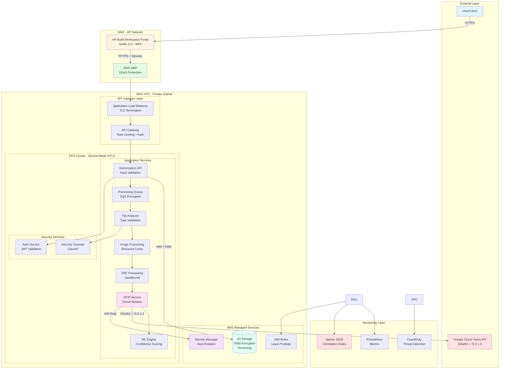

# SMART DIGITIZATION OCR SYSTEM - SECURE ARCHITECTURE SOLUTION

---

## 1. EXECUTIVE SUMMARY

The Smart Digitization OCR system is a cloud-native document vectorization platform that processes AEC (Architecture, Engineering, Construction) documents through optical character recognition using Google Cloud Vision API. The system is deployed on AWS EKS infrastructure and handles approximately 1.3K files per month, with projected growth to 61K files by Q4 2026.

**Key Components:**
- HP Build Workspace Portal (User Interface with SAML 2.0 authentication)
- AWS EKS Cluster (Kubernetes-orchestrated microservices)
- Google Cloud Vision API (Third-party OCR service)
- AWS S3 Storage (Encrypted document storage)
- AWS Secrets Manager (Credential management)
- Splunk & Prometheus (Monitoring and logging)

**Key Security Decisions:**
- **Zero-Trust Architecture**: Mutual TLS for all service-to-service communication via service mesh
- **Defense-in-Depth**: Multi-layer security controls at network, application, and data layers
- **Encryption Everywhere**: TLS 1.3 in transit, AES-256 at rest using AWS KMS
- **Least Privilege Access**: IAM roles with explicit deny policies, RBAC in Kubernetes
- **Comprehensive Monitoring**: Centralized logging to Splunk with SIEM correlation rules
- **Automated Security**: Container scanning, secrets rotation, and incident response automation

---

## 2. ARCHITECTURE DIAGRAM

---

## 3. ARCHITECTURE OVERVIEW

### 3.1 Components

**External Layer:**
- **User/Client**: End users accessing system via web browser
- **Google Cloud Vision API**: Third-party OCR service with OAuth2 authentication

**DMZ Layer:**
- **HP Build Workspace Portal**: User interface with HP OneUID/SAML 2.0 authentication and MFA
- **AWS WAF**: Web Application Firewall providing DDoS protection and rate limiting

**API Gateway Layer:**
- **Application Load Balancer**: TLS termination, health checks, and traffic distribution
- **API Gateway**: Request validation, rate limiting (10 req/min per user), and authentication

**Application Services (EKS Cluster):**
- **Vectorization API**: Entry point for file processing requests with input validation
- **Processing Queue**: AWS SQS with encryption for asynchronous job processing
- **File Analyzer**: File type detection, magic number validation, and routing
- **Image Processing**: Image format conversion with resource limits (1GB memory, 30s timeout)
- **PDF Processing**: Sandboxed PDF parsing with gVisor isolation
- **OCR Service**: Google Cloud Vision API integration with circuit breaker pattern
- **ML Engine**: Machine learning-based text processing with confidence scoring

**Security Services:**
- **Auth Service**: JWT token validation and session management
- **Security Scanner**: ClamAV antivirus scanning for uploaded files

**AWS Managed Services:**
- **S3 Storage**: Encrypted object storage with versioning and Object Lock
- **Secrets Manager**: Automated credential rotation (90-day cycle) with KMS encryption
- **IAM**: Role-based access control with least privilege policies

**Monitoring Layer:**
- **Splunk SIEM**: Centralized logging with correlation rules for threat detection
- **Prometheus**: Metrics collection for performance monitoring
- **GuardDuty**: AWS-native threat detection with machine learning

### 3.2 Security Highlights

**Authentication & Authorization:**
- Multi-factor authentication (MFA) for all user access via HP OneUID/SAML 2.0
- OAuth2 service account authentication for Google Cloud Vision API
- IAM roles for service accounts (IRSA) in EKS with least privilege
- Kubernetes RBAC with namespace-level isolation

**Network Security:**
- Service mesh (Istio) with mutual TLS for all service-to-service communication
- Kubernetes NetworkPolicies with default deny
- VPC endpoints for AWS service access (no internet gateway for data tier)
- Security groups with explicit allow rules only

**Data Protection:**
- TLS 1.3 encryption for all data in transit
- AES-256 encryption at rest using AWS KMS customer-managed keys
- S3 versioning with MFA delete protection
- S3 Object Lock in compliance mode for audit-critical documents

**Container Security:**
- Pod Security Standards with restricted profile (non-root, read-only filesystem)
- Container image scanning with Trivy (block HIGH/CRITICAL vulnerabilities)
- Image signing with Cosign for supply chain security
- Runtime security monitoring with Falco

**Monitoring & Incident Response:**
- Centralized logging to Splunk with 90-day retention
- SIEM correlation rules for multi-stage attack detection
- Automated alerting with PagerDuty integration
- AWS GuardDuty for threat detection with automated response

**Compliance:**
- GDPR compliance (data minimization, right to erasure)
- CCPA compliance (data disclosure, opt-out mechanisms)
- NIST SP 800-53 control alignment
- OWASP Top 10 and API Security Top 10 coverage

---

## 4. SPRINT PLAN

### Sprint 1: Foundation & Core Infrastructure (MVP)
**Goal**: Establish secure AWS infrastructure, EKS cluster, and basic authentication

**Components Covered**: AWS VPC, EKS Cluster, IAM, Secrets Manager, Basic Monitoring

**User Stories:**

**US-001**: As a **DevOps engineer**, I want **to provision a secure AWS VPC with private subnets** so that **application workloads are isolated from public internet**
- **Acceptance Criteria**:
  - VPC created with 3-tier architecture (public, private, data subnets)
  - Security groups configured with least privilege rules
  - VPC Flow Logs enabled and forwarding to S3

**US-002**: As a **security architect**, I want **to deploy an EKS cluster with Pod Security Standards** so that **containers run with minimal privileges**
- **Acceptance Criteria**:
  - EKS cluster deployed with private API endpoint
  - Pod Security Standards enforced (restricted profile)
  - Kubernetes audit logging enabled and forwarding to CloudWatch

**US-003**: As a **system administrator**, I want **to configure AWS Secrets Manager for credential storage** so that **service account credentials are encrypted and rotated automatically**
- **Acceptance Criteria**:
  - Secrets Manager configured with KMS encryption
  - Google Cloud service account credentials stored securely
  - Automated 90-day rotation policy configured

---

### Sprint 2: API Gateway & Authentication (MVP)
**Goal**: Implement API Gateway, authentication services, and user access controls

**Components Covered**: API Gateway, Auth Service, HP Build Workspace Portal Integration

**User Stories:**

**US-004**: As a **user**, I want **to authenticate using HP OneUID with MFA** so that **my account is protected from unauthorized access**
- **Acceptance Criteria**:
  - SAML 2.0 integration with HP OneUID completed
  - MFA enforced for all user logins
  - Session management with 15-minute idle timeout

**US-005**: As a **API developer**, I want **to implement rate limiting at API Gateway** so that **the system is protected from abuse and DDoS attacks**
- **Acceptance Criteria**:
  - Rate limiting configured (10 req/min per user, 50 req/min per IP)
  - AWS WAF deployed with managed rule sets
  - Rate limit exceeded responses return HTTP 429

**US-006**: As a **security engineer**, I want **to implement JWT-based service authentication** so that **internal services can authenticate securely**
- **Acceptance Criteria**:
  - Auth Service deployed with JWT token generation
  - Token validation implemented in all services
  - Token expiration set to 1 hour with refresh capability

---

### Sprint 3: File Processing Pipeline (MVP)
**Goal**: Build core file processing pipeline with security controls

**Components Covered**: Vectorization API, Processing Queue, File Analyzer, Security Scanner

**User Stories:**

**US-007**: As a **user**, I want **to upload AEC documents through a secure interface** so that **my files are processed for vectorization**
- **Acceptance Criteria**:
  - File upload endpoint with TLS 1.3 encryption
  - File size validation (20MB for images, 2000 pages for PDFs)
  - File type validation using magic number verification

**US-008**: As a **security engineer**, I want **to scan all uploaded files for malware** so that **malicious files are blocked before processing**
- **Acceptance Criteria**:
  - ClamAV antivirus scanner integrated in pipeline
  - Malicious files quarantined and logged
  - User notified of scan results

**US-009**: As a **system architect**, I want **to implement asynchronous processing with SQS** so that **the system can handle variable workloads efficiently**
- **Acceptance Criteria**:
  - AWS SQS queue configured with encryption
  - Dead letter queue configured for failed messages
  - Queue depth monitoring with CloudWatch alarms

---

### Sprint 4: OCR Integration & ML Processing
**Goal**: Integrate Google Cloud Vision API and implement ML engine

**Components Covered**: OCR Service, ML Engine, Image Processing, PDF Processing

**User Stories:**

**US-010**: As a **system**, I want **to integrate with Google Cloud Vision API securely** so that **text can be extracted from documents**
- **Acceptance Criteria**:
  - OAuth2 authentication implemented with short-lived tokens
  - Circuit breaker pattern configured (5 failures trigger 5-minute cooldown)
  - API calls encrypted with TLS 1.3

**US-011**: As a **developer**, I want **to process images and PDFs in sandboxed containers** so that **malicious files cannot compromise the system**
- **Acceptance Criteria**:
  - Image processing with resource limits (1GB memory, 30s timeout)
  - PDF processing in gVisor sandboxed containers
  - Resource exhaustion protection implemented

**US-012**: As a **data scientist**, I want **to implement ML-based text processing with confidence scoring** so that **low-quality OCR results can be identified**
- **Acceptance Criteria**:
  - ML Engine deployed with confidence score calculation
  - Minimum confidence threshold set to 0.7
  - Low-confidence results flagged for manual review

---

### Sprint 5: Storage & Data Protection
**Goal**: Implement secure storage with encryption and compliance controls

**Components Covered**: S3 Storage, Encryption, Data Retention, Backup

**User Stories:**

**US-013**: As a **compliance officer**, I want **to encrypt all stored documents at rest** so that **data confidentiality is maintained**
- **Acceptance Criteria**:
  - S3 bucket encryption enabled with AWS KMS customer-managed keys
  - Encryption enforced via bucket policies (deny unencrypted uploads)
  - KMS key rotation enabled (annual)

**US-014**: As a **security architect**, I want **to implement S3 versioning and Object Lock** so that **documents cannot be tampered with or deleted**
- **Acceptance Criteria**:
  - S3 versioning enabled with MFA delete protection
  - Object Lock configured in compliance mode (7-year retention)
  - Audit logging enabled for all S3 data events

**US-015**: As a **system administrator**, I want **to implement automated data retention policies** so that **data is deleted after retention period expires**
- **Acceptance Criteria**:
  - S3 lifecycle policies configured (90 days operational, 1 year security logs)
  - Automated deletion after retention period
  - Deletion events logged to Splunk

---

### Sprint 6: Monitoring, Logging & Incident Response
**Goal**: Implement comprehensive monitoring, logging, and automated incident response

**Components Covered**: Splunk, Prometheus, GuardDuty, Alerting, Incident Response

**User Stories:**

**US-016**: As a **security analyst**, I want **to centralize all logs in Splunk with SIEM correlation** so that **security threats can be detected in real-time**
- **Acceptance Criteria**:
  - All application and infrastructure logs forwarded to Splunk
  - SIEM correlation rules configured for multi-stage attacks
  - Security dashboards created with real-time metrics

**US-017**: As a **DevOps engineer**, I want **to monitor system performance with Prometheus** so that **performance issues can be identified proactively**
- **Acceptance Criteria**:
  - Prometheus deployed with metrics collection from all services
  - Grafana dashboards created for key metrics (latency, error rates, throughput)
  - Alerting rules configured for performance degradation

**US-018**: As a **incident responder**, I want **to implement automated incident response** so that **critical security events trigger immediate containment actions**
- **Acceptance Criteria**:
  - AWS GuardDuty enabled with automated response via Lambda
  - PagerDuty integration for critical alerts
  - Incident response playbooks documented and tested

---

## IMPLEMENTATION NOTES

**Security Testing Requirements:**
- Container image scanning in CI/CD (Trivy) - block HIGH/CRITICAL vulnerabilities
- SAST scanning (Veracode) - quality gate in pull requests
- DAST scanning (OWASP ZAP) - monthly in staging environment
- Penetration testing - annual third-party assessment

**Compliance Validation:**
- AWS Config rules for NIST SP 800-53 compliance
- Quarterly compliance audits with automated reporting
- GDPR/CCPA compliance validation before production deployment

**Deployment Strategy:**
- Blue-green deployments for zero-downtime updates
- Canary deployments for gradual rollout (10% → 50% → 100%)
- Automated rollback on health check failures

**Scalability Considerations:**
- Horizontal pod autoscaling based on CPU/memory (target 70% utilization)
- Cluster autoscaling for node-level scaling
- Queue-based processing to handle 47x volume growth (1.3K → 61K files/month)

---

**Document Classification**: HP Internal - Confidential  
**Version**: 1.0  
**Prepared By**: Principal Security Architect and Solution Architect  
**Date**: 2024  
**Review Cycle**: Quarterly or upon significant architecture changes
