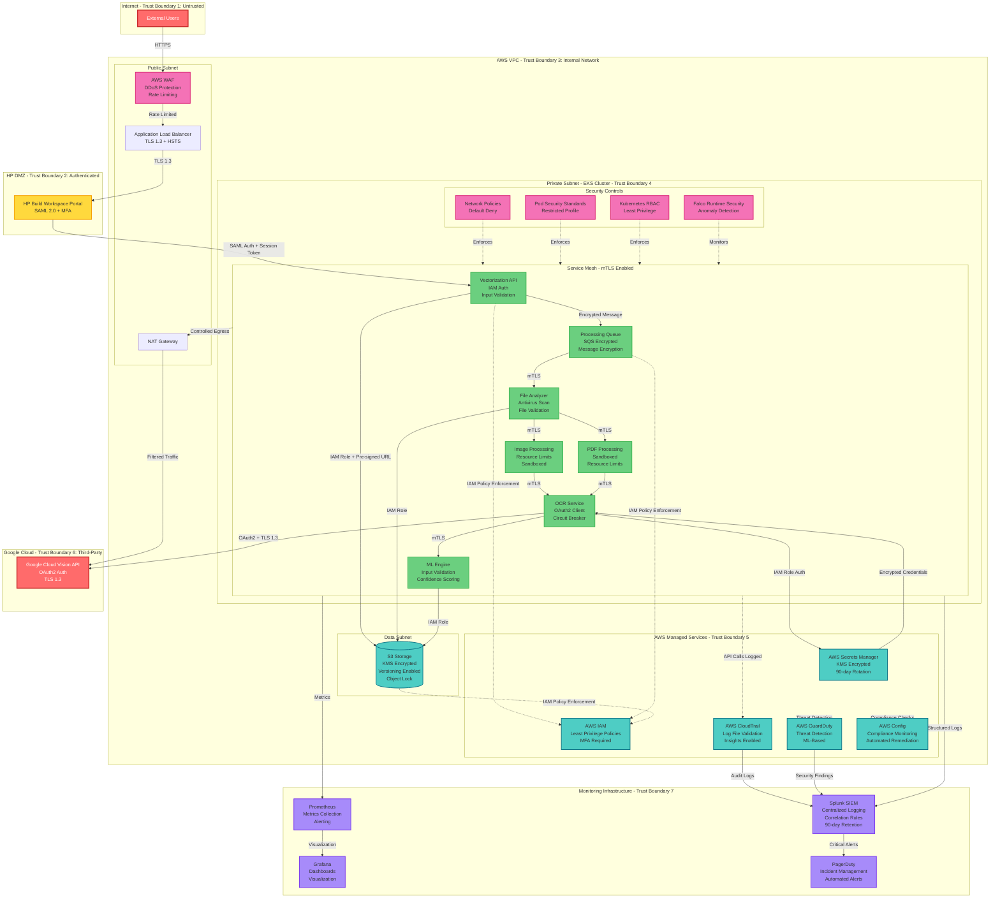

# EXECUTIVE SUMMARY

## System Overview

The Smart Digitization OCR system is a cloud-native document vectorization platform that processes Architecture, Engineering, and Construction (AEC) documents through optical character recognition using Google Cloud Vision API. Deployed on AWS EKS infrastructure, the system handles approximately 1.3K files per month with projected growth to 61K files by Q4 2026, supporting 30+ languages including Latin, Cyrillic, Arabic, and East Asian scripts.

## Key Security Decisions

**1. Zero-Trust Architecture**
- Implemented service mesh (Istio/Linkerd) with mutual TLS for all service-to-service communication
- Enforced least privilege IAM policies with explicit deny statements
- Deployed Kubernetes NetworkPolicies with default deny for all namespaces
- Implemented pod-level AWS authentication using IAM roles for service accounts (IRSA)

**2. Defense-in-Depth Data Protection**
- TLS 1.3 encryption enforced for all communications with HSTS headers
- AES-256 encryption at rest for all S3 buckets using AWS KMS customer-managed keys
- S3 Object Lock in compliance mode with 7-year retention for audit-critical documents
- Encrypted queue messages and VPC endpoints for all AWS service access

**3. Comprehensive Credential Management**
- All credentials stored exclusively in AWS Secrets Manager with KMS encryption
- Automated 90-day credential rotation with zero-downtime rotation
- Short-lived OAuth2 tokens (1-hour expiration) for Google Cloud Vision API access
- Credential leak detection scanning code repositories and public sources

**4. Multi-Layer Security Controls**
- Multi-factor authentication (MFA) mandatory for all user access via HP OneUID/SAML 2.0
- Multi-layer rate limiting: per-user (10 req/min), per-IP (50 req/min), global (1000 req/min)
- Container image scanning with Trivy blocking HIGH/CRITICAL vulnerabilities
- Pod Security Standards with restricted profile enforcement (non-root containers, read-only filesystems)

**5. Threat-Informed Monitoring**
- Centralized logging to Splunk with 90-day hot storage and 1-year cold storage
- SIEM correlation rules for multi-stage attack detection
- Real-time security dashboards displaying authentication rates, API errors, and security events
- Automated alerting for critical security events with PagerDuty integration

## Architecture Highlights

**Cloud-Native Infrastructure**
- AWS EKS cluster with horizontal pod autoscaling and cluster autoscaler
- Three-tier network architecture (public, private, data subnets) with VPC isolation
- Private EKS API endpoints with no public access
- AWS WAF with managed rule sets for DDoS protection

**Secure API Integration**
- OAuth2 authentication for Google Cloud Vision API with service account credentials
- Circuit breaker pattern with 5-minute cooldown after 5 consecutive failures
- Exponential backoff for API retries (initial 1s, max 60s)
- API request signing and response integrity verification

**Container Security**
- Signed container images using Docker Content Trust or Cosign
- Image promotion workflow (dev→staging→prod) with security gates
- Runtime security monitoring with Falco or Sysdig
- Container isolation using gVisor or Kata Containers for high-risk workloads

**Compliance Alignment**
- Mapped to 35 NIST SP 800-53 Rev 5 controls across 12 control families
- Aligned with OWASP Top 10 2021, OWASP API Security Top 10 2023, and OWASP ASVS v4.0
- Defends against 22 MITRE ATT&CK techniques across 8 tactics
- GDPR and CCPA compliance controls including data minimization and right to erasure

**Operational Excellence**
- Comprehensive audit logging with non-repudiation controls
- Automated incident response playbooks for common attack scenarios
- Quarterly incident response tabletop exercises
- Continuous compliance monitoring using AWS Config Rules

---

# FINAL ARCHITECTURE DIAGRAM

---

# SPRINT PLAN

## Sprint 1: Foundation & Core Infrastructure (MVP - Part 1)
**Duration:** 2 weeks  
**Goal:** Establish secure AWS infrastructure, EKS cluster, and basic authentication/authorization framework

### Components Covered
- AWS VPC with three-tier network architecture
- EKS cluster with security hardening
- IAM roles and policies
- AWS Secrets Manager integration
- Basic monitoring infrastructure

### User Stories

**US-001:** As a DevOps engineer, I want to provision a secure AWS VPC with three-tier network architecture so that the application has proper network segmentation and isolation.
- **Acceptance Criteria:**
  - VPC created with public, private, and data subnets across 3 availability zones
  - Security groups configured with least privilege rules (deny-by-default)
  - VPC endpoints configured for S3, Secrets Manager, and SQS
  - VPC Flow Logs enabled and forwarding to S3

**US-002:** As a security architect, I want to deploy an EKS cluster with Pod Security Standards so that containers run with minimal privileges and reduced attack surface.
- **Acceptance Criteria:**
  - EKS cluster deployed with private API endpoints
  - Pod Security Standards enforced with restricted profile
  - Kubernetes RBAC configured with least privilege service accounts
  - Container runtime configured to run non-root containers

**US-003:** As a security engineer, I want to configure AWS Secrets Manager with automated credential rotation so that service account credentials are securely stored and regularly rotated.
- **Acceptance Criteria:**
  - AWS Secrets Manager configured with KMS encryption
  - IAM policies enforcing least privilege access to secrets
  - Automated 90-day rotation configured for Google Cloud service account credentials
  - CloudTrail logging enabled for all Secrets Manager access

**US-004:** As a platform engineer, I want to deploy centralized logging to Splunk so that all security events and application logs are aggregated for monitoring and analysis.
- **Acceptance Criteria:**
  - Fluentd deployed as DaemonSet on all EKS nodes
  - Structured JSON logging configured with consistent timestamp format
  - Logs forwarding to Splunk using HEC over TLS
  - 90-day hot storage and 1-year cold storage retention configured

---

## Sprint 2: API Gateway & Authentication (MVP - Part 2)
**Duration:** 2 weeks  
**Goal:** Implement secure API gateway, user authentication, and file upload functionality

### Components Covered
- Application Load Balancer with TLS 1.3
- AWS WAF for DDoS protection
- Vectorization API with input validation
- HP OneUID/SAML 2.0 integration
- S3 storage with encryption

### User Stories

**US-005:** As a user, I want to authenticate using HP OneUID with MFA so that only authorized users can access the document vectorization service.
- **Acceptance Criteria:**
  - SAML 2.0 integration with HP OneUID implemented
  - MFA mandatory for all user authentication
  - Session management with 15-minute idle timeout and 8-hour maximum duration
  - Failed authentication attempts logged to Splunk with alerting on >5 failures in 5 minutes

**US-006:** As a security engineer, I want to deploy AWS WAF with rate limiting so that the API is protected against DDoS attacks and abuse.
- **Acceptance Criteria:**
  - AWS WAF deployed with managed rule sets (Core Rule Set, Known Bad Inputs, SQL Injection)
  - Rate-based rules configured (block IPs exceeding 2000 requests in 5 minutes)
  - Multi-layer rate limiting: per-user (10 req/min), per-IP (50 req/min), global (1000 req/min)
  - WAF logs forwarding to Splunk for analysis

**US-007:** As a user, I want to upload AEC documents (images and PDFs) through a secure API so that my files are processed for vectorization.
- **Acceptance Criteria:**
  - File upload API endpoint with TLS 1.3 encryption and HSTS headers
  - File size validation (20MB for images, 2000 pages for PDFs)
  - File type validation using magic number verification
  - Antivirus scanning with ClamAV before processing
  - Files stored in S3 with KMS encryption and versioning enabled

**US-008:** As a developer, I want comprehensive input validation on all API endpoints so that malicious inputs are rejected before processing.
- **Acceptance Criteria:**
  - JSON schema validation for all API requests
  - File content validation (not just extension checking)
  - Request size limits enforced (10MB max payload)
  - Input sanitization for all user-provided data
  - Validation failures logged with correlation IDs

---

## Sprint 3: OCR Integration & Processing Pipeline
**Duration:** 2 weeks  
**Goal:** Implement Google Cloud Vision API integration, processing queue, and file analysis components

### Components Covered
- Processing Queue (AWS SQS)
- File Analyzer service
- OCR Service with Google Cloud Vision API integration
- OAuth2 authentication flow
- Circuit breaker pattern

### User Stories

**US-009:** As a system, I want to queue file processing requests asynchronously so that the API can handle high volumes without blocking user requests.
- **Acceptance Criteria:**
  - AWS SQS queue configured with encryption at rest using KMS
  - Message payloads encrypted before queuing
  - Dead letter queue configured for failed processing attempts
  - Queue depth monitoring with alerts at >100 messages

**US-010:** As an OCR service, I want to authenticate with Google Cloud Vision API using OAuth2 so that API calls are securely authorized.
- **Acceptance Criteria:**
  - Service account credentials retrieved from AWS Secrets Manager using IAM role authentication
  - OAuth2 access tokens generated with 1-hour expiration
  - Token refresh mechanism implemented before expiration
  - Credential leak detection scanning code repositories
  - All authentication attempts logged to Splunk

**US-011:** As a system, I want to implement circuit breaker pattern for Google Cloud Vision API calls so that the service degrades gracefully during API outages.
- **Acceptance Criteria:**
  - Circuit breaker opens after 5 consecutive failures
  - 5-minute cooldown period before attempting recovery
  - Half-open state allows 3 test requests to check service recovery
  - Circuit breaker state transitions logged to Splunk
  - Fallback mechanism queues requests for retry

**US-012:** As a file analyzer, I want to validate and classify uploaded files so that only supported file types are processed and malicious files are rejected.
- **Acceptance Criteria:**
  - File type detection using magic number verification
  - Image format validation (JPEG, PNG, TIFF)
  - PDF structure validation before processing
  - Malicious file detection using antivirus scanning
  - File metadata extraction and logging

---

## Sprint 4: Image & PDF Processing with Security Hardening
**Duration:** 2 weeks  
**Goal:** Implement image and PDF processing services with sandboxing and resource controls

### Components Covered
- Image Processing service
- PDF Processing service
- Container sandboxing (gVisor/Kata Containers)
- Resource quotas and limits
- Runtime security monitoring

### User Stories

**US-013:** As an image processing service, I want to process images in sandboxed containers so that malicious images cannot compromise the host system.
- **Acceptance Criteria:**
  - Image processing containers run with gVisor or Kata Containers for enhanced isolation
  - Resource limits enforced (1GB memory, 2 CPU cores per container)
  - Image dimension validation (max 10000x10000 pixels)
  - 30-second timeout per image processing
  - ImageMagick configured with security policies enabled

**US-014:** As a PDF processing service, I want to parse PDFs in sandboxed containers so that malicious PDFs cannot exploit parser vulnerabilities.
- **Acceptance Criteria:**
  - PDF processing containers run with gVisor or Kata Containers
  - Resource limits enforced (2GB memory, 4 CPU cores per container)
  - PDF structure validation before parsing
  - 5-minute timeout per PDF processing
  - PDF libraries (PyPDF2, pdfplumber) updated to latest secure versions

**US-015:** As a security engineer, I want to deploy Falco for runtime security monitoring so that suspicious container behavior is detected and alerted.
- **Acceptance Criteria:**
  - Falco deployed as DaemonSet on all EKS nodes
  - Runtime policies configured to detect unexpected process execution, file modifications, and network connections
  - Falco alerts forwarding to Splunk with automated response for high-severity events
  - Runtime security dashboard created in Grafana

**US-016:** As a platform engineer, I want to implement resource quotas for all namespaces so that resource exhaustion attacks are prevented.
- **Acceptance Criteria:**
  - Resource quotas configured: 4 cores per pod, 16 cores per namespace
  - Memory limits: 2GB per pod, 8GB per namespace
  - Storage limits: 10GB per PVC, 50GB per namespace
  - LimitRanger admission controller enforcing default resource limits

---

## Sprint 5: ML Engine & Service Mesh
**Duration:** 2 weeks  
**Goal:** Implement ML engine for text processing and deploy service mesh for zero-trust networking

### Components Covered
- ML Engine service
- Service mesh (Istio/Linkerd) with mutual TLS
- Kubernetes NetworkPolicies
- Distributed tracing

### User Stories

**US-017:** As an ML engine, I want to process OCR results with confidence scoring so that low-quality extractions can be flagged for manual review.
- **Acceptance Criteria:**
  - ML engine processes text with geometric analysis
  - Confidence score thresholds implemented (minimum 0.7)
  - Low-confidence regions flagged for manual review
  - Input validation and sanitization for all ML inputs
  - Adversarial input detection using anomaly detection

**US-018:** As a security architect, I want to deploy a service mesh with mutual TLS so that all service-to-service communication is encrypted and authenticated.
- **Acceptance Criteria:**
  - Istio or Linkerd service mesh deployed across all namespaces
  - Mutual TLS configured in strict mode (reject plaintext connections)
  - Service mesh authorization policies enforcing fine-grained access control
  - mTLS certificate rotation automated with 90-day expiration
  - Service mesh metrics exported to Prometheus

**US-019:** As a network security engineer, I want to implement Kubernetes NetworkPolicies so that pod-to-pod communication is restricted to only necessary connections.
- **Acceptance Criteria:**
  - Default deny NetworkPolicies applied to all namespaces
  - Namespace-specific NetworkPolicies allowing only required pod-to-pod communication
  - Egress NetworkPolicies restricting external destinations to explicit allow list
  - NetworkPolicy violations logged to Splunk
  - NetworkPolicy compliance validated using kube-bench

**US-020:** As a developer, I want distributed tracing implemented so that request flows can be traced end-to-end for debugging and performance analysis.
- **Acceptance Criteria:**
  - Jaeger or AWS X-Ray deployed for distributed tracing
  - Correlation IDs propagated across all service calls
  - Trace data exported to Prometheus and Splunk
  - Tracing dashboard created in Grafana showing latency percentiles (p50, p95, p99)

---

## Sprint 6: Monitoring, Compliance & Production Readiness
**Duration:** 2 weeks  
**Goal:** Complete monitoring infrastructure, implement compliance controls, and prepare for production deployment

### Components Covered
- Prometheus and Grafana dashboards
- AWS GuardDuty and Security Hub
- Compliance monitoring (AWS Config)
- Incident response automation
- Production deployment validation

### User Stories

**US-021:** As a security operations engineer, I want comprehensive security dashboards so that I can monitor the security posture in real-time.
- **Acceptance Criteria:**
  - Security dashboard displaying authentication success/failure rates, API error rates, and security events
  - Real-time alerting for critical security events (failed auth >5 in 5 min, privilege escalation attempts, unusual API usage)
  - SIEM correlation rules implemented for multi-stage attack detection
  - Automated incident creation in PagerDuty for critical alerts

**US-022:** As a compliance officer, I want automated compliance monitoring so that the system continuously validates adherence to security standards.
- **Acceptance Criteria:**
  - AWS Config deployed with compliance rules for CIS AWS Foundations Benchmark
  - Compliance dashboard showing real-time compliance status
  - Automated remediation for common compliance violations
  - Quarterly compliance reports generated automatically
  - GDPR and CCPA compliance controls validated (data minimization, right to erasure)

**US-023:** As a security engineer, I want AWS GuardDuty and Security Hub integrated so that threats are detected using machine learning and aggregated findings are centralized.
- **Acceptance Criteria:**
  - AWS GuardDuty enabled with threat detection for VPC, S3, and IAM
  - AWS Security Hub aggregating findings from GuardDuty, Config, and IAM Access Analyzer
  - Security findings forwarding to Splunk with automated response for high-severity findings
  - Threat intelligence feeds integrated with Splunk

**US-024:** As a DevOps engineer, I want to validate production readiness so that the system meets all security, performance, and reliability requirements before go-live.
- **Acceptance Criteria:**
  - All HIGH and CRITICAL vulnerabilities remediated (container scanning, SAST, DAST)
  - Penetration testing completed with all findings addressed
  - Disaster recovery testing completed with RTO <4 hours and RPO <1 hour
  - Load testing completed supporting 61K files/month processing capacity
  - Security review and approval obtained from CISO

---

## Sprint Success Metrics

**Sprint 1-2 (MVP):**
- Infrastructure provisioned and secured
- User authentication functional with MFA
- File upload working with basic validation
- Centralized logging operational

**Sprint 3-4:**
- OCR processing functional with Google Cloud Vision API
- Circuit breaker and rate limiting operational
- Container sandboxing implemented
- Runtime security monitoring active

**Sprint 5-6:**
- ML engine processing OCR results
- Service mesh with mTLS operational
- Compliance monitoring active
- Production readiness validated

**Overall Success Criteria:**
- Zero HIGH/CRITICAL vulnerabilities in production
- 99.5% service availability achieved
- All 27 security requirements implemented
- Compliance with NIST SP 800-53, OWASP, and MITRE ATT&CK frameworks validated
- Security review and CISO approval obtained
