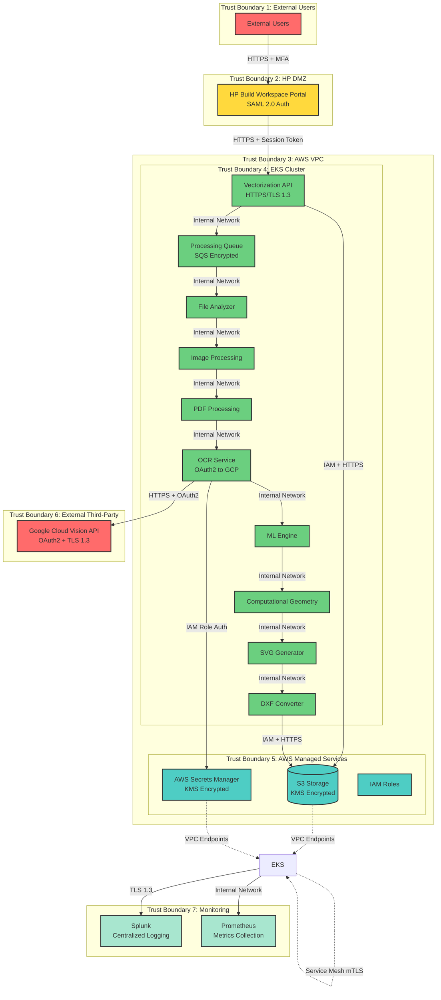

# Final Security Requirements Specification and Architecture Output

## Section 1: Final Security Requirements Specification (SRS)

### Authentication & Authorization

**SRS-001**: Implement strong multi-factor authentication for all user access  
**Source**: Threat Modeling Agent (T-001)  
**Mapped Threat**: T-001 (User impersonation and authentication bypass)  
**Description**: Deploy HP OneUID/SAML 2.0 integration with mandatory MFA for all users accessing HP Build Workspace Portal. Implement adaptive authentication with risk scoring based on user behavior, location, and device.

**SRS-002**: Enforce service identity verification and least privilege access  
**Source**: Threat Modeling Agent (T-005)  
**Mapped Threat**: T-005 (Unauthorized service attempts to retrieve Google Cloud credentials)  
**Description**: Implement IAM role-based authentication with EKS service accounts, enable AWS CloudTrail logging for all Secrets Manager access, implement IP-based access restrictions, and require MFA for manual credential access.

**SRS-003**: Secure Kubernetes control plane access  
**Source**: Threat Modeling Agent (T-024)  
**Mapped Threat**: T-024 (Unauthorized access to cluster management functions)  
**Description**: Enable RBAC with least privilege (no cluster-admin for applications), implement API server audit logging to CloudWatch, use private API endpoints, enable admission controllers, implement network policies restricting API server access.

**SRS-004**: Implement mutual authentication for service-to-service communication  
**Source**: Threat Modeling Agent (T-013, T-026)  
**Mapped Threat**: T-013, T-026 (Service impersonation within EKS cluster)  
**Description**: Deploy service mesh (Istio or Linkerd) with mutual TLS, use Kubernetes service accounts with token projection, enforce NetworkPolicies denying all traffic by default, implement pod identity with SPIFFE/SPIRE.

### Data Protection

**SRS-005**: Enforce encrypted communications with certificate validation  
**Source**: Threat Modeling Agent (T-002)  
**Mapped Threat**: T-002 (Man-in-the-middle attack modifying file upload requests)  
**Description**: Implement TLS 1.3 for all communications, enable HSTS headers with 1-year max-age, implement certificate pinning for mobile clients, use AWS Certificate Manager for certificate lifecycle management.

**SRS-006**: Encrypt all data in transit and at rest within processing pipeline  
**Source**: Threat Modeling Agent (T-004)  
**Mapped Threat**: T-004 (Sensitive document content exposed through insecure queue messages)  
**Description**: Enable AWS SQS encryption at rest using AWS KMS, encrypt message payloads before queuing, implement IAM policies restricting queue access to authorized services only, enable VPC endpoints for SQS.

**SRS-007**: Protect data confidentiality during third-party API calls  
**Source**: Threat Modeling Agent (T-007)  
**Mapped Threat**: T-007 (Sensitive document content exposed during API transmission)  
**Description**: Use TLS 1.3 encryption for all API calls, validate Google Cloud Vision API data handling policies and DPA compliance, implement data classification tagging, minimize data sent to API.

**SRS-008**: Implement defense-in-depth access controls for object storage  
**Source**: Threat Modeling Agent (T-010)  
**Mapped Threat**: T-010 (Unauthorized access to processed files and customer documents)  
**Description**: Enforce S3 bucket policies with explicit deny-by-default, enable S3 access logging to dedicated audit bucket, implement VPC endpoints for S3 access, use pre-signed URLs with 15-minute expiration.

**SRS-009**: Ensure integrity and immutability of stored data  
**Source**: Threat Modeling Agent (T-011)  
**Mapped Threat**: T-011 (Malicious modification of stored files or processing results)  
**Description**: Enable S3 versioning with MFA delete protection, implement S3 Object Lock for critical files (compliance mode, 7-year retention), use S3 bucket encryption with AWS KMS customer-managed keys.

**SRS-010**: Encrypt data during replication and transit  
**Source**: Threat Modeling Agent (T-022)  
**Mapped Threat**: T-022 (Data intercepted during S3 cross-region replication)  
**Description**: Enable S3 replication with SSE-KMS encryption, implement S3 bucket versioning for replication tracking, use VPC endpoints for replication traffic.

### Secrets Management

**SRS-011**: Implement least privilege access and credential rotation  
**Source**: Threat Modeling Agent (T-009)  
**Mapped Threat**: T-009 (Compromised IAM role gains access to service account credentials)  
**Description**: Enforce least privilege IAM policies with explicit deny for unauthorized actions, enable MFA for credential rotation operations, audit access logs daily, rotate credentials every 90 days automatically.

**SRS-012**: Implement secure credential management and monitoring  
**Source**: Threat Modeling Agent (T-018)  
**Mapped Threat**: T-018 (Stolen or leaked service account credentials used for unauthorized API access)  
**Description**: Store credentials exclusively in AWS Secrets Manager with KMS encryption, implement automated 90-day credential rotation, monitor for unusual API usage patterns, use short-lived tokens (1-hour expiration).

### Logging & Monitoring

**SRS-013**: Implement comprehensive audit logging with non-repudiation controls  
**Source**: Threat Modeling Agent (T-003)  
**Mapped Threat**: T-003 (User denies submitting malicious or inappropriate content)  
**Description**: Log user identity, timestamp, source IP, file hash (SHA-256), and file metadata to Splunk, implement log integrity verification, maintain 90-day hot storage and 1-year cold storage.

**SRS-014**: Ensure log integrity and immutability  
**Source**: Threat Modeling Agent (T-015)  
**Mapped Threat**: T-015 (Logs tampered with to hide malicious activity)  
**Description**: Use write-once log storage with WORM compliance, implement cryptographic log integrity verification (SHA-256 hashing), enforce TLS 1.3 for log transmission.

**SRS-015**: Secure monitoring endpoints and sanitize metrics  
**Source**: Threat Modeling Agent (T-016)  
**Mapped Threat**: T-016 (Sensitive operational data exposed through metrics endpoints)  
**Description**: Implement authentication for Prometheus endpoints using OAuth2 or basic auth, sanitize metric labels removing PII and sensitive data, use Kubernetes NetworkPolicies restricting access to monitoring namespace.

**SRS-016**: Implement secure logging practices and data sanitization  
**Source**: Threat Modeling Agent (T-027)  
**Mapped Threat**: T-027 (Sensitive data exposure through application logs or error messages)  
**Description**: Sanitize logs removing PII, credentials, and sensitive data, implement structured logging with consistent format, use log levels appropriately, implement error handling without stack trace exposure to users.

### API Security

**SRS-017**: Ensure integrity and authenticity of API communications  
**Source**: Threat Modeling Agent (T-006)  
**Mapped Threat**: T-006 (API request/response intercepted and modified in transit)  
**Description**: Enforce TLS 1.3 with certificate validation, implement request signing using OAuth2 tokens, validate response integrity using checksums, implement timeout controls (30 second max).

**SRS-018**: Implement rate limiting and request throttling controls  
**Source**: Threat Modeling Agent (T-008)  
**Mapped Threat**: T-008 (API rate limits exceeded causing service disruption)  
**Description**: Enforce 1800 requests/minute limit, implement circuit breaker pattern with 5-minute cooldown, use exponential backoff (initial 1s, max 60s), implement queue-based processing with priority levels.

**SRS-019**: Implement multi-layer rate limiting and DDoS protection  
**Source**: Threat Modeling Agent (T-023)  
**Mapped Threat**: T-023 (Distributed attack bypassing rate limiting controls)  
**Description**: Implement per-user rate limiting (10 req/min), per-IP limiting (50 req/min), and global limiting (1000 req/min), deploy AWS WAF with rate-based rules, implement CAPTCHA for suspicious patterns.

**SRS-020**: Implement file validation and resource limits  
**Source**: Threat Modeling Agent (T-017)  
**Mapped Threat**: T-017 (Large file uploads or malicious files causing resource exhaustion)  
**Description**: Enforce file size limits (20MB for images, 2000 pages for PDFs), validate file types using magic number verification, implement antivirus scanning with ClamAV, apply rate limiting per user (10 files/minute).

### Infrastructure / Architecture Security

**SRS-021**: Harden container runtime and implement defense-in-depth  
**Source**: Threat Modeling Agent (T-012)  
**Mapped Threat**: T-012 (Container escape leading to node compromise)  
**Description**: Implement Pod Security Standards (restricted profile), enforce non-root containers (runAsNonRoot: true), enable SELinux or AppArmor profiles, scan images with Trivy blocking HIGH/CRITICAL vulnerabilities.

**SRS-022**: Implement input validation and ML security controls  
**Source**: Threat Modeling Agent (T-014)  
**Mapped Threat**: T-014 (Malicious input designed to poison ML model or extract training data)  
**Description**: Validate all inputs against expected schemas, implement confidence score thresholds (minimum 0.7), isolate ML processing in dedicated namespace, monitor for adversarial inputs using anomaly detection.

**SRS-023**: Implement secure file processing with sandboxing  
**Source**: Threat Modeling Agent (T-019)  
**Mapped Threat**: T-019 (Malicious PDF exploiting parser vulnerabilities)  
**Description**: Process PDFs in sandboxed containers with gVisor or Kata Containers, validate PDF structure before processing, implement resource limits (2GB memory, 4 CPU cores max), scan with antivirus before processing.

**SRS-024**: Implement image validation and resource controls  
**Source**: Threat Modeling Agent (T-020)  
**Mapped Threat**: T-020 (Image bombs or malicious images causing memory exhaustion)  
**Description**: Validate image dimensions before processing (max 10000x10000 pixels), implement memory limits (1GB per container), process in isolated containers with resource quotas, implement 30-second timeout per image.

**SRS-025**: Ensure output integrity and prevent injection attacks  
**Source**: Threat Modeling Agent (T-021)  
**Mapped Threat**: T-021 (Malicious code injection into generated DXF files)  
**Description**: Validate DXF output format against schema, sanitize all text content removing special characters, implement output scanning for malicious patterns, use secure serialization libraries.

**SRS-026**: Implement container image security and supply chain controls  
**Source**: Threat Modeling Agent (T-025)  
**Mapped Threat**: T-025 (Malicious container images deployed to production)  
**Description**: Sign container images using Docker Content Trust or Cosign, implement image scanning in CI/CD with Trivy or Snyk, use private ECR registry with IAM authentication, enable vulnerability scanning on push.

**SRS-027**: Implement zero-trust networking within cluster  
**Source**: Threat Modeling Agent (T-026)  
**Mapped Threat**: T-026 (Internal service impersonation within EKS cluster)  
**Description**: Deploy service mesh (Istio/Linkerd) with mutual TLS for all service communication, use Kubernetes NetworkPolicies with default deny, enforce pod identity using service accounts, implement SPIFFE/SPIRE for workload identity.

## Section 2: Final Architecture Output

### Architecture Summary

The Smart Digitization OCR system is a cloud-based document vectorization solution deployed on AWS EKS infrastructure that processes customer documents through optical character recognition and machine learning. The system consists of a web-based HP Build Workspace Portal for user access, a Vectorization API as the entry point, and a processing pipeline including File Analyzer, Image Processing, PDF Processing, and OCR Service components. The OCR Service integrates with Google Cloud Vision API using OAuth2 authentication and credentials stored in AWS Secrets Manager. The system uses AWS S3 for document storage with encryption at rest and in transit, and includes comprehensive monitoring through Splunk and Prometheus. The architecture implements multiple trust boundaries with the EKS cluster serving as the core processing environment, AWS managed services providing secure infrastructure components, and external integration with Google Cloud Vision API for OCR processing. Security is enforced through IAM roles, VPC isolation, service mesh with mutual TLS, and comprehensive audit logging.

### Mermaid Diagram

