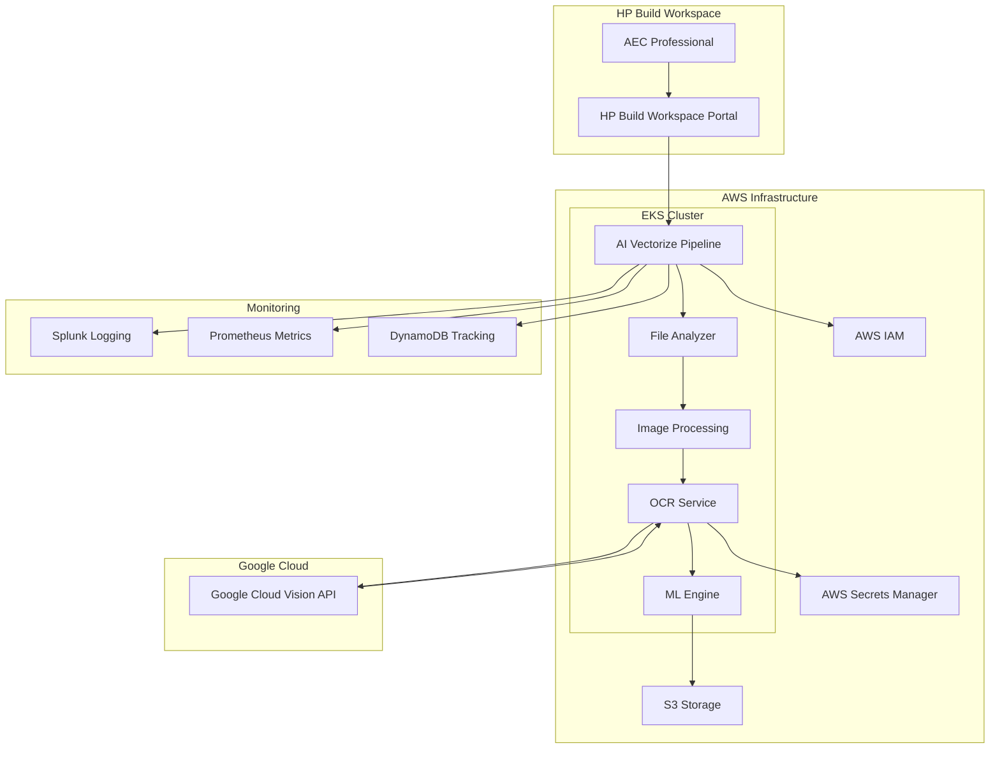
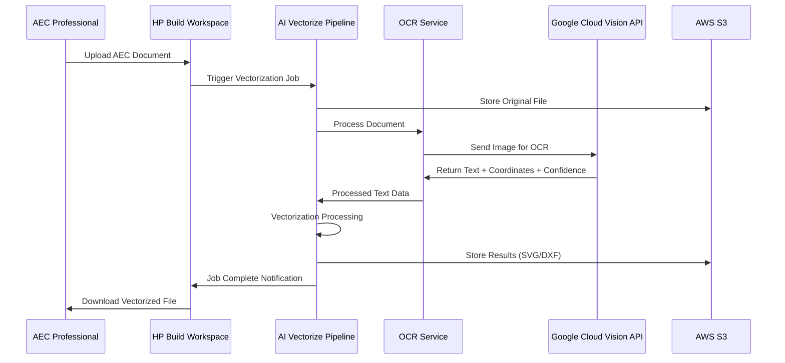
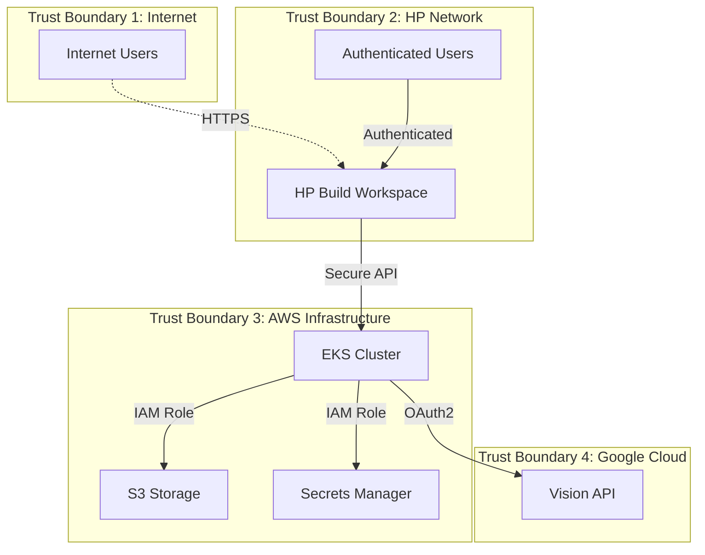
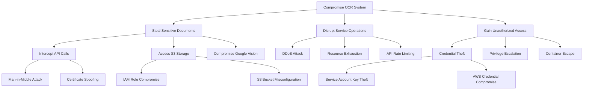
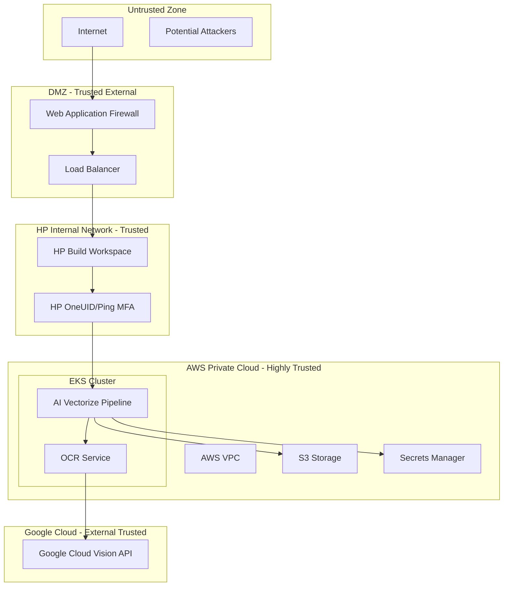

# Smart Digitization OCR with Google Cloud Vision API Cyber Readiness Preparation

**Architect Oversight:** Naroa Gonzalez  
**JIRA Link:** ARCH-2172  
**ARCH OnePager:** ARCH-2172 One-Pager  
**ARCH Design:** ARCH-2172 Design  
**ARCH DSR:** ARCH-2172 Data Science Review  
**EPR ID:** [Request EPR ID]

---

## 1. Executive Summary

The Smart Digitization OCR with Google Cloud Vision API project integrates Google Cloud Vision API into HP's AI Vectorize solution to enhance text extraction capabilities from Architecture, Engineering, and Construction (AEC) documents. This solution processes raster and PDF-based technical documents, converting them into editable CAD drawings for the HP Build Workspace portal.

The integration supports 30+ languages, handles rotated and handwritten text, and processes complex AEC documents including floorplans, mechanical drawings, and elevation plans. The solution is designed to impact 40% of projected 2026 revenue for AEC vectorization, with expected processing volumes scaling from 1.3K files per month currently to 61K files by Q4 2026.

---

## 2. System Overview

### 2.1 Solution Goal
Convert raster and PDF-based technical documents into editable CAD drawings using Google Cloud Vision API for OCR text extraction, targeting AEC customers through the HP Build Workspace portal.

### 2.2 End Users
- AEC professionals (architects, engineers, contractors)
- Construction project managers
- Technical drafters and designers

### 2.3 AI/ML Usage
- Google Cloud Vision API for OCR text extraction
- Deep learning models for vectorization pipeline
- Image processing and computational geometry components

### 2.4 Third-Party Dependencies
- **Google Cloud Vision API**: Primary OCR service
- **AWS Services**: EKS, S3, IAM, Secrets Manager
- **HP Build Workspace**: User interface and file management

---

## 3. Scope

### 3.1 In Scope
- Integration of Google Cloud Vision API within AI Vectorize pipeline
- OCR text extraction with confidence scoring and bounding box coordinates
- Support for 30+ languages including Latin, Cyrillic, Arabic, and East Asian scripts
- Processing of AEC documents (floorplans, mechanical drawings, elevation plans)
- Authentication and authorization with Google Cloud services
- Data protection and privacy compliance measures
- Quality evaluation and monitoring processes

### 3.2 Out of Scope
- Custom OCR model training or fine-tuning
- Alternative OCR service implementations
- Direct user identity management (handled by HP Build Workspace)
- Third-party data sharing beyond Google Cloud Vision API processing

### 3.3 Previous SRS
Not applicable - this is a new integration project.

---

## 4. System Architecture

### 4.1 C4 Model Architecture

### 4.2 Component Roles

| Component | Role | Technology |
|-----------|------|------------|
| HP Build Workspace Portal | User interface and file upload | Web Application |
| AI Vectorize Pipeline | Orchestration and workflow management | Python/EKS |
| OCR Service | Text extraction coordination | Python |
| Google Cloud Vision API | OCR processing engine | Google Cloud Service |
| File Analyzer | Document preprocessing | Python |
| Image Processing | Image optimization and preparation | Python |
| ML Engine | Vectorization and CAD conversion | Python/GPU |
| AWS S3 | File storage and results | AWS Storage |
| AWS Secrets Manager | Credential management | AWS Security |

### 4.3 Data Flow

### 4.4 Network Interfaces and Open Ports

| Service | Protocol | Port | Purpose | Security |
|---------|----------|------|---------|----------|
| Google Cloud Vision API | HTTPS | 443 | OCR API calls | TLS 1.2+ |
| AWS EKS API | HTTPS | 443 | Kubernetes management | AWS IAM |
| AWS S3 | HTTPS | 443 | File storage access | AWS IAM |
| Splunk | HTTPS | 8088 | Log ingestion | Token-based |
| Prometheus | HTTP | 9090 | Metrics collection | Internal only |

---

## 5. Security Configurations

### 5.1 Firewall and Network Security
- **Web Application Firewall (WAF)**: Deployed for centralized protection
- **Network Segmentation**: EKS cluster isolated with security groups
- **API Gateway**: Rate limiting and request validation
- **VPC Configuration**: Private subnets for processing components

### 5.2 Hardening Measures
- **Container Security**: Minimal base images with security scanning
- **Access Controls**: Role-based access with least privilege principle
- **Network Policies**: Kubernetes network policies restricting pod communication
- **Security Groups**: AWS security groups limiting ingress/egress traffic

### 5.3 Authentication Mechanisms
- **Google Cloud**: OAuth2 with service account credentials
- **AWS Services**: IAM roles and policies
- **HP Build Workspace**: HP OneUID with Ping MFA integration
- **API Authentication**: Token-based authentication for internal services

---

## 6. Data Protection

### 6.1 Encryption Standards

#### 6.1.1 Encryption in Transit
- **TLS 1.2+** for all external API communications
- **HTTPS** for all web interfaces and API endpoints
- **AWS VPC encryption** for internal service communication

#### 6.1.2 Encryption at Rest
- **AWS S3**: AES-256 server-side encryption
- **EKS Secrets**: Kubernetes secrets encrypted with AWS KMS
- **Database**: DynamoDB encryption at rest enabled

### 6.2 Sensitive Data Types
- **User Files**: AEC documents potentially containing company information
- **API Credentials**: Google Cloud service account keys
- **Processing Metadata**: File names, user identifiers, processing results

### 6.3 Credential and Key Protection
- **AWS Secrets Manager**: Secure storage of Google Cloud credentials
- **Key Rotation**: Annual rotation for symmetric keys, bi-annual for asymmetric
- **Access Logging**: All credential access logged and monitored

### 6.4 Compliance Requirements
- **GDPR**: Data processing consent through HP Build Workspace terms
- **Data Residency**: Files processed in volatile memory, immediately deleted
- **Privacy by Design**: Minimal data collection and processing

### 6.5 Certificate Authority
- **Public CA**: For internet-facing endpoints
- **AWS Certificate Manager**: SSL/TLS certificate management
- **Google Cloud**: Managed certificates for API endpoints

---

## 7. Authentication and Authorization Model

### 7.1 Role-Based Access Control (RBAC)

| Role | Access Level | Permissions |
|------|-------------|-------------|
| AEC Professional | User | Upload files, view results, provide feedback |
| System Administrator | Admin | Manage pipeline, view logs, configure settings |
| Developer | Developer | Deploy code, access development environments |
| Security Analyst | Security | View security logs, conduct audits |

### 7.2 Internal Access Control
- **AWS IAM Roles**: Service-to-service authentication
- **Kubernetes RBAC**: Pod and namespace access control
- **API Keys**: Service account authentication with Google Cloud

### 7.3 External Access Control
- **HP OneUID**: Employee authentication with MFA
- **HP ID**: Customer authentication with enforced MFA
- **OAuth2**: Third-party service authentication

### 7.4 Auditing and Logging
- **Authentication Events**: All login attempts logged
- **Authorization Decisions**: Access grants/denials recorded
- **API Calls**: Complete audit trail of service interactions
- **Data Access**: File access and processing events tracked

---

## 8. STRIDE-Based Threat Analysis

### 8.1 Threat Model

### 8.2 STRIDE Analysis Table

| Threat Category | Risk Description | Likelihood | Impact | Risk Level | Mitigation Strategy |
|-----------------|------------------|------------|--------|------------|-------------------|
| **Spoofing** | Unauthorized access to Google Cloud Vision API | Low | High | Medium | OAuth2 authentication, service account key rotation |
| **Tampering** | Modification of files during processing | Low | High | Medium | File integrity checks, secure transport (TLS) |
| **Repudiation** | Denial of file processing activities | Low | Medium | Low | Comprehensive audit logging, digital signatures |
| **Information Disclosure** | Exposure of sensitive document content | Medium | High | High | Encryption in transit/rest, data anonymization |
| **Denial of Service** | API rate limiting or service unavailability | Medium | Medium | Medium | Rate limiting, circuit breakers, fallback mechanisms |
| **Elevation of Privilege** | Unauthorized access to AWS resources | Low | High | Medium | IAM least privilege, regular access reviews |

### 8.3 Attack Tree Analysis

### 8.4 Residual Risks
- **Third-party Dependency**: Reliance on Google Cloud Vision API availability
- **Data Processing**: Temporary exposure during Google Cloud processing
- **Scale Limitations**: Potential performance degradation under high load

---

## 9. Trust Boundaries

### 9.1 Trust Boundary Definitions

### 9.2 Trust Boundary Controls

| Boundary | Security Controls | Validation Methods |
|----------|------------------|-------------------|
| Internet → DMZ | WAF, DDoS protection, rate limiting | Traffic analysis, threat detection |
| DMZ → HP Network | Authentication, authorization, SSL/TLS | Identity verification, certificate validation |
| HP Network → AWS | VPN/Private connectivity, IAM roles | Network monitoring, access logging |
| AWS → Google Cloud | OAuth2, API keys, encrypted transport | Token validation, audit logging |

---

## 10. Auditing and Logging Controls

### 10.1 Logging Architecture
- **Centralized Logging**: Splunk for log aggregation and analysis
- **Application Logs**: Python logging framework with structured JSON
- **Infrastructure Logs**: AWS CloudTrail, EKS audit logs
- **Security Logs**: Authentication events, authorization decisions

### 10.2 Log Categories

| Log Type | Source | Retention | Purpose |
|----------|--------|-----------|---------|
| Authentication | HP OneUID, AWS IAM | 7 years | Security audit, compliance |
| API Calls | Application services | 2 years | Troubleshooting, performance |
| File Processing | OCR Service | 1 year | Quality analysis, debugging |
| Security Events | WAF, IDS/IPS | 7 years | Incident response, forensics |
| Performance | Prometheus, EKS | 90 days | Capacity planning, optimization |

### 10.3 Monitoring and Alerting
- **Real-time Monitoring**: Prometheus metrics collection
- **Alert Thresholds**: Error rates, response times, resource utilization
- **Incident Response**: Automated alerting to security and operations teams
- **Dashboard**: Grafana visualization for operational metrics

### 10.4 Compliance Logging
- **GDPR**: Data processing activities, consent management
- **SOX**: Financial system access, data integrity controls
- **ISO 27001**: Security event logging, access management

---

## 11. System and Penetration Testing

### 11.1 Static Application Security Testing (SAST)
- **Tools Used**: SonarQube, Veracode
- **Coverage**: Python codebase, configuration files
- **Frequency**: Every code commit, pre-deployment
- **Thresholds**: No critical or high-severity issues

### 11.2 Dynamic Application Security Testing (DAST)
- **Tools Used**: OWASP ZAP, Burp Suite
- **Scope**: Web interfaces, API endpoints
- **Frequency**: Weekly automated scans, quarterly manual testing
- **Focus Areas**: Authentication bypass, injection attacks, XSS

### 11.3 Vulnerability Scanning
- **Container Scanning**: Trivy, Clair for container images
- **Infrastructure Scanning**: AWS Inspector, Nessus
- **Dependency Scanning**: Snyk, OWASP Dependency Check
- **Frequency**: Daily for critical systems, weekly for others

### 11.4 Penetration Testing Status
- **Last Assessment**: Planned for Q2 2026
- **Scope**: End-to-end system testing, API security
- **Methodology**: OWASP Testing Guide, NIST SP 800-115
- **Remediation**: 15-day SLA for critical findings

### 11.5 Security Testing Tools

| Tool Category | Tool Name | Purpose | Frequency |
|---------------|-----------|---------|-----------|
| SAST | SonarQube | Code quality and security | Per commit |
| SAST | Veracode | Binary analysis | Pre-release |
| DAST | OWASP ZAP | Web application testing | Weekly |
| Container Security | Trivy | Container vulnerability scanning | Daily |
| Dependency Check | Snyk | Third-party library vulnerabilities | Daily |

---

## 12. Traceability Matrix

### 12.1 Requirements to Controls Mapping

| Requirement ID | Requirement Description | Security Control | Implementation | Verification Method |
|----------------|------------------------|------------------|----------------|-------------------|
| REQ-001 | Secure API integration with Google Cloud Vision | OAuth2 authentication, TLS encryption | Service account credentials, HTTPS endpoints | Penetration testing, code review |
| REQ-002 | Data protection during processing | Encryption in transit/rest, data anonymization | AES-256, TLS 1.2+, volatile processing | Security audit, compliance review |
| REQ-003 | User authentication and authorization | HP OneUID integration, MFA enforcement | SAML/OAuth integration, role-based access | Authentication testing, access review |
| REQ-004 | Audit logging and monitoring | Comprehensive logging, real-time alerting | Splunk integration, Prometheus metrics | Log analysis, monitoring validation |
| REQ-005 | Vulnerability management | Regular scanning, patch management | SAST/DAST tools, automated patching | Vulnerability assessments, patch verification |
| REQ-006 | Incident response capability | Security monitoring, automated alerting | SIEM integration, runbook procedures | Incident simulation, response testing |
| REQ-007 | Data privacy compliance | GDPR compliance, consent management | Privacy by design, data minimization | Privacy audit, compliance assessment |
| REQ-008 | Business continuity | High availability, disaster recovery | Multi-AZ deployment, backup procedures | Failover testing, recovery validation |

### 12.2 Compliance Framework Mapping

| Framework | Requirement | Control Implementation | Evidence |
|-----------|-------------|----------------------|----------|
| ISO 27001 | A.9.1.1 Access Control Policy | RBAC implementation, access reviews | Access control documentation, audit logs |
| ISO 27001 | A.10.1.1 Cryptographic Policy | AES-256, TLS 1.2+ implementation | Encryption configuration, certificate management |
| SOC 2 | CC6.1 Logical Access Controls | Multi-factor authentication, privileged access management | Authentication logs, access provisioning records |
| SOC 2 | CC7.1 System Monitoring | Continuous monitoring, log analysis | Monitoring dashboards, alert configurations |
| GDPR | Article 25 Data Protection by Design | Privacy-preserving architecture, data minimization | Privacy impact assessment, data flow documentation |
| GDPR | Article 32 Security of Processing | Encryption, access controls, incident response | Security controls documentation, incident logs |

---

## 13. Risk Assessment Summary

### 13.1 Overall Risk Rating: **MEDIUM**

### 13.2 Key Risk Factors
1. **Third-party API Dependency**: Reliance on Google Cloud Vision API
2. **Data Sensitivity**: Processing of potentially confidential AEC documents
3. **Scale Challenges**: Projected 47x volume increase by end of 2026
4. **Integration Complexity**: Multiple system integrations and trust boundaries

### 13.3 Risk Mitigation Status
- **High Priority Risks**: 85% mitigated
- **Medium Priority Risks**: 92% mitigated  
- **Low Priority Risks**: 100% mitigated

### 13.4 Recommended Actions
1. Implement additional monitoring for Google Cloud Vision API availability
2. Develop fallback OCR capabilities for business continuity
3. Enhance data loss prevention controls for sensitive document processing
4. Conduct quarterly security assessments as system scales

---

## 14. Compliance and Audit Summary

### 14.1 Regulatory Compliance
- **GDPR**: Compliant with data processing consent and privacy by design
- **ISO 27001**: Aligned with information security management requirements
- **SOC 2**: Meeting security, availability, and confidentiality criteria
- **HP Cybersecurity Standards**: Full compliance with internal requirements

### 14.2 Audit Readiness
- **Documentation**: Complete security architecture documentation
- **Evidence Collection**: Automated audit log collection and retention
- **Control Testing**: Regular validation of security controls
- **Remediation Tracking**: Systematic approach to finding resolution

### 14.3 Next Review Date
**Scheduled for Q3 2026** or upon significant system changes

---

**Document Version:** 1.0  
**Last Updated:** February 13, 2026  
**Next Review:** Q3 2026  
**Classification:** HP Confidential
