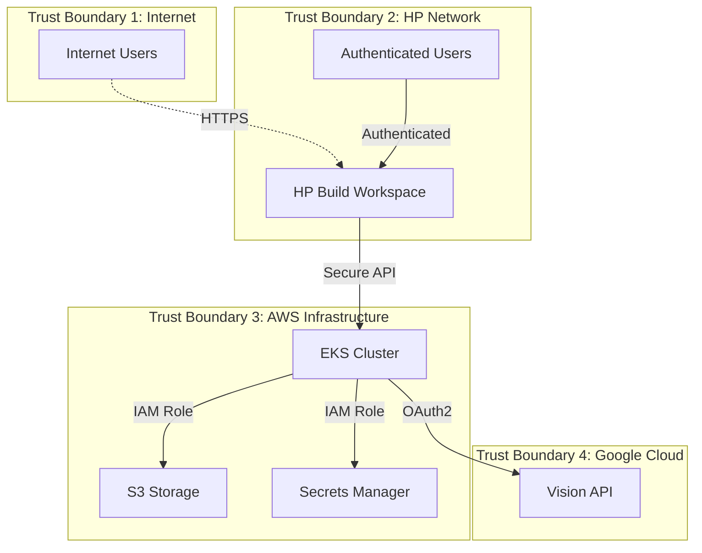
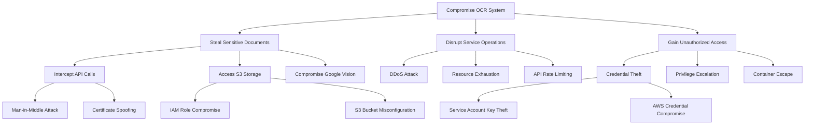
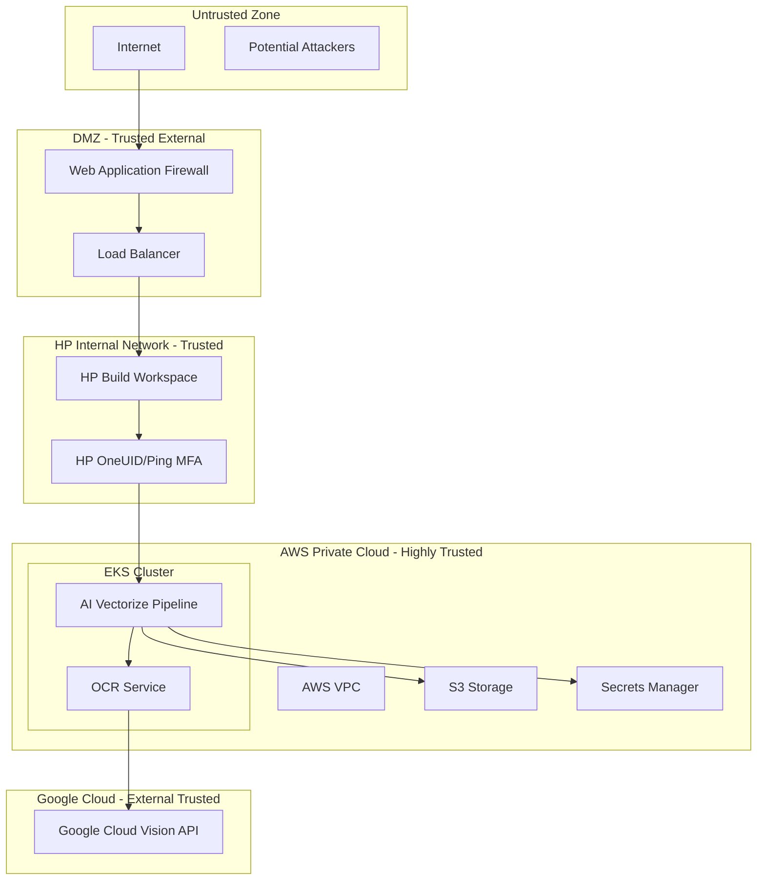

# Smart Digitization OCR with Google Cloud Vision API Cyber Readiness Preparation

## 8. STRIDE-Based Threat Analysis

### 8.1 Threat Model

### 8.2 STRIDE Analysis Table

| Threat Category | Risk Description | Likelihood | Impact | Risk Level | Mitigation Strategy |
|-----------------|------------------|------------|--------|------------|-------------------|
| **Spoofing** | Unauthorized access to Google Cloud Vision API | Low | High | Medium | OAuth2 authentication, service account key rotation |
| **Tampering** | Modification of files during processing | Low | High | Medium | File integrity checks, secure transport (TLS) |
| **Repudiation** | Denial of file processing activities | Low | Medium | Low | Comprehensive audit logging, digital signatures |
| **Information Disclosure** | Exposure of sensitive document content | Medium | High | High | Encryption in transit/rest, data anonymization |
| **Denial of Service** | API rate limiting or service unavailability | Medium | Medium | Medium | Rate limiting, circuit breakers, fallback mechanisms |
| **Elevation of Privilege** | Unauthorized access to AWS resources | Low | High | Medium | IAM least privilege, regular access reviews |

### 8.3 Attack Tree Analysis

### 8.4 Residual Risks
- **Third-party Dependency**: Reliance on Google Cloud Vision API availability
- **Data Processing**: Temporary exposure during Google Cloud processing
- **Scale Limitations**: Potential performance degradation under high load

---

## 9. Trust Boundaries

### 9.1 Trust Boundary Definitions

### 9.2 Trust Boundary Controls

| Boundary | Security Controls | Validation Methods |
|----------|------------------|-------------------|
| Internet → DMZ | WAF, DDoS protection, rate limiting | Traffic analysis, threat detection |
| DMZ → HP Network | Authentication, authorization, SSL/TLS | Identity verification, certificate validation |
| HP Network → AWS | VPN/Private connectivity, IAM roles | Network monitoring, access logging |
| AWS → Google Cloud | OAuth2, API keys, encrypted transport | Token validation, audit logging |

---

## 10. Auditing and Logging Controls

### 10.1 Logging Architecture
- **Centralized Logging**: Splunk for log aggregation and analysis
- **Application Logs**: Python logging framework with structured JSON
- **Infrastructure Logs**: AWS CloudTrail, EKS audit logs
- **Security Logs**: Authentication events, authorization decisions

### 10.2 Log Categories

| Log Type | Source | Retention | Purpose |
|----------|--------|-----------|---------|
| Authentication | HP OneUID, AWS IAM | 7 years | Security audit, compliance |
| API Calls | Application services | 2 years | Troubleshooting, performance |
| File Processing | OCR Service | 1 year | Quality analysis, debugging |
| Security Events | WAF, IDS/IPS | 7 years | Incident response, forensics |
| Performance | Prometheus, EKS | 90 days | Capacity planning, optimization |

### 10.3 Monitoring and Alerting
- **Real-time Monitoring**: Prometheus metrics collection
- **Alert Thresholds**: Error rates, response times, resource utilization
- **Incident Response**: Automated alerting to security and operations teams
- **Dashboard**: Grafana visualization for operational metrics

### 10.4 Compliance Logging
- **GDPR**: Data processing activities, consent management
- **SOX**: Financial system access, data integrity controls
- **ISO 27001**: Security event logging, access management

---

## 11. System and Penetration Testing

### 11.1 Static Application Security Testing (SAST)
- **Tools Used**: SonarQube, Veracode
- **Coverage**: Python codebase, configuration files
- **Frequency**: Every code commit, pre-deployment
- **Thresholds**: No critical or high-severity issues

### 11.2 Dynamic Application Security Testing (DAST)
- **Tools Used**: OWASP ZAP, Burp Suite
- **Scope**: Web interfaces, API endpoints
- **Frequency**: Weekly automated scans, quarterly manual testing
- **Focus Areas**: Authentication bypass, injection attacks, XSS

### 11.3 Vulnerability Scanning
- **Container Scanning**: Trivy, Clair for container images
- **Infrastructure Scanning**: AWS Inspector, Nessus
- **Dependency Scanning**: Snyk, OWASP Dependency Check
- **Frequency**: Daily for critical systems, weekly for others

### 11.4 Penetration Testing Status
- **Last Assessment**: Planned for Q2 2026
- **Scope**: End-to-end system testing, API security
- **Methodology**: OWASP Testing Guide, NIST SP 800-115
- **Remediation**: 15-day SLA for critical findings

### 11.5 Security Testing Tools

| Tool Category | Tool Name | Purpose | Frequency |
|---------------|-----------|---------|-----------|
| SAST | SonarQube | Code quality and security | Per commit |
| SAST | Veracode | Binary analysis | Pre-release |
| DAST | OWASP ZAP | Web application testing | Weekly |
| Container Security | Trivy | Container vulnerability scanning | Daily |
| Dependency Check | Snyk | Third-party library vulnerabilities | Daily |

---
