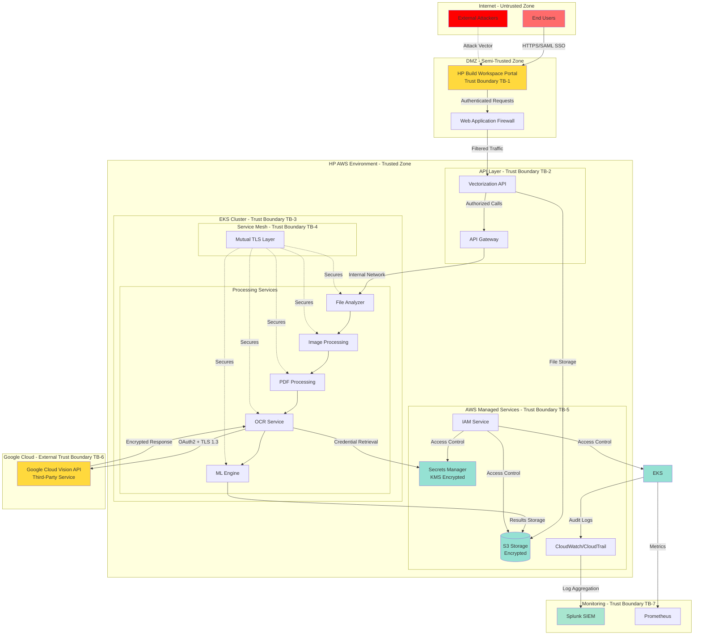

# STRIDE-Based Threat Modeling Analysis

## STRIDE-Based Threat Analysis

| Threat ID | Component | STRIDE Category | Threat Description | Risk Level | Mitigation Strategy |
|-----------|-----------|-----------------|-------------------|------------|---------------------|
| T-001 | Google Cloud Vision API Authentication | Spoofing | Attacker impersonates the service by stealing OAuth2 credentials from AWS Secrets Manager | Critical | • Implement credential rotation every 90 days • Enable AWS CloudTrail for Secrets Manager access logging • Implement IP whitelisting for API calls • Use AWS KMS for additional encryption layer • Monitor for unusual authentication patterns |
| T-002 | HP Build Workspace Portal | Spoofing | Attacker bypasses SSO/SAML authentication to submit malicious files | High | • Enforce MFA for all user accounts • Implement session timeout policies • Monitor failed authentication attempts • Use SAML assertion encryption • Implement anti-CSRF tokens |
| T-003 | File Upload Interface | Tampering | Malicious file injection containing exploits or malware during upload | High | • Implement file type validation and sanitization • Use antivirus scanning before processing • Enforce file size limits • Validate file headers and magic numbers • Sandbox file processing environment |
| T-004 | Data in Transit to Google Cloud Vision API | Tampering | Man-in-the-middle attack intercepting and modifying data sent to external API | High | • Enforce TLS 1.3 with certificate pinning • Implement request signing • Validate API response integrity • Use mutual TLS authentication • Monitor for certificate anomalies |
| T-005 | AWS S3 Storage | Tampering | Unauthorized modification of stored files or processing results | High | • Enable S3 versioning and object lock • Implement bucket policies with least privilege • Enable S3 access logging • Use S3 Object Lambda for access control • Implement integrity checks (checksums) |
| T-006 | Processing Queue | Repudiation | Users deny submitting malicious or inappropriate content | Medium | • Log all user actions with timestamps and user IDs • Implement non-repudiation through digital signatures • Store audit logs in immutable storage (S3 Glacier) • Maintain chain of custody for all files • Enable CloudTrail for API calls |
| T-007 | OCR Processing Logs | Repudiation | Attackers delete or modify logs to hide malicious activity | High | • Send logs to centralized SIEM (Splunk) in real-time • Implement log integrity verification • Use write-once storage for critical logs • Enable CloudWatch Logs encryption • Implement log retention policies (minimum 1 year) |
| T-008 | Google Cloud Vision API Responses | Information Disclosure | Sensitive text extracted from documents exposed through logging or error messages | Critical | • Implement data masking for PII in logs • Encrypt all log data at rest and in transit • Restrict log access to authorized personnel only • Implement DLP controls on extracted text • Sanitize error messages to prevent information leakage |
| T-009 | AWS Secrets Manager | Information Disclosure | Unauthorized access to Google Cloud service account credentials | Critical | • Implement IAM policies with least privilege • Enable AWS Secrets Manager rotation • Use VPC endpoints for private access • Monitor access patterns with CloudTrail • Implement break-glass procedures with alerts |
| T-010 | S3 Bucket Configuration | Information Disclosure | Misconfigured S3 buckets exposing customer files publicly | Critical | • Block all public access at bucket level • Implement bucket policies requiring encryption • Enable S3 Block Public Access • Regular security audits with AWS Config • Use S3 Access Analyzer |
| T-011 | Network Communication | Information Disclosure | Network sniffing exposing sensitive data in transit | High | • Enforce TLS 1.3 for all communications • Disable legacy protocols (TLS 1.0, 1.1) • Implement network segmentation • Use VPC flow logs for monitoring • Deploy network intrusion detection systems |
| T-012 | Google Cloud Vision API | Denial of Service | API rate limiting or service outage disrupting processing pipeline | High | • Implement exponential backoff and retry logic • Use circuit breaker pattern • Monitor API quotas and usage • Implement queue-based processing with persistence • Set up budget alerts for cost overruns |
| T-013 | EKS Cluster Resources | Denial of Service | Resource exhaustion attack consuming all cluster compute/memory | High | • Implement Kubernetes resource quotas and limits • Configure horizontal pod autoscaling • Set up cluster autoscaling • Monitor resource utilization with Prometheus • Implement rate limiting at API gateway |
| T-014 | File Processing Pipeline | Denial of Service | Malicious files designed to cause processing failures or infinite loops | Medium | • Implement processing timeouts • Validate file complexity before processing • Use resource limits per processing job • Implement dead letter queues for failed jobs • Monitor processing times and alert on anomalies |
| T-015 | AWS IAM Roles | Elevation of Privilege | Compromised IAM role used to escalate privileges within AWS environment | Critical | • Implement least privilege IAM policies • Use IAM Access Analyzer to identify excessive permissions • Enable MFA for privileged operations • Implement SCPs (Service Control Policies) • Regular IAM policy reviews and audits |
| T-016 | Kubernetes RBAC | Elevation of Privilege | Container escape or privilege escalation within EKS cluster | High | • Implement Pod Security Standards (restricted) • Use non-root containers • Enable SELinux or AppArmor • Implement network policies • Regular security scanning with Trivy |
| T-017 | API Gateway/Service Mesh | Elevation of Privilege | Bypassing authentication to access internal services directly | High | • Implement service mesh with mutual TLS (Istio/Linkerd) • Use API gateway for all external access • Implement zero-trust network architecture • Regular penetration testing • Monitor for lateral movement attempts |
| T-018 | Third-Party Dependencies | Elevation of Privilege | Vulnerable dependencies allowing code execution or privilege escalation | High | • Implement automated dependency scanning (Veracode, SonarQube) • Maintain software bill of materials (SBOM) • Regular vulnerability patching • Use container image scanning • Implement runtime application self-protection (RASP) |
| T-019 | OAuth2 Token Management | Spoofing | Token theft or replay attacks against Google Cloud Vision API | High | • Implement short-lived access tokens • Use token binding • Implement token rotation • Monitor for token reuse from different IPs • Use OAuth2 PKCE extension |
| T-020 | ML Engine Processing | Tampering | Adversarial inputs designed to manipulate ML model outputs | Medium | • Implement input validation and sanitization • Use model versioning and integrity checks • Monitor model performance metrics • Implement anomaly detection on outputs • Regular model security assessments |
| T-021 | Monitoring Systems (Splunk/Prometheus) | Information Disclosure | Unauthorized access to monitoring data revealing system architecture | Medium | • Implement RBAC for monitoring systems • Encrypt monitoring data in transit and at rest • Sanitize sensitive data before logging • Implement audit logging for monitoring access • Use secure authentication for monitoring endpoints |
| T-022 | PDF Processing Module | Denial of Service | Malformed PDF files causing parser crashes or resource exhaustion | Medium | • Implement PDF validation before processing • Use sandboxed PDF processing • Set memory and CPU limits • Implement file complexity analysis • Use timeout mechanisms |
| T-023 | DXF Output Generation | Tampering | Injection of malicious content into generated DXF files | Medium | • Validate all output data • Implement output sanitization • Use secure serialization libraries • Perform integrity checks on outputs • Implement content security policies |
| T-024 | Vectorization Queue | Tampering | Queue poisoning attacks injecting malicious processing jobs | High | • Implement message signing and verification • Use encrypted queue messages • Implement queue access controls • Monitor for unusual queue patterns • Use dead letter queues with analysis |
| T-025 | Cross-Service Communication | Spoofing | Service impersonation within EKS cluster | High | • Implement service mesh with mutual TLS • Use Kubernetes service accounts • Implement network policies • Use workload identity • Monitor inter-service communication patterns |

## Trust Boundaries

### Trust Boundary Descriptions:

- **TB-1 (Internet to DMZ)**: User authentication boundary - SAML/SSO enforcement point
- **TB-2 (DMZ to API Layer)**: API authentication and authorization boundary - validates authenticated sessions
- **TB-3 (API to EKS Cluster)**: Container orchestration boundary - Kubernetes RBAC enforcement
- **TB-4 (Service Mesh)**: Inter-service communication boundary - mutual TLS between microservices
- **TB-5 (EKS to AWS Services)**: Cloud service boundary - IAM role-based access control
- **TB-6 (HP AWS to Google Cloud)**: External service boundary - OAuth2 authentication with third-party API
- **TB-7 (Production to Monitoring)**: Observability boundary - secure log and metrics transmission

## Attack Trees

### Attack Tree 1: Compromise Google Cloud Vision API Integration

```mermaid
graph TD
    ROOT[Compromise OCR Processing<br/>and Extract Sensitive Data]
    
    ROOT --> G1[Steal OAuth2 Credentials]
    ROOT --> G2[Intercept API Communication]
    ROOT --> G3[Exploit API Vulnerabilities]
    
    G1 --> A1[Access AWS Secrets Manager]
    G1 --> A2[Steal from Memory/Logs]
    G1 --> A3[Social Engineering]
    
    A1 --> A1a[Compromise IAM Role]
    A1 --> A1b[Exploit Secrets Manager Vuln]
    A1 --> A1c[Insider Threat]
    
    A1a --> A1a1[Phishing Attack on Admin]
    A1a --> A1a2[Exploit IAM Misconfiguration]
    A1a --> A1a3[Credential Stuffing]
    
    A2 --> A2a[Memory Dump from Container]
    A2 --> A2b[Extract from Application Logs]
    A2 --> A2c[Debug Interface Exposure]
    
    G2 --> B1[Man-in-the-Middle Attack]
    G2 --> B2[DNS Hijacking]
    G2 --> B3[BGP Hijacking]
    
    B1 --> B1a[Compromise TLS Certificate]
    B1 --> B1b[SSL Stripping]
    B1 --> B1c[Rogue Certificate Authority]
    
    G3 --> C1[API Authentication Bypass]
    G3 --> C2[API Rate Limit Exhaustion]
    G3 --> C3[Injection Attacks]
    
    C1 --> C1a[Token Replay Attack]
    C1 --> C1b[Session Fixation]
    C1 --> C1c[OAuth Flow Manipulation]
    
    C3 --> C3a[Malicious File Upload]
    C3 --> C3b[Command Injection via Filename]
    C3 --> C3c[XXE in PDF Processing]
    
    style ROOT fill:#ff6b6b
    style G1 fill:#ff9999
    style G2 fill:#ff9999
    style G3 fill:#ff9999
    style A1a1 fill:#ffcccc
    style B1a fill:#ffcccc
    style C3a fill:#ffcccc
```

### Attack Tree 2: Data Exfiltration from S3 Storage

```mermaid
graph TD
    ROOT2[Exfiltrate Customer Files<br/>from S3 Storage]
    
    ROOT2 --> G1[Compromise AWS Credentials]
    ROOT2 --> G2[Exploit S3 Misconfiguration]
    ROOT2 --> G3[Insider Threat]
    
    G1 --> A1[Steal IAM Access Keys]
    G1 --> A2[Assume IAM Role]
    G1 --> A3[Exploit Instance Metadata]
    
    A1 --> A1a[Phishing AWS Admin]
    A1 --> A1b[Extract from Code Repository]
    A1 --> A1c[Compromise CI/CD Pipeline]
    
    A1b --> A1b1[GitHub Secrets Exposure]
    A1b --> A1b2[Hardcoded Credentials]
    A1b --> A1b3[Environment Variable Leak]
    
    A2 --> A2a[Exploit Trust Relationship]
    A2 --> A2b[Privilege Escalation]
    A2 --> A2c[Cross-Account Access]
    
    A3 --> A3a[SSRF to Metadata Service]
    A3 --> A3b[Container Escape]
    A3 --> A3c[Kubernetes Pod Compromise]
    
    G2 --> B1[Public Bucket Access]
    G2 --> B2[Overly Permissive Policies]
    G2 --> B3[Missing Encryption]
    
    B1 --> B1a[Bucket Enumeration]
    B1 --> B1b[Anonymous Access Enabled]
    B1 --> B1c[ACL Misconfiguration]
    
    B2 --> B2a[Wildcard Principal in Policy]
    B2 --> B2b[Missing Condition Keys]
    B2 --> B2c[Cross-Account Access Allowed]
    
    G3 --> C1[Authorized User Abuse]
    G3 --> C2[Compromised Employee Account]
    G3 --> C3[Malicious Administrator]
    
    C1 --> C1a[Excessive Permissions]
    C1 --> C1b[Lack of Monitoring]
    C1 --> C1c[No Data Classification]
    
    C2 --> C2a[Credential Theft]
    C2 --> C2b[Account Takeover]
    C2 --> C2c[Session Hijacking]
    
    style ROOT2 fill:#ff6b6b
    style G1 fill:#ff9999
    style G2 fill:#ff9999
    style G3 fill:#ff9999
    style A1b1 fill:#ffcccc
    style B1b fill:#ffcccc
    style C1a fill:#ffcccc
```

### Attack Tree 3: Denial of Service Against Processing Pipeline

```mermaid
graph TD
    ROOT3[Disrupt OCR Processing<br/>Pipeline Operations]
    
    ROOT3 --> G1[Exhaust API Quota]
    ROOT3 --> G2[Overwhelm EKS Resources]
    ROOT3 --> G3[Corrupt Processing Queue]
    
    G1 --> A1[Excessive API Calls]
    G1 --> A2[Cost Exhaustion Attack]
    
    A1 --> A1a[Automated Bot Submissions]
    A1 --> A1b[Distributed Attack]
    A1 --> A1c[Replay Legitimate Requests]
    
    A1a --> A1a1[Bypass Rate Limiting]
    A1a --> A1a2[Multiple Account Creation]
    A1a --> A1a3[IP Rotation]
    
    A2 --> A2a[Submit Large Files]
    A2 --> A2b[Complex Document Processing]
    A2 --> A2c[Trigger Expensive Operations]
    
    G2 --> B1[Resource Exhaustion]
    G2 --> B2[Container Bomb]
    G2 --> B3[Network Flooding]
    
    B1 --> B1a[CPU Exhaustion]
    B1 --> B1b[Memory Exhaustion]
    B1 --> B1c[Disk Space Exhaustion]
    
    B1a --> B1a1[Infinite Loop in Processing]
    B1a --> B1a2[Cryptographic Operations]
    B1a --> B1a3[Complex ML Inference]
    
    B2 --> B2a[Fork Bomb in Container]
    B2 --> B2b[Zip Bomb Upload]
    B2 --> B2c[Recursive Processing]
    
    G3 --> C1[Queue Poisoning]
    G3 --> C2[Message Flooding]
    G3 --> C3[Dead Letter Queue Overflow]
    
    C1 --> C1a[Malformed Messages]
    C1 --> C1b[Invalid Job Parameters]
    C1 --> C1c[Circular Dependencies]
    
    C2 --> C2a[High Volume Submissions]
    C2 --> C2b[Priority Queue Manipulation]
    C2 --> C2c[Duplicate Job Creation]
    
    style ROOT3 fill:#ff6b6b
    style G1 fill:#ff9999
    style G2 fill:#ff9999
    style G3 fill:#ff9999
    style A1a1 fill:#ffcccc
    style B1a1 fill:#ffcccc
    style C1a fill:#ffcccc
```

## Auditing and Logging Controls

### Authentication and Authorization Logging

- **User Authentication Events**: Log all SSO/SAML authentication attempts (successful and failed) with user ID, timestamp, source IP, and user agent
- **Service Account Authentication**: Log all OAuth2 token requests and renewals for Google Cloud Vision API access with service account identifier and requesting service
- **IAM Role Assumptions**: Log all AWS IAM role assumption events with source identity, target role, and session duration
- **API Authorization Decisions**: Log all API gateway authorization decisions including allowed/denied requests with user context and requested resource
- **Privilege Escalation Attempts**: Alert on any attempts to assume higher-privilege roles or access restricted resources
- **Session Management**: Log session creation, expiration, and termination events with session IDs and user context

### API Access Logging

- **Google Cloud Vision API Calls**: Log all API requests including request ID, timestamp, file identifier (anonymized), response time, and HTTP status code
- **API Rate Limiting Events**: Log rate limit threshold breaches with user/service identifier and request patterns
- **API Error Responses**: Log all 4xx and 5xx errors with detailed error messages (sanitized of sensitive data) and request context
- **API Quota Usage**: Track and log API quota consumption against allocated limits with trending analysis
- **Request/Response Payloads**: Log metadata about requests (file size, type, language) without logging actual content to prevent data leakage
- **Third-Party API Health**: Monitor and log Google Cloud Vision API availability and response time metrics

### Data Access and Modification Logging

- **S3 Bucket Access**: Enable S3 server access logging and CloudTrail data events for all object-level operations (GET, PUT, DELETE)
- **File Upload Events**: Log all file uploads with user ID, file hash (SHA-256), file size, file type, and upload timestamp
- **File Processing Events**: Log processing pipeline stages (received, analyzing, processing, completed, failed) with processing duration
- **Data Modification**: Log all modifications to processed files or metadata with before/after states
- **Data Deletion**: Log all file deletion events with retention policy compliance verification
- **Secrets Access**: Log all AWS Secrets Manager access events with requesting service identity and secret identifier (not secret value)

### Anomaly Detection and Security Monitoring

- **Unusual Access Patterns**: Detect and alert on access from unusual geographic locations, unusual times, or unusual access volumes
- **Failed Authentication Patterns**: Alert on multiple failed authentication attempts indicating brute force or credential stuffing attacks
- **Privilege Escalation Detection**: Monitor for unusual IAM role assumptions or permission changes
- **Data Exfiltration Detection**: Monitor for unusual data transfer volumes or patterns from S3 buckets
- **API Abuse Detection**: Detect unusual API call patterns, excessive error rates, or suspicious request sequences
- **Lateral Movement Detection**: Monitor for unusual inter-service communication patterns within EKS cluster
- **Malware Detection**: Log antivirus scan results for all uploaded files with threat signatures

### SIEM Integration (Splunk)

- **Real-Time Log Aggregation**: Stream all application, infrastructure, and security logs to Splunk in real-time
- **Correlation Rules**: Implement correlation rules to detect multi-stage attacks across different log sources
- **Automated Alerting**: Configure alerts for critical security events with severity-based escalation procedures
- **Compliance Reporting**: Generate automated compliance reports for GDPR, CCPA, and HP security standards
- **Forensic Analysis**: Maintain searchable log archives for incident investigation and forensic analysis (minimum 1-year retention)
- **Dashboard Visualization**: Create security dashboards showing authentication trends, API usage, error rates, and security events
- **Threat Intelligence Integration**: Integrate threat intelligence feeds to correlate events with known attack patterns

### Audit Trail Requirements

- **Immutable Logging**: Store critical audit logs in write-once storage (S3 Glacier with object lock) to prevent tampering
- **Log Integrity Verification**: Implement cryptographic hashing of log entries to detect unauthorized modifications
- **Chain of Custody**: Maintain complete audit trail for all files from upload through processing to final output
- **Compliance Audit Support**: Ensure logs contain sufficient detail to support regulatory audits and compliance verification
- **Log Retention Policies**: Implement tiered retention (hot: 90 days, warm: 1 year, cold: 7 years for compliance)
- **Access Audit Logs**: Log all access to audit logs themselves with administrator identity and purpose

### Performance and Operational Logging

- **Processing Metrics**: Log processing times, queue depths, throughput rates, and resource utilization
- **Error Rate Monitoring**: Track and alert on elevated error rates across all pipeline components
- **Cost Tracking**: Log API usage costs and resource consumption for budget monitoring and optimization
- **Quality Metrics**: Log OCR confidence scores, accuracy metrics, and quality assessment results
- **Capacity Planning**: Collect metrics for capacity planning including peak usage times and growth trends

## Security Testing Considerations

### Penetration Testing

- **External Penetration Testing**: Conduct annual third-party penetration testing of HP Build Workspace Portal and external-facing APIs
- **Internal Network Penetration Testing**: Test lateral movement capabilities within EKS cluster and AWS environment
- **API Security Testing**: Perform dedicated API penetration testing focusing on authentication, authorization, and input validation
- **Social Engineering Testing**: Conduct phishing simulations targeting administrators with access to AWS Secrets Manager
- **Red Team Exercises**: Perform adversarial simulations attempting to compromise OAuth2 credentials and exfiltrate data
- **Cloud Configuration Testing**: Test for AWS misconfigurations including IAM policies, S3 bucket permissions, and security group rules
- **Container Security Testing**: Attempt container escapes and privilege escalation within EKS cluster
- **Third-Party Integration Testing**: Test security of Google Cloud Vision API integration including token handling and data transmission

### Vulnerability Scanning

- **Infrastructure Scanning**: Weekly automated vulnerability scans of all AWS resources using AWS Inspector and third-party tools
- **Container Image Scanning**: Scan all container images with Trivy before deployment and continuously in runtime
- **Dependency Scanning**: Daily automated scanning of application dependencies using Veracode and SonarQube
- **Static Application Security Testing (SAST)**: Integrate SAST tools in CI/CD pipeline to detect code-level vulnerabilities
- **Dynamic Application Security Testing (DAST)**: Perform DAST against running applications to identify runtime vulnerabilities
- **Software Composition Analysis (SCA)**: Maintain SBOM and continuously monitor for vulnerable dependencies
- **Configuration Scanning**: Use AWS Config and custom rules to detect security misconfigurations
- **Secrets Scanning**: Scan code repositories and container images for hardcoded credentials or API keys

### API Security Testing

- **Authentication Testing**: Test OAuth2 implementation for token theft, replay attacks, and session management vulnerabilities
- **Authorization Testing**: Verify proper enforcement of access controls and test for privilege escalation
- **Input Validation Testing**: Test file upload functionality with malicious files, oversized files, and malformed data
- **Rate Limiting Testing**: Verify rate limiting effectiveness and test for bypass techniques
- **API Fuzzing**: Use automated fuzzing tools to test API endpoints for unexpected behavior and crashes
- **Injection Testing**: Test for SQL injection, command injection, XXE, and other injection vulnerabilities
- **Error Handling Testing**: Verify that error messages don't leak sensitive information about system architecture
- **API Gateway Testing**: Test API gateway configuration for security misconfigurations and bypass techniques

### Configuration Reviews

- **AWS IAM Policy Review**: Quarterly review of all IAM policies to ensure least privilege principle
- **S3 Bucket Configuration Audit**: Monthly audit of S3 bucket policies, ACLs, and public access settings
- **Kubernetes RBAC Review**: Review Kubernetes role bindings and service account permissions quarterly
- **Network Security Group Review**: Audit security group rules and network ACLs for overly permissive configurations
- **Secrets Manager Configuration**: Review secret rotation policies and access patterns monthly
- **TLS Configuration Review**: Verify TLS 1.3 enforcement and cipher suite configurations
- **Logging Configuration Audit**: Ensure all required logging is enabled and properly configured
- **Monitoring Alert Review**: Review and tune monitoring alerts to reduce false positives and ensure coverage

### Compliance Testing

- **GDPR Compliance Testing**: Verify data subject rights implementation (access, deletion, portability)
- **Data Encryption Verification**: Test encryption at rest and in transit across all data flows
- **Access Control Testing**: Verify proper implementation of role-based access control
- **Audit Log Completeness**: Verify all required events are being logged per compliance requirements
- **Data Retention Testing**: Verify automated data deletion according to retention policies
- **Privacy Impact Assessment**: Conduct annual privacy impact assessments for data processing activities
- **Third-Party Risk Assessment**: Annual security assessment of Google Cloud Vision API compliance posture

### Incident Response Testing

- **Tabletop Exercises**: Quarterly tabletop exercises simulating security incidents (credential compromise, data breach, DDoS)
- **Incident Response Plan Testing**: Annual full-scale incident response drills with all stakeholders
- **Disaster Recovery Testing**: Semi-annual DR testing including failover and recovery procedures
- **Backup Restoration Testing**: Quarterly testing of backup restoration procedures for critical data
- **Communication Plan Testing**: Test incident communication procedures and escalation paths
- **Forensic Readiness**: Verify ability to collect and preserve evidence for forensic analysis
- **Business Continuity Testing**: Test business continuity plans under various failure scenarios

### Continuous Security Monitoring

- **Security Metrics Dashboard**: Implement real-time security metrics dashboard tracking key security indicators
- **Threat Hunting**: Conduct proactive threat hunting exercises monthly to identify hidden threats
- **Security Posture Assessment**: Quarterly comprehensive security posture assessments
- **Compliance Monitoring**: Continuous automated compliance monitoring against security baselines
- **Vulnerability Trending**: Track vulnerability remediation metrics and time-to-patch
- **Security Training Effectiveness**: Measure effectiveness of security awareness training through simulated attacks
- **Third-Party Security Monitoring**: Monitor Google Cloud Vision API security advisories and incidents

### Secure Development Testing

- **Code Review**: Mandatory peer code review for all changes with security focus
- **Security Unit Testing**: Maintain 80%+ test coverage including security-specific test cases
- **Integration Testing**: Test security controls in integrated environment before production deployment
- **Regression Testing**: Automated security regression testing in CI/CD pipeline
- **Secure Configuration Testing**: Verify secure defaults and configuration hardening
- **Dependency Update Testing**: Test security patches and dependency updates in staging environment
- **Infrastructure as Code Security**: Scan Terraform/CloudFormation templates for security issues

---

# Security Requirements

## Threat-to-Requirement Mapping

| Component | Threat ID | STRIDE Category | Threat Description | Security Requirement | Recommended Control |
|-----------|-----------|-----------------|-------------------|---------------------|---------------------|
| Google Cloud Vision API Authentication | T-001 | Spoofing | Attacker impersonates the service by stealing OAuth2 credentials from AWS Secrets Manager | The system SHALL implement OAuth2 credential rotation every 90 days maximum and SHALL enable comprehensive access logging for all Secrets Manager operations | • AWS Secrets Manager automatic rotation • AWS CloudTrail logging enabled • IP-based access restrictions • AWS KMS encryption for secrets • CloudWatch anomaly detection alerts |
| HP Build Workspace Portal | T-002 | Spoofing | Attacker bypasses SSO/SAML authentication to submit malicious files | The system SHALL enforce multi-factor authentication for all user accounts and SHALL implement SAML assertion encryption with session timeout policies not exceeding 30 minutes of inactivity | • HP OneUID SSO with MFA enforcement • SAML 2.0 with encrypted assertions • Session timeout: 30 minutes idle • Anti-CSRF token validation • Failed login attempt monitoring (5 attempts = lockout) |
| File Upload Interface | T-003 | Tampering | Malicious file injection containing exploits or malware during upload | The system SHALL validate all uploaded files against an approved whitelist of file types and SHALL perform antivirus scanning before processing with file size limits enforced | • File type validation (magic number verification) • ClamAV or equivalent antivirus scanning • Maximum file size: 50MB • Sandboxed processing environment • File header and extension validation |
| Data in Transit to Google Cloud Vision API | T-004 | Tampering | Man-in-the-middle attack intercepting and modifying data sent to external API | The system SHALL enforce TLS 1.3 with certificate pinning for all communications with Google Cloud Vision API and SHALL implement request signing for integrity verification | • TLS 1.3 mandatory (TLS 1.0/1.1 disabled) • Certificate pinning for Google API endpoints • HMAC-SHA256 request signing • Mutual TLS authentication • Certificate expiration monitoring |
| AWS S3 Storage | T-005 | Tampering | Unauthorized modification of stored files or processing results | The system SHALL enable S3 versioning and object lock for all buckets containing customer data and SHALL implement bucket policies enforcing least privilege access | • S3 versioning enabled • S3 Object Lock (Compliance mode) • Bucket policies with explicit deny for public access • S3 access logging enabled • SHA-256 integrity checksums |
| Processing Queue | T-006 | Repudiation | Users deny submitting malicious or inappropriate content | The system SHALL log all user actions with immutable timestamps, user identifiers, and digital signatures to ensure non-repudiation | • CloudTrail logging for all API calls • Immutable audit logs in S3 Glacier • Digital signatures using AWS KMS • Chain of custody documentation • Minimum 1-year log retention |
| OCR Processing Logs | T-007 | Repudiation | Attackers delete or modify logs to hide malicious activity | The system SHALL send all logs to a centralized SIEM in real-time and SHALL implement write-once storage with cryptographic integrity verification | • Real-time streaming to Splunk SIEM • Write-once storage (S3 Glacier with Object Lock) • Log integrity verification (SHA-256 hashing) • CloudWatch Logs encryption (AES-256) • Minimum 1-year retention policy |
| Google Cloud Vision API Responses | T-008 | Information Disclosure | Sensitive text extracted from documents exposed through logging or error messages | The system SHALL implement data masking for all PII in logs and SHALL encrypt all log data at rest and in transit with access restricted to authorized personnel only | • PII data masking (regex-based redaction) • AES-256 encryption for logs at rest • TLS 1.3 for log transmission • DLP controls on extracted text • Sanitized error messages (no stack traces in production) |
| AWS Secrets Manager | T-009 | Information Disclosure | Unauthorized access to Google Cloud service account credentials | The system SHALL implement IAM policies with least privilege and SHALL use VPC endpoints for private access to Secrets Manager with comprehensive access monitoring | • IAM policies with explicit resource ARNs • VPC endpoints (no internet gateway access) • AWS Secrets Manager automatic rotation • CloudTrail monitoring with real-time alerts • Break-glass procedures with MFA |
| S3 Bucket Configuration | T-010 | Information Disclosure | Misconfigured S3 buckets exposing customer files publicly | The system SHALL block all public access at the bucket level and SHALL enable S3 Block Public Access with regular automated security audits | • S3 Block Public Access enabled (account-level) • Bucket policies requiring encryption • AWS Config rules for compliance monitoring • S3 Access Analyzer for external access detection • Quarterly security audits |
| Network Communication | T-011 | Information Disclosure | Network sniffing exposing sensitive data in transit | The system SHALL enforce TLS 1.3 for all network communications and SHALL implement network segmentation with VPC flow logs enabled | • TLS 1.3 mandatory (disable TLS 1.0/1.1) • Network segmentation (separate subnets for tiers) • VPC Flow Logs enabled • Network intrusion detection (AWS GuardDuty) • Private subnets for backend services |
| Google Cloud Vision API | T-012 | Denial of Service | API rate limiting or service outage disrupting processing pipeline | The system SHALL implement exponential backoff with circuit breaker patterns and SHALL monitor API quotas with automated alerting | • Exponential backoff (initial: 1s, max: 60s) • Circuit breaker pattern (5 failures = open) • API quota monitoring with CloudWatch • Queue-based processing with SQS persistence • Budget alerts at 80% threshold |
| EKS Cluster Resources | T-013 | Denial of Service | Resource exhaustion attack consuming all cluster compute/memory | The system SHALL implement Kubernetes resource quotas and limits for all pods and SHALL configure horizontal pod autoscaling with cluster autoscaling | • Resource quotas per namespace • Pod resource limits (CPU: 2 cores, Memory: 4GB) • Horizontal Pod Autoscaler (target: 70% CPU) • Cluster Autoscaler enabled • Prometheus monitoring with alerts |
| File Processing Pipeline | T-014 | Denial of Service | Malicious files designed to cause processing failures or infinite loops | The system SHALL implement processing timeouts and SHALL validate file complexity before processing with resource limits per job | • Processing timeout: 5 minutes per file • File complexity validation (page count, size) • Resource limits per job (CPU, memory) • Dead letter queue for failed jobs • CloudWatch anomaly detection |
| AWS IAM Roles | T-015 | Elevation of Privilege | Compromised IAM role used to escalate privileges within AWS environment | The system SHALL implement least privilege IAM policies and SHALL enable MFA for all privileged operations with regular policy reviews | • IAM policies with explicit resource restrictions • IAM Access Analyzer for permission analysis • MFA required for privileged operations • Service Control Policies (SCPs) • Quarterly IAM policy audits |
| Kubernetes RBAC | T-016 | Elevation of Privilege | Container escape or privilege escalation within EKS cluster | The system SHALL implement Pod Security Standards (restricted profile) and SHALL use non-root containers with security context constraints | • Pod Security Standards (restricted) • Non-root containers (runAsNonRoot: true) • SELinux or AppArmor profiles • Network policies (default deny) • Trivy container scanning in CI/CD |
| API Gateway/Service Mesh | T-017 | Elevation of Privilege | Bypassing authentication to access internal services directly | The system SHALL implement a service mesh with mutual TLS for all inter-service communication and SHALL use an API gateway for all external access | • Service mesh (Istio or Linkerd) with mTLS • API Gateway for external access only • Zero-trust network architecture • Network policies (deny by default) • Annual penetration testing |
| Third-Party Dependencies | T-018 | Elevation of Privilege | Vulnerable dependencies allowing code execution or privilege escalation | The system SHALL implement automated dependency scanning in CI/CD pipeline and SHALL maintain a Software Bill of Materials (SBOM) with regular vulnerability patching | • Veracode/SonarQube dependency scanning • SBOM generation and maintenance • Automated vulnerability patching (critical: 15 days) • Container image scanning (Trivy) • Runtime application self-protection (RASP) |
| OAuth2 Token Management | T-019 | Spoofing | Token theft or replay attacks against Google Cloud Vision API | The system SHALL implement short-lived access tokens (maximum 1 hour) and SHALL monitor for token reuse from different IP addresses | • Access token lifetime: 1 hour maximum • Token binding to client certificates • Automatic token rotation • IP-based token reuse detection • OAuth2 PKCE extension |
| ML Engine Processing | T-020 | Tampering | Adversarial inputs designed to manipulate ML model outputs | The system SHALL implement input validation and sanitization for all ML inputs and SHALL monitor model performance metrics for anomalies | • Input validation and sanitization • Model versioning with integrity checks • Performance metric monitoring • Anomaly detection on outputs • Quarterly model security assessments |
| Monitoring Systems (Splunk/Prometheus) | T-021 | Information Disclosure | Unauthorized access to monitoring data revealing system architecture | The system SHALL implement RBAC for all monitoring systems and SHALL encrypt monitoring data in transit and at rest | • RBAC for Splunk and Prometheus • TLS 1.3 for monitoring data transmission • AES-256 encryption at rest • Sensitive data sanitization before logging • Audit logging for monitoring access |
| PDF Processing Module | T-022 | Denial of Service | Malformed PDF files causing parser crashes or resource exhaustion | The system SHALL implement PDF validation before processing and SHALL use sandboxed PDF processing with memory and CPU limits | • PDF validation (structure and syntax) • Sandboxed processing environment • Memory limit: 2GB per process • CPU limit: 2 cores per process • Processing timeout: 3 minutes |
| DXF Output Generation | T-023 | Tampering | Injection of malicious content into generated DXF files | The system SHALL validate all output data and SHALL implement output sanitization with integrity checks | • Output data validation • Output sanitization (remove scripts/macros) • Secure serialization libraries • SHA-256 integrity checksums • Content Security Policy headers |
| Vectorization Queue | T-024 | Tampering | Queue poisoning attacks injecting malicious processing jobs | The system SHALL implement message signing and verification for all queue messages and SHALL use encrypted queue messages with access controls | • HMAC-SHA256 message signing • SQS encryption (SSE-SQS or SSE-KMS) • Queue access policies (least privilege) • Unusual pattern detection • Dead letter queue with analysis |
| Cross-Service Communication | T-025 | Spoofing | Service impersonation within EKS cluster | The system SHALL implement service mesh with mutual TLS for all inter-service communication and SHALL use Kubernetes service accounts with workload identity | • Service mesh with mTLS (Istio/Linkerd) • Kubernetes service accounts per service • Network policies (default deny) • Workload identity federation • Inter-service communication monitoring |

## Security Control Categories

### Category: Identity and Access Management

**Requirements:**

1. **Multi-Factor Authentication (MFA)** - REQ-IAM-001
   - All user accounts accessing HP Build Workspace Portal SHALL require MFA
   - Administrative accounts SHALL require MFA for all privileged operations
   - MFA SHALL use time-based one-time passwords (TOTP) or hardware tokens
   - Implementation: HP OneUID with MFA enforcement, AWS IAM MFA for administrative access

2. **Role-Based Access Control (RBAC)** - REQ-IAM-002
   - The system SHALL implement RBAC with least privilege principle
   - User roles SHALL be defined based on job function with explicit permission grants
   - Role assignments SHALL be reviewed quarterly and recertified annually
   - Implementation: Kubernetes RBAC for EKS cluster, AWS IAM roles for cloud resources, Splunk RBAC for monitoring access

3. **Secure Session Management** - REQ-IAM-003
   - User sessions SHALL timeout after 30 minutes of inactivity
   - Session tokens SHALL be cryptographically random (minimum 128 bits entropy)
   - Session tokens SHALL be invalidated upon logout or password change
   - Implementation: SAML session management with encrypted assertions, secure cookie attributes (HttpOnly, Secure, SameSite)

4. **Service Account Management** - REQ-IAM-004
   - Service accounts SHALL use complex passwords (minimum 12 characters, 3 character types)
   - Service accounts SHALL NOT use interactive login capabilities
   - Service account credentials SHALL be stored in AWS Secrets Manager with automatic rotation
   - Implementation: Kubernetes service accounts with workload identity, AWS IAM roles for service-to-service authentication

5. **Privileged Access Management** - REQ-IAM-005
   - Privileged operations SHALL require break-glass procedures with MFA
   - All privileged access SHALL be logged and monitored in real-time
   - Privileged accounts SHALL be separate from standard user accounts
   - Implementation: AWS IAM with MFA for privileged operations, CloudTrail logging, Splunk alerting

### Category: API Security

**Requirements:**

1. **API Authentication** - REQ-API-001
   - External APIs SHALL authenticate using OAuth2 or SAML
   - Internal APIs SHALL authenticate using mutual TLS or OAuth2
   - API keys SHALL NOT be used for user authentication or authorization
   - Implementation: OAuth2 for Google Cloud Vision API, mutual TLS for inter-service communication

2. **API Authorization** - REQ-API-002
   - All API requests SHALL be authorized based on the principle of least privilege
   - Authorization decisions SHALL be logged with user context and requested resource
   - API endpoints SHALL validate authorization for each request (no caching of authorization decisions)
   - Implementation: API Gateway with IAM authorization, Kubernetes network policies

3. **Input Validation** - REQ-API-003
   - All API inputs SHALL be validated against a defined schema
   - File uploads SHALL be validated for file type, size, and content
   - Input validation failures SHALL be logged and monitored
   - Implementation: JSON schema validation, file magic number verification, ClamAV antivirus scanning

4. **API Rate Limiting** - REQ-API-004
   - External APIs SHALL implement rate limiting (maximum 100 requests per minute per user)
   - Rate limit violations SHALL be logged and trigger security alerts
   - Rate limiting SHALL be implemented at the API Gateway level
   - Implementation: AWS API Gateway throttling, CloudWatch alarms for rate limit violations

5. **API Security Headers** - REQ-API-005
   - All API responses SHALL include security headers (Content-Security-Policy, X-Content-Type-Options, X-Frame-Options)
   - CORS policies SHALL be restrictive and explicitly defined
   - API responses SHALL NOT include sensitive information in headers
   - Implementation: API Gateway response transformation, security header middleware

6. **API Token Management** - REQ-API-006
   - OAuth2 access tokens SHALL have a maximum lifetime of 1 hour
   - Refresh tokens SHALL have a maximum lifetime of 24 hours
   - Tokens SHALL be bound to client certificates where possible
   - Implementation: OAuth2 with PKCE extension, token binding, automatic token rotation

### Category: Data Protection

**Requirements:**

1. **Encryption in Transit** - REQ-DATA-001
   - All data in transit SHALL be encrypted using TLS 1.3
   - Legacy protocols (TLS 1.0, TLS 1.1, SSL) SHALL be disabled
   - Certificate pinning SHALL be implemented for external API communications
   - Implementation: TLS 1.3 with approved cipher suites, certificate pinning for Google Cloud Vision API

2. **Encryption at Rest** - REQ-DATA-002
   - All data at rest SHALL be encrypted using AES-256 encryption
   - S3 buckets SHALL enforce encryption for all objects
   - Database encryption SHALL use Transparent Data Encryption (TDE)
   - Implementation: S3 default encryption (SSE-S3 or SSE-KMS), RDS encryption, EBS volume encryption

3. **Secure Key Management** - REQ-DATA-003
   - Encryption keys SHALL be managed using AWS KMS
   - Keys SHALL be rotated automatically every 365 days
   - Key access SHALL be logged and monitored
   - Implementation: AWS KMS with automatic key rotation, CloudTrail logging for key usage

4. **Data Masking and Redaction** - REQ-DATA-004
   - PII SHALL be masked in all logs and monitoring systems
   - Error messages SHALL NOT contain sensitive data
   - Data masking SHALL use irreversible techniques (hashing, tokenization)
   - Implementation: Regex-based PII redaction, sanitized error messages, DLP controls

5. **Data Classification** - REQ-DATA-005
   - All data SHALL be classified according to HP data classification policy
   - Sensitive and PII data SHALL be tagged in S3 with appropriate metadata
   - Data handling SHALL be based on classification level
   - Implementation: S3 object tagging, AWS Macie for data discovery and classification

6. **Data Retention and Deletion** - REQ-DATA-006
   - Data retention policies SHALL be enforced automatically
   - Customer data SHALL be deleted within 90 days after processing completion
   - Audit logs SHALL be retained for minimum 1 year
   - Implementation: S3 lifecycle policies, automated deletion workflows

### Category: Network Security

**Requirements:**

1. **Network Segmentation** - REQ-NET-001
   - Production and non-production environments SHALL be in separate VPCs
   - Application tiers SHALL be in separate subnets (web, application, data)
   - Backend services SHALL be in private subnets with no internet access
   - Implementation: AWS VPC with multiple subnets, security groups, network ACLs

2. **Firewall Rules** - REQ-NET-002
   - Security groups SHALL implement least privilege (deny by default)
   - Inbound rules SHALL be restricted to specific source IP ranges
   - Outbound rules SHALL be restricted to required destinations only
   - Implementation: AWS Security Groups, Network ACLs

3. **Network Intrusion Detection** - REQ-NET-003
   - Network traffic SHALL be monitored for malicious activity
   - Intrusion detection alerts SHALL be sent to Splunk SIEM
   - VPC Flow Logs SHALL be enabled for all VPCs
   - Implementation: AWS GuardDuty, VPC Flow Logs, Splunk integration

4. **Service Mesh Security** - REQ-NET-004
   - Inter-service communication SHALL use mutual TLS
   - Service mesh SHALL enforce zero-trust network policies
   - Service-to-service authentication SHALL use workload identity
   - Implementation: Istio or Linkerd service mesh, Kubernetes network policies

5. **DDoS Protection** - REQ-NET-005
   - External-facing services SHALL be protected against DDoS attacks
   - Rate limiting SHALL be implemented at multiple layers
   - DDoS mitigation SHALL be automated
   - Implementation: AWS Shield Standard, AWS WAF rate limiting, CloudFront

6. **Private Connectivity** - REQ-NET-006
   - AWS services SHALL be accessed via VPC endpoints (no internet gateway)
   - Third-party API access SHALL use private connectivity where available
   - NAT gateways SHALL be used for outbound internet access from private subnets
   - Implementation: VPC endpoints for S3, Secrets Manager, CloudWatch; NAT Gateway for outbound access

### Category: Logging and Monitoring

**Requirements:**

1. **Centralized Logging** - REQ-LOG-001
   - All application, infrastructure, and security logs SHALL be sent to Splunk SIEM
   - Logs SHALL be transmitted in real-time (maximum 5-minute delay)
   - Log transmission SHALL be encrypted using TLS 1.3
   - Implementation: CloudWatch Logs with Splunk integration, Fluentd for container logs

2. **Security Event Monitoring** - REQ-LOG-002
   - Security events SHALL be monitored in real-time with automated alerting
   - Critical security events SHALL trigger immediate notifications
   - Security dashboards SHALL be available to security operations team
   - Implementation: Splunk correlation rules, CloudWatch alarms, PagerDuty integration

3. **Audit Trails** - REQ-LOG-003
   - All user actions SHALL be logged with user ID, timestamp, and action details
   - All API calls SHALL be logged with request/response metadata
   - All data access SHALL be logged with data classification and access purpose
   - Implementation: CloudTrail for AWS API calls, application audit logging, S3 access logs

4. **Log Integrity** - REQ-LOG-004
   - Critical audit logs SHALL be stored in immutable storage
   - Log integrity SHALL be verified using cryptographic hashing
   - Log tampering attempts SHALL trigger security alerts
   - Implementation: S3 Glacier with Object Lock, SHA-256 log hashing, CloudWatch anomaly detection

5. **Log Retention** - REQ-LOG-005
   - Security logs SHALL be retained for minimum 1 year
   - Compliance logs SHALL be retained for 7 years
   - Log retention SHALL be enforced automatically
   - Implementation: S3 lifecycle policies, tiered storage (hot/warm/cold)

6. **Monitoring Coverage** - REQ-LOG-006
   - Authentication events (successful and failed) SHALL be logged
   - Authorization decisions SHALL be logged
   - Data access and modifications SHALL be logged
   - Privileged operations SHALL be logged
   - API calls to external services SHALL be logged
   - Implementation: Comprehensive logging across all system components

### Category: Container and Orchestration Security

**Requirements:**

1. **Container Image Security** - REQ-CON-001
   - All container images SHALL be scanned for vulnerabilities before deployment
   - Container images SHALL be built from approved base images only
   - Container images SHALL NOT contain secrets or credentials
   - Implementation: Trivy scanning in CI/CD pipeline, ECR image scanning, approved base image registry

2. **Pod Security** - REQ-CON-002
   - Pods SHALL run as non-root users
   - Pods SHALL implement Pod Security Standards (restricted profile)
   - Privileged containers SHALL be prohibited
   - Implementation: Pod Security Admission, security context constraints, runAsNonRoot enforcement

3. **Resource Limits** - REQ-CON-003
   - All pods SHALL have CPU and memory limits defined
   - Resource quotas SHALL be enforced at namespace level
   - Resource exhaustion SHALL trigger alerts
   - Implementation: Kubernetes resource quotas and limits, Prometheus monitoring

4. **Network Policies** - REQ-CON-004
   - Kubernetes network policies SHALL implement default deny
   - Inter-pod communication SHALL be explicitly allowed based on labels
   - Egress traffic SHALL be restricted to required destinations
   - Implementation: Kubernetes NetworkPolicy resources, Calico or Cilium CNI

5. **Secrets Management** - REQ-CON-005
   - Kubernetes secrets SHALL be encrypted at rest
   - Secrets SHALL be mounted as volumes (not environment variables)
   - External secrets SHALL be synchronized from AWS Secrets Manager
   - Implementation: EKS encryption provider, External Secrets Operator

### Category: Vulnerability Management

**Requirements:**

1. **Vulnerability Scanning** - REQ-VUL-001
   - Infrastructure SHALL be scanned weekly for vulnerabilities
   - Container images SHALL be scanned before deployment and continuously in runtime
   - Application dependencies SHALL be scanned daily
   - Implementation: AWS Inspector, Trivy, Veracode, SonarQube

2. **Patch Management** - REQ-VUL-002
   - Critical vulnerabilities SHALL be patched within 15 days
   - High vulnerabilities SHALL be patched within 30 days
   - Patch deployment SHALL be tested in non-production environments first
   - Implementation: Automated patching workflows, staging environment testing

3. **Software Bill of Materials (SBOM)** - REQ-VUL-003
   - SBOM SHALL be generated for all applications
   - SBOM SHALL be maintained and updated with each release
   - SBOM SHALL be monitored for vulnerable components
   - Implementation: SBOM generation tools, vulnerability database integration

## Security Implementation Recommendations

### Secure Configuration Practices

**AWS Configuration Hardening:**

1. **IAM Configuration:**
   - Enable MFA for all IAM users, especially those with console access
   - Implement IAM password policy: minimum 12 characters, complexity requirements, 90-day rotation
   - Use IAM roles instead of access keys for EC2 instances and Lambda functions
   - Enable IAM Access Analyzer to identify resources shared with external entities
   - Implement Service Control Policies (SCPs) to enforce organizational security policies

2. **S3 Bucket Hardening:**
   - Enable S3 Block Public Access at account and bucket levels
   - Enforce encryption for all objects (default encryption with SSE-S3 or SSE-KMS)
   - Enable S3 versioning for all buckets containing critical data
   - Implement S3 Object Lock for compliance and audit logs (WORM storage)
   - Enable S3 access logging and send logs to centralized logging bucket
   - Use S3 Access Points for fine-grained access control
   - Implement bucket policies with explicit deny for unencrypted uploads

3. **VPC Security:**
   - Separate production and non-production environments into different VPCs
   - Use private subnets for all backend services (no direct internet access)
   - Implement VPC Flow Logs for network traffic monitoring
   - Use VPC endpoints for AWS service access (S3, Secrets Manager, CloudWatch)
   - Configure security groups with least privilege (deny by default)
   - Implement network ACLs as an additional layer of defense
   - Use NAT Gateway for outbound internet access from private subnets

4. **Secrets Manager Configuration:**
   - Enable automatic secret rotation (90 days for OAuth2 credentials)
   - Use VPC endpoints for private access to Secrets Manager
   - Implement resource-based policies restricting access to specific IAM roles
   - Enable CloudTrail logging for all Secrets Manager API calls
   - Use AWS KMS customer-managed keys for additional encryption layer
   - Implement break-glass procedures with MFA for emergency access

**Kubernetes/EKS Configuration Hardening:**

1. **Cluster Security:**
   - Enable EKS cluster endpoint private access
   - Disable public cluster endpoint or restrict to specific IP ranges
   - Enable EKS control plane logging (audit, authenticator, controllerManager)
   - Use EKS encryption provider for secrets encryption at rest
   - Implement Pod Security Standards (restricted profile)
   - Enable IRSA (IAM Roles for Service Accounts) for pod-level IAM permissions

2. **RBAC Configuration:**
   - Implement least privilege RBAC policies
   - Use separate service accounts for each application
   - Avoid using default service account
   - Regularly audit role bindings and cluster role bindings
   - Implement namespace-level resource quotas
   - Use admission controllers to enforce security policies

3. **Network Policies:**
   - Implement default deny network policies
   - Explicitly allow required inter-pod communication
   - Restrict egress traffic to required destinations
   - Use namespace isolation for multi-tenant workloads
   - Implement service mesh (Istio/Linkerd) for mutual TLS

**Application Configuration Hardening:**

1. **OAuth2 Configuration:**
   - Use OAuth2 with PKCE extension for authorization code flow
   - Implement short-lived access tokens (1 hour maximum)
   - Use refresh token rotation
   - Implement token binding to client certificates
   - Monitor for token reuse from different IP addresses
   - Store tokens securely (never in local storage or cookies without HttpOnly flag)

2. **TLS Configuration:**
   - Enforce TLS 1.3 (disable TLS 1.0, 1.1, 1.2)
   - Use approved cipher suites (ECDHE-RSA-AES256-GCM-SHA384, ECDHE-RSA-AES128-GCM-SHA256)
   - Implement certificate pinning for external API communications
   - Use certificates from HP DigitalBadge or approved CA
   - Implement certificate expiration monitoring (alert 30 days before expiration)
   - Use mutual TLS for inter-service communication

3. **API Gateway Configuration:**
   - Implement rate limiting (100 requests per minute per user)
   - Enable request/response logging
   - Implement request validation against OpenAPI schema
   - Use API keys for client identification (not authentication)
   - Implement CORS policies with explicit allowed origins
   - Enable AWS WAF for API Gateway

### Monitoring and Alerting

**Critical Security Alerts (Immediate Response Required):**

1. **Authentication Anomalies:**
   - Multiple failed login attempts (5+ within 5 minutes)
   - Successful login from unusual geographic location
   - Login outside normal business hours for privileged accounts
   - MFA bypass attempts
   - Implementation: Splunk correlation rules, CloudWatch alarms, PagerDuty integration

2. **Privilege Escalation:**
   - IAM role assumption by unauthorized principal
   - Kubernetes RBAC policy changes
   - Secrets Manager access by unauthorized service
   - Sudo command execution in containers
   - Implementation: CloudTrail monitoring, Kubernetes audit logs, real-time Splunk alerts

3. **Data Exfiltration:**
   - Unusual data transfer volume from S3 buckets
   - Data access from unusual IP addresses
   - Large number of S3 GetObject operations
   - Data transfer to unauthorized destinations
   - Implementation: CloudWatch metrics, S3 access logs analysis, AWS Macie

4. **API Abuse:**
   - Rate limit violations
   - Excessive API error rates (>10% error rate)
   - Unusual API call patterns
   - API calls from blacklisted IP addresses
   - Implementation: API Gateway metrics, CloudWatch alarms, WAF rules

**High-Priority Security Alerts (Response within 1 hour):**

1. **Vulnerability Detection:**
   - Critical vulnerability detected in container image
   - Critical vulnerability in application dependency
   - AWS security advisory affecting deployed services
   - Implementation: Trivy scanning, Veracode alerts, AWS Security Hub

2. **Configuration Drift:**
   - S3 bucket public access enabled
   - Security group rule allowing 0.0.0.0/0 access
   - Encryption disabled on S3 bucket or RDS instance
   - CloudTrail logging disabled
   - Implementation: AWS Config rules, automated remediation

3. **Malware Detection:**
   - Malware detected in uploaded file
   - Malicious container image detected
   - Suspicious process execution in container
   - Implementation: ClamAV scanning, runtime security monitoring

**Medium-Priority Security Alerts (Response within 4 hours):**

1. **Compliance Violations:**
   - Log retention policy violation
   - Data retention policy violation
   - Missing encryption on new resources
   - Implementation: AWS Config, automated compliance checks

2. **Performance Anomalies:**
   - Unusual resource utilization
   - Processing time anomalies
   - Queue depth anomalies
   - Implementation: CloudWatch anomaly detection, Prometheus alerts

**Monitoring Dashboards:**

1. **Security Operations Dashboard:**
   - Authentication success/failure rates
   - API error rates and latency
   - Active security alerts by severity
   - Vulnerability scan results
   - Compliance status
   - Implementation: Splunk dashboard, CloudWatch dashboard

2. **Infrastructure Health Dashboard:**
   - EKS cluster health and resource utilization
   - S3 bucket metrics (requests, errors, data transfer)
   - API Gateway metrics (requests, latency, errors)
   - Lambda function metrics (invocations, errors, duration)
   - Implementation: CloudWatch dashboard, Prometheus/Grafana

3. **Application Performance Dashboard:**
   - Processing pipeline metrics (throughput, latency)
   - OCR accuracy and confidence scores
   - Queue depths and processing times
   - Google Cloud Vision API usage and costs
   - Implementation: CloudWatch dashboard, custom application metrics

### Secure Deployment Considerations

**CI/CD Pipeline Security:**

1. **Source Code Security:**
   - Implement branch protection rules (require pull request reviews)
   - Scan code for secrets before commit (git-secrets, TruffleHog)
   - Perform SAST scanning in CI pipeline (SonarQube, Veracode)
   - Implement code signing for releases
   - Implementation: GitHub branch protection, pre-commit hooks, CI/CD integration

2. **Build Security:**
   - Use approved base images from trusted registry
   - Scan container images for vulnerabilities (Trivy)
   - Scan dependencies for vulnerabilities (Veracode, Snyk)
   - Generate and store SBOM
   - Sign container images
   - Implementation: CI/CD pipeline stages, ECR image scanning

3. **Deployment Security:**
   - Deploy to non-production environment first
   - Perform automated security testing (DAST)
   - Implement blue-green or canary deployments
   - Require manual approval for production deployments
   - Implement rollback procedures
   - Implementation: AWS CodePipeline, manual approval gates

**Infrastructure as Code Security:**

1. **Terraform/CloudFormation Security:**
   - Scan IaC templates for security issues (Checkov, tfsec)
   - Implement peer review for infrastructure changes
   - Use remote state with encryption and locking
   - Implement drift detection
   - Version control all infrastructure code
   - Implementation: Pre-commit hooks, CI/CD scanning, Terraform Cloud

2. **Configuration Management:**
   - Use AWS Systems Manager Parameter Store or Secrets Manager for configuration
   - Never hardcode secrets in IaC templates
   - Implement configuration validation
   - Use separate configurations for each environment
   - Implementation: Terraform variables, AWS Secrets Manager

**Deployment Environments:**

1. **Environment Separation:**
   - Maintain separate AWS accounts for production and non-production
   - Use separate VPCs for each environment
   - Implement separate IAM roles and policies
   - Use separate encryption keys
   - Implementation: AWS Organizations, separate AWS accounts

2. **Production Deployment:**
   - Require manual approval for production deployments
   - Implement deployment windows (avoid peak hours)
   - Perform health checks before and after deployment
   - Implement automated rollback on failure
   - Maintain deployment runbooks
   - Implementation: AWS CodePipeline, manual approval actions

3. **Disaster Recovery:**
   - Implement automated backups (S3 versioning, RDS snapshots)
   - Test backup restoration quarterly
   - Implement multi-region failover for critical services
   - Maintain disaster recovery runbooks
   - Conduct disaster recovery drills semi-annually
   - Implementation: AWS Backup, cross-region replication

**Operational Security:**

1. **Change Management:**
   - Implement change approval process for production changes
   - Document all changes in change management system
   - Perform risk assessment for high-impact changes
   - Implement change windows for maintenance
   - Implementation: ServiceNow or similar ITSM tool

2. **Incident Response:**
   - Maintain incident response plan
   - Conduct tabletop exercises quarterly
   - Implement automated incident response playbooks
   - Maintain on-call rotation for security team
   - Document all security incidents
   - Implementation: PagerDuty, incident response runbooks

3. **Security Training:**
   - Conduct security awareness training annually for all users
   - Conduct secure coding training for developers
   - Conduct phishing simulations quarterly
   - Maintain security documentation and runbooks
   - Implementation: Security awareness platform, internal training

**Third-Party Integration Security:**

1. **Google Cloud Vision API:**
   - Use dedicated service account with minimal permissions
   - Implement request signing for integrity verification
   - Monitor API usage and costs
   - Implement circuit breaker for API failures
   - Review Google Cloud security advisories regularly
   - Implementation: OAuth2 with service account, CloudWatch monitoring

2. **Vendor Risk Management:**
   - Conduct annual security assessment of Google Cloud Vision API
   - Review vendor security certifications (SOC 2, ISO 27001)
   - Implement vendor security requirements in contracts
   - Monitor vendor security incidents
   - Maintain vendor contact information for security incidents
   - Implementation: Vendor risk management program

---

**Document Version:** 2.0  
**Last Updated:** 2024  
**Classification:** Internal - Security Sensitive  
**Review Cycle:** Quarterly or upon significant architecture changes  
**Document Owner:** Cybersecurity Architecture Team  
**Approved By:** Chief Information Security Officer (CISO)