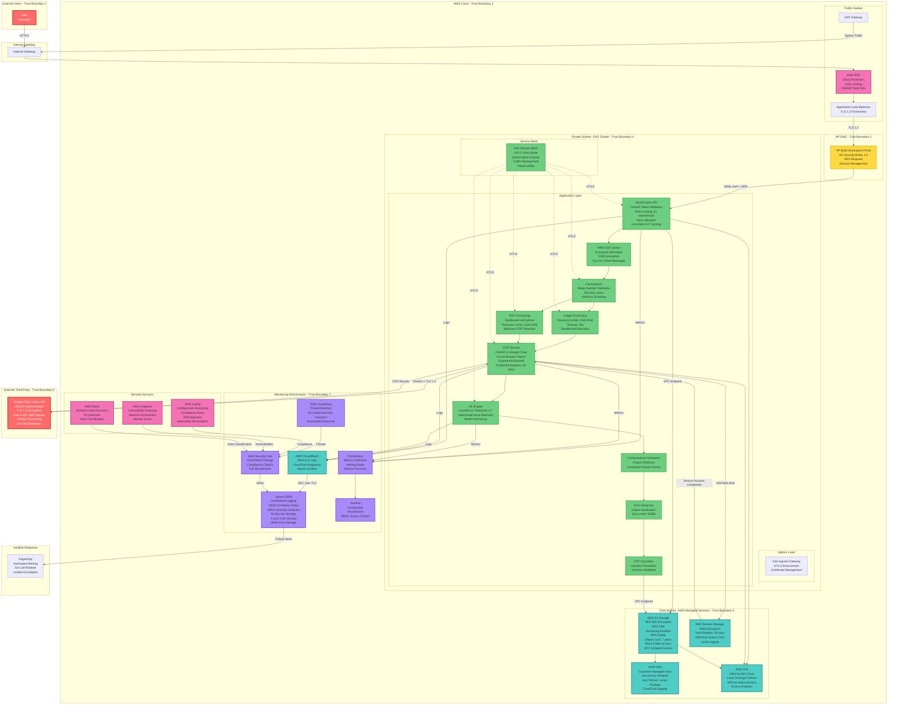

# ARCHITECTURE SYNTHESIS: Smart Digitization OCR with Google Cloud Vision API

## EXECUTIVE SUMMARY

### System Purpose
The Smart Digitization OCR solution is a cloud-native, enterprise-grade document vectorization system that integrates Google Cloud Vision API to extract text from Architecture, Engineering, and Construction (AEC) documents. Deployed on AWS EKS infrastructure, the system processes approximately 1.3K files per month with projected growth to 61K files by Q4 2026, supporting 30+ languages including complex layouts with rotated and handwritten text.

### Security Posture
The architecture implements a defense-in-depth security strategy with multiple layers of protection:

**Authentication & Authorization:**
- Multi-factor authentication (MFA) via HP OneUID/SAML 2.0 for all user access
- OAuth2 service account authentication for Google Cloud Vision API integration
- IAM roles for service accounts (IRSA) in EKS with least privilege enforcement
- Kubernetes RBAC with namespace-level isolation and no cluster-admin privileges for applications

**Data Protection:**
- End-to-end encryption: TLS 1.3 for all communications, AES-256 for data at rest
- AWS KMS customer-managed keys with automatic annual rotation
- S3 Object Lock in compliance mode for audit-critical documents (7-year retention)
- Encrypted queue messages and secrets stored exclusively in AWS Secrets Manager

**Network Security:**
- Three-tier VPC architecture with public, private, and data subnets
- Service mesh (Istio/Linkerd) with mutual TLS for all service-to-service communication
- VPC endpoints for AWS services eliminating internet exposure
- AWS WAF with managed rule sets for DDoS protection and threat mitigation
- Kubernetes NetworkPolicies with default-deny posture

**Container Security:**
- Pod Security Standards (restricted profile) enforced across all workloads
- Non-root containers with read-only root filesystems where possible
- Automated vulnerability scanning with Trivy blocking HIGH/CRITICAL vulnerabilities
- Signed container images using Docker Content Trust or Cosign
- Runtime security monitoring with Falco detecting anomalous behavior

**Monitoring & Incident Response:**
- Centralized logging to Splunk with 90-day hot storage and 1-year cold storage
- Real-time security event monitoring with automated alerting via PagerDuty
- AWS CloudTrail for comprehensive API audit logging with log file validation
- Prometheus metrics collection with Grafana dashboards for performance monitoring
- User behavior analytics (UBA) for anomaly detection and threat hunting

**Compliance Alignment:**
- **GDPR**: Data minimization, right to erasure, data portability, consent management
- **CCPA**: Data disclosure, opt-out mechanisms, consumer rights request workflow
- **NIST SP 800-53 Rev 5**: 35 controls across 12 control families implemented
- **OWASP**: Aligned with Top 10 2021, API Security Top 10 2023, ASVS v4.0, Kubernetes Top 10 2022
- **MITRE ATT&CK**: Defense against 22 techniques across 8 tactics
- **HP Cybersecurity Standards**: Full compliance with internal security policies

### Architecture Highlights

**Scalability & Performance:**
- Horizontal pod autoscaling based on queue depth and resource utilization
- Cluster autoscaling for dynamic node provisioning
- Circuit breaker pattern for Google Cloud Vision API with 5-minute cooldown
- Queue-based asynchronous processing supporting 1800 requests/minute
- GPU-accelerated ML engine for geometric element detection

**Resilience & Availability:**
- Multi-AZ deployment for high availability (99.5% uptime SLA)
- Cross-region S3 replication for disaster recovery
- Recovery Time Objective (RTO): 4 hours, Recovery Point Objective (RPO): 1 hour
- Graceful degradation during Google Cloud Vision API outages
- Automated failover to secondary availability zones

**Security-by-Design:**
- Zero-trust architecture with continuous verification
- Least privilege access enforced at all layers (IAM, RBAC, NetworkPolicies)
- Defense-in-depth with multiple security control layers
- Automated security testing in CI/CD pipeline (SAST, DAST, SCA, container scanning)
- Immutable infrastructure with infrastructure-as-code (Terraform)

**Operational Excellence:**
- Comprehensive observability with structured logging, metrics, and distributed tracing
- Automated incident response playbooks for common attack scenarios
- Quarterly disaster recovery drills and security testing
- Continuous compliance monitoring with AWS Config and automated remediation
- Security champions program and secure development lifecycle (SDL)

---

## FINAL ARCHITECTURE DIAGRAM

### Architecture Component Details

#### Trust Boundaries
1. **External Users (Untrusted)**: Public internet users requiring authentication and validation
2. **HP DMZ (Authenticated)**: HP Build Workspace Portal with SAML 2.0 authentication
3. **AWS Cloud (Internal)**: AWS VPC with network segmentation and security groups
4. **EKS Cluster (Internal Service)**: Kubernetes cluster with service mesh and NetworkPolicies
5. **AWS Managed Services (Managed Service)**: AWS-managed services with HP-configured policies
6. **External Third-Party (Third-Party Service)**: Google Cloud Vision API with OAuth2 authentication
7. **Monitoring Infrastructure (Internal Monitoring)**: Logging and monitoring with read-only access

#### Security Controls by Layer

**Perimeter Security:**
- AWS WAF with OWASP Core Rule Set, Known Bad Inputs, SQL Injection protection
- Rate-based rules: Block IPs exceeding 2000 requests in 5 minutes
- DDoS protection with AWS Shield Standard
- Geographic restrictions if required

**Application Security:**
- Input validation using JSON Schema at API Gateway
- File type validation using magic numbers (not extensions)
- Antivirus scanning with ClamAV before processing
- Output encoding to prevent injection attacks
- CORS policies with explicit origin whitelisting
- Security headers: CSP, X-Frame-Options, X-Content-Type-Options, HSTS

**Data Security:**
- Encryption at rest: AES-256 with AWS KMS customer-managed keys
- Encryption in transit: TLS 1.3 with strong cipher suites only
- S3 bucket policies with deny-by-default and explicit allow
- Pre-signed URLs with 15-minute expiration for temporary access
- Data classification tagging: Public, Internal, Confidential, Restricted

**Network Security:**
- VPC with three-tier architecture (public, private, data subnets)
- Security groups with least privilege rules (deny-by-default)
- Kubernetes NetworkPolicies with default-deny for all namespaces
- VPC endpoints for AWS services (no internet exposure)
- Service mesh with mutual TLS in strict mode

**Container Security:**
- Pod Security Standards (restricted profile) enforced
- Non-root containers (runAsNonRoot: true)
- Read-only root filesystems where possible
- Seccomp profiles restricting system calls
- SELinux/AppArmor profiles for all containers
- Resource quotas: 4 CPU cores, 2GB RAM per pod

**Identity & Access:**
- HP OneUID/SAML 2.0 with mandatory MFA
- IAM roles for service accounts (IRSA) in EKS
- OAuth2 service account authentication for Google Cloud Vision API
- Least privilege IAM policies with explicit deny statements
- Automated credential rotation every 90 days

**Monitoring & Detection:**
- Centralized logging to Splunk with structured JSON format
- Real-time SIEM correlation rules for multi-stage attack detection
- AWS GuardDuty for ML-based threat detection
- Prometheus metrics with alerting rules
- User behavior analytics (UBA) for anomaly detection
- AWS CloudTrail for comprehensive API audit logging

---

## DEVELOPMENT PLAN

### Sprint Overview
The development plan is structured into 4 sprints focusing on MVP delivery in the first 2 sprints, followed by advanced features and production hardening. Each sprint is 2 weeks in duration.

---

### SPRINT 1: Core Infrastructure & Authentication (MVP Foundation)

**Goal:** Establish secure cloud infrastructure, authentication mechanisms, and basic file upload capability

**Components Covered:**
- AWS VPC with three-tier architecture
- EKS cluster with basic security configurations
- HP Build Workspace Portal integration
- S3 storage with encryption
- IAM roles and policies
- Basic monitoring setup

**User Stories:**

**US-001**: As a system administrator, I want to provision a secure AWS VPC with three-tier network architecture so that the application has proper network segmentation and isolation
- **Acceptance Criteria:**
  - VPC created with public, private, and data subnets across 2 availability zones
  - Security groups configured with least privilege rules (deny-by-default)
  - VPC endpoints created for S3, Secrets Manager, and CloudWatch

**US-002**: As a system administrator, I want to deploy an EKS cluster with Pod Security Standards so that containers run with minimal privileges
- **Acceptance Criteria:**
  - EKS cluster deployed with private API endpoint
  - Pod Security Standards (restricted profile) enforced across all namespaces
  - IAM roles for service accounts (IRSA) configured

**US-003**: As a user, I want to authenticate using HP OneUID/SAML 2.0 with MFA so that only authorized users can access the system
- **Acceptance Criteria:**
  - HP Build Workspace Portal integrated with SAML 2.0 authentication
  - MFA enforcement configured for all user accounts
  - Session management implemented with 15-minute idle timeout

**US-004**: As a user, I want to upload PDF and image files through the portal so that I can submit documents for OCR processing
- **Acceptance Criteria:**
  - File upload API endpoint created with TLS 1.3 encryption
  - File size limits enforced (20MB for images, 2000 pages for PDFs)
  - Files stored in S3 with AES-256 encryption using KMS

**US-005**: As a security engineer, I want all API calls logged to CloudWatch so that I can audit system access
- **Acceptance Criteria:**
  - CloudWatch Logs configured for all EKS pods
  - AWS CloudTrail enabled for all API calls with log file validation
  - Structured logging implemented in JSON format with correlation IDs

---

### SPRINT 2: OCR Processing Pipeline (MVP Core)

**Goal:** Implement core OCR processing pipeline with Google Cloud Vision API integration and basic security controls

**Components Covered:**
- AWS SQS queue for asynchronous processing
- File Analyzer service
- Image Processing service
- PDF Processing service
- OCR Service with Google Cloud Vision API integration
- AWS Secrets Manager for credential management

**User Stories:**

**US-006**: As a system, I want to queue uploaded files for asynchronous processing so that the system can handle multiple requests concurrently
- **Acceptance Criteria:**
  - AWS SQS queue created with encryption at rest using KMS
  - Dead letter queue (DLQ) configured for failed messages
  - Queue messages encrypted before submission

**US-007**: As a system, I want to analyze uploaded files to determine their type and validity so that only supported files are processed
- **Acceptance Criteria:**
  - File Analyzer service validates file types using magic numbers
  - Antivirus scanning with ClamAV implemented before processing
  - Invalid files rejected with appropriate error messages

**US-008**: As a system, I want to process images and PDFs in sandboxed containers so that malicious files cannot compromise the system
- **Acceptance Criteria:**
  - Image Processing service deployed with resource limits (1GB RAM, 30s timeout)
  - PDF Processing service deployed with gVisor sandboxing (2GB RAM, 5min timeout)
  - Malicious file detection implemented with automated quarantine

**US-009**: As a system, I want to integrate with Google Cloud Vision API using OAuth2 authentication so that I can extract text from documents securely
- **Acceptance Criteria:**
  - OCR Service deployed with OAuth2 service account authentication
  - Service account credentials stored in AWS Secrets Manager with KMS encryption
  - Circuit breaker pattern implemented with 5-minute cooldown after 5 failures

**US-010**: As a security engineer, I want Google Cloud service account credentials rotated automatically every 90 days so that credential exposure risk is minimized
- **Acceptance Criteria:**
  - Automated credential rotation configured in AWS Secrets Manager
  - Zero-downtime rotation implemented with token refresh
  - Credential rotation events logged to Splunk

---

### SPRINT 3: ML Processing & Advanced Security

**Goal:** Implement ML engine for text processing, service mesh for mTLS, and advanced security monitoring

**Components Covered:**
- ML Engine for text processing
- Computational Geometry service
- SVG Generator
- DXF Converter
- Istio service mesh
- Splunk SIEM integration
- AWS GuardDuty and Security Hub

**User Stories:**

**US-011**: As a system, I want to process OCR results through ML models to extract geometric elements so that I can generate accurate CAD drawings
- **Acceptance Criteria:**
  - ML Engine deployed with confidence threshold validation (minimum 0.7)
  - Adversarial input detection implemented with anomaly detection
  - Model versioning and rollback capability configured

**US-012**: As a system, I want to generate DXF output files with injection prevention so that output files are safe for downstream consumption
- **Acceptance Criteria:**
  - DXF Converter validates output format against schema
  - Text content sanitized removing special characters
  - Output size limits enforced (50MB maximum)

**US-013**: As a security engineer, I want all service-to-service communication encrypted with mutual TLS so that internal traffic cannot be intercepted
- **Acceptance Criteria:**
  - Istio service mesh deployed with mTLS in strict mode
  - Service mesh authorization policies configured for fine-grained access control
  - Certificate rotation automated with 90-day expiration

**US-014**: As a security engineer, I want centralized logging to Splunk with SIEM correlation rules so that I can detect multi-stage attacks
- **Acceptance Criteria:**
  - Fluentd deployed for log aggregation with HEC over TLS to Splunk
  - SIEM correlation rules configured for common attack patterns
  - Automated alerting to PagerDuty for critical security events

**US-015**: As a security engineer, I want AWS GuardDuty and Security Hub enabled so that I can detect threats and monitor compliance
- **Acceptance Criteria:**
  - AWS GuardDuty enabled with automated response for high-confidence threats
  - AWS Security Hub configured with CIS AWS Foundations Benchmark
  - Compliance dashboards created in Splunk with real-time status

---

### SPRINT 4: Production Hardening & Compliance

**Goal:** Implement production-grade security controls, compliance monitoring, and disaster recovery capabilities

**Components Covered:**
- AWS WAF with OWASP rule sets
- Kubernetes NetworkPolicies
- Container image scanning and signing
- AWS Config for compliance monitoring
- Cross-region S3 replication
- Disaster recovery procedures

**User Stories:**

**US-016**: As a security engineer, I want AWS WAF deployed with OWASP rule sets so that the application is protected from common web attacks
- **Acceptance Criteria:**
  - AWS WAF configured with OWASP Core Rule Set, Known Bad Inputs, SQL Injection
  - Rate-based rules implemented (block IPs exceeding 2000 requests in 5 minutes)
  - Geographic restrictions configured if required

**US-017**: As a security engineer, I want Kubernetes NetworkPolicies with default-deny so that pod-to-pod communication is restricted to necessary flows only
- **Acceptance Criteria:**
  - Default-deny NetworkPolicies applied to all namespaces
  - Namespace-specific NetworkPolicies created allowing only required communication
  - NetworkPolicies tested and validated in staging environment

**US-018**: As a DevOps engineer, I want automated container image scanning and signing in CI/CD pipeline so that only secure images are deployed
- **Acceptance Criteria:**
  - Trivy scanning integrated in CI/CD blocking HIGH/CRITICAL vulnerabilities
  - Container images signed using Docker Content Trust or Cosign
  - Image promotion workflow implemented (dev→staging→prod)

**US-019**: As a compliance officer, I want AWS Config monitoring compliance with CIS benchmarks so that I can demonstrate regulatory compliance
- **Acceptance Criteria:**
  - AWS Config rules configured for CIS AWS Foundations Benchmark
  - Automated remediation implemented for common compliance violations
  - Quarterly compliance reports generated automatically

**US-020**: As a system administrator, I want cross-region S3 replication and disaster recovery procedures so that the system can recover from regional failures
- **Acceptance Criteria:**
  - S3 cross-region replication configured with encryption
  - Disaster recovery runbook documented with RTO 4 hours, RPO 1 hour
  - Quarterly disaster recovery drills conducted and documented

---

### Sprint Dependencies & Sequencing

**Sprint 1 → Sprint 2:**
- Infrastructure and authentication must be in place before processing pipeline
- S3 storage and IAM roles required for file processing

**Sprint 2 → Sprint 3:**
- OCR processing pipeline must be functional before ML processing
- Basic monitoring required before advanced SIEM integration

**Sprint 3 → Sprint 4:**
- Service mesh and monitoring must be operational before production hardening
- Security controls must be tested before compliance validation

### Definition of Done (All Sprints)

**Code Quality:**
- Unit test coverage ≥80%
- Code reviewed and approved by 2 team members
- Linting passed (Ruff, Black, Mypy)
- SAST scanning passed (Veracode/Checkmarx)
- SCA scanning passed (Snyk/Dependabot)

**Security:**
- Container image scanning passed (no HIGH/CRITICAL vulnerabilities)
- Secrets scanning passed (no exposed credentials)
- Security review completed and approved
- Threat model updated if architecture changes

**Documentation:**
- Architecture diagrams updated
- API documentation updated (OpenAPI/Swagger)
- Runbooks updated for operational procedures
- Security controls documented

**Testing:**
- Unit tests passed
- Integration tests passed
- Security tests passed (DAST in staging)
- Performance tests passed (load testing)

**Deployment:**
- Deployed to staging environment
- Smoke tests passed in staging
- Production deployment approved by security and operations
- Rollback procedure tested and documented

---

### Post-MVP Enhancements (Future Sprints)

**Performance Optimization:**
- Implement caching layer for frequently accessed files
- Optimize ML model inference with GPU acceleration
- Implement batch processing for high-volume scenarios

**Advanced Security:**
- Deploy runtime security monitoring with Falco
- Implement container isolation with gVisor for all workloads
- Deploy AWS Shield Advanced for enhanced DDoS protection

**Operational Excellence:**
- Implement chaos engineering practices with Chaos Mesh
- Deploy automated canary deployments with Flagger
- Implement cost optimization with AWS Cost Explorer and recommendations

**Compliance & Governance:**
- Implement GDPR right to erasure automation
- Deploy privacy impact assessments (PIA) workflow
- Implement data residency controls for geographic restrictions

---

**Document Classification:** HP Internal - Confidential  
**Version:** 1.0  
**Last Updated:** 2025-01-15  
**Prepared By:** Principal Security Architect and Solution Architect  
**Review Status:** Architecture Synthesis Complete - Pending Security Review  
**Next Review Date:** Quarterly or upon significant architecture changes

**Approval Required:**
- CISO Office: Pending Approval
- Security Architecture Lead: Pending Approval
- Development Manager: Pending Approval
- Compliance Team: Pending Approval

**Change History:**
- v1.0 (2025-01-15): Initial architecture synthesis with executive summary, final architecture diagram, and 4-sprint development plan
