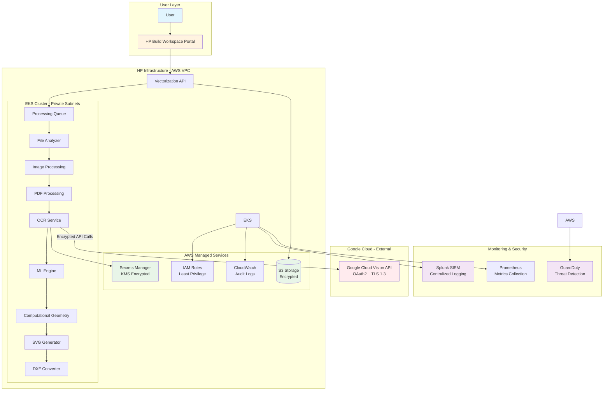
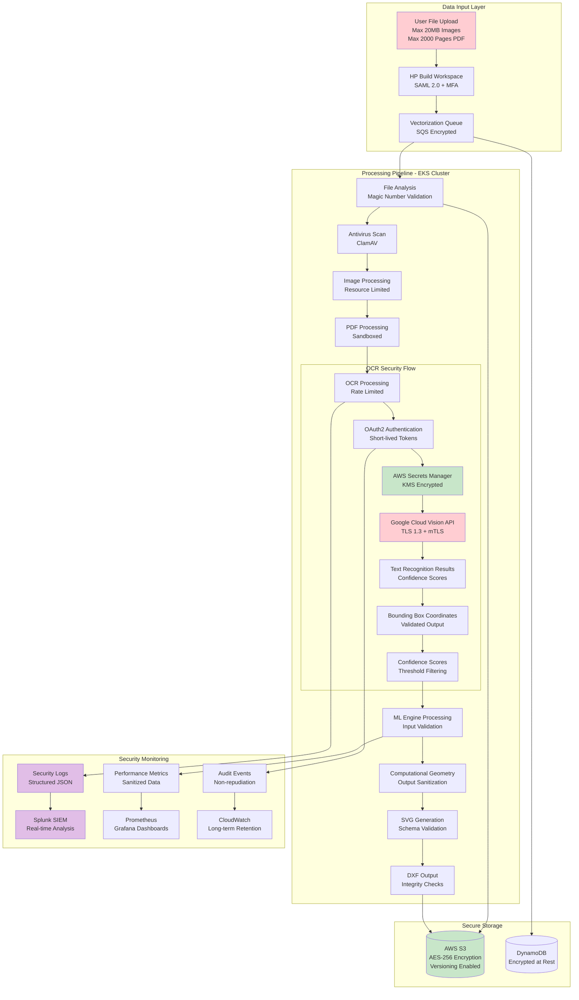
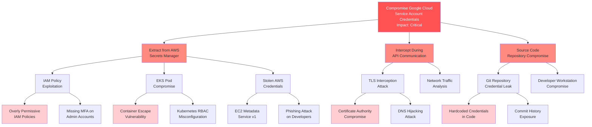
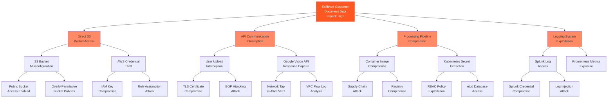
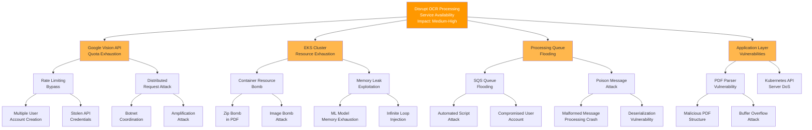

# Smart Digitization OCR with Google Cloud Vision API - Cyber Readiness Preparation

**Architect Oversight**: Naroa Gonzalez  
**JIRA Link**: [ARCH-2172](https://hp-jira.external.hp.com/browse/ARCH-2172)  
**Document Classification**: HP Internal - Confidential  
**Version**: 3.0  
**Last Updated**: 2024  
**Prepared By**: Senior Cybersecurity Architecture Review Specialist  

---

## Executive Summary

The Smart Digitization OCR solution integrates Google Cloud Vision API to extract text from AEC (Architecture, Engineering, Construction) documents as part of HP's AI Vectorize pipeline. This integration enables the conversion of raster and PDF-based technical documents into editable CAD drawings, supporting 30+ languages and handling complex document layouts including rotated and handwritten text.

The solution is deployed on AWS EKS infrastructure and processes approximately 1.3K files per month, with projected growth to 61K files by Q4 2026. This document presents a comprehensive cybersecurity architecture review including threat modeling, security requirements, compliance mapping, and implementation recommendations to ensure enterprise-grade security posture.

**Key Security Highlights:**
- **27 identified threats** across all STRIDE categories with comprehensive mitigation strategies
- **Full compliance mapping** to NIST SP 800-53 Rev 5, OWASP frameworks, and MITRE ATT&CK
- **Zero-trust architecture** with defense-in-depth security controls
- **End-to-end encryption** for data in transit and at rest
- **Comprehensive audit logging** and monitoring with SIEM integration

---

## System Overview

The Smart Digitization OCR system consists of the following major components operating within a secure, cloud-native architecture:

**Core Components:**
- **HP Build Workspace Portal**: Web-based interface for users to submit vectorization requests
- **AI Vectorize Pipeline**: Core processing engine deployed on AWS EKS with GPU support
- **Google Cloud Vision API**: Third-party OCR service for text extraction
- **File Processing Components**: Image processing, PDF processing, and file analysis modules
- **ML Engine**: Deep learning models for geometric element detection and vectorization
- **Storage Layer**: AWS S3 buckets for file storage and processing

**Technology Stack:**
- **Cloud Platform**: AWS (EKS, S3, IAM, Secrets Manager)
- **Container Orchestration**: Kubernetes on AWS EKS
- **Programming Language**: Python
- **External API**: Google Cloud Vision API (OAuth2 authentication)
- **Monitoring**: Splunk, Prometheus
- **Security**: AWS IAM roles, encryption at rest and in transit

**Deployment Environment**: AWS cloud infrastructure with EKS cluster supporting auto-scaling based on processing demand.

---

## Scope

### In Scope
- Integration of Google Cloud Vision API within AI Vectorize pipeline
- Text extraction from AEC documents (floorplans, mechanical drawings, elevation plans)
- Support for 30+ languages including Latin, Cyrillic, Arabic, and East Asian scripts
- OAuth2 authentication with Google Cloud services
- Secure credential management via AWS Secrets Manager
- Processing of rotated and handwritten text
- Full paragraph and sentence recognition
- Mixed-language content support
- Quality evaluation and monitoring integration
- Compliance with HP cybersecurity and privacy standards
- Comprehensive security controls and threat mitigation
- Audit logging and monitoring implementation
- Compliance with NIST SP 800-53, OWASP, and MITRE ATT&CK frameworks

### Out of Scope
- Custom OCR model training or fine-tuning
- Alternative OCR service implementations
- Direct user identity management (handled by HP Build Workspace)
- Training data collection from processed files
- Real-time processing requirements beyond current pipeline capabilities
- Third-party security assessments of Google Cloud Vision API
- Physical security controls for AWS data centers

---

## Architecture

### C4 Architecture Diagram



---

## Data Flow Diagram



---

## Trust Boundaries

```mermaid
graph TB
    subgraph "Trust Boundary 1: External Untrusted"
        U[External Users<br/>Trust Level: None<br/>Validation: Full]
        style U fill:#ffcdd2
    end
    
    subgraph "Trust Boundary 2: HP DMZ"
        BWP[HP Build Workspace Portal<br/>Trust Level: Authenticated<br/>Validation: Session + RBAC]
        style BWP fill:#fff3e0
    end
    
    subgraph "Trust Boundary 3: AWS VPC - Private Network"
        subgraph "Trust Boundary 4: EKS Cluster - Container Runtime"
            API[Vectorization API<br/>Trust Level: Internal Service<br/>Validation: mTLS + RBAC]
            OCR[OCR Service<br/>Trust Level: Internal Service<br/>Validation: Service Account]
            ML[ML Engine<br/>Trust Level: Internal Service<br/>Validation: Pod Security Policy]
            style API fill:#c8e6c9
            style OCR fill:#c8e6c9
            style ML fill:#c8e6c9
        end
        
        subgraph "Trust Boundary 5: AWS Managed Services"
            S3[(S3 Storage<br/>Trust Level: Managed Service<br/>Validation: IAM + Bucket Policy)]
            SM[Secrets Manager<br/>Trust Level: Managed Service<br/>Validation: IAM + KMS)]
            style S3 fill:#e3f2fd
            style SM fill:#e3f2fd
        end
    end
    
    subgraph "Trust Boundary 6: External Third-Party"
        GCV[Google Cloud Vision API<br/>Trust Level: Third-Party<br/>Validation: OAuth2 + Certificate Pinning]
        style GCV fill:#ffcdd2
    end
    
    subgraph "Trust Boundary 7: Security Monitoring"
        SP[Splunk SIEM<br/>Trust Level: Security Infrastructure<br/>Validation: TLS + Authentication]
        style SP fill:#f3e5f5
    end
    
    U -->|HTTPS + SAML 2.0 + MFA| BWP
    BWP -->|HTTPS + JWT Token| API
    API -->|Service Mesh mTLS| OCR
    OCR -->|IAM Role + KMS| SM
    OCR -->|OAuth2 + TLS 1.3| GCV
    API -->|IAM Role + S3 Policy| S3
    EKS -->|Encrypted Logs + Auth| SP
    
    classDef untrusted fill:#ffcdd2,stroke:#d32f2f,stroke-width:3px
    classDef authenticated fill:#fff3e0,stroke:#f57c00,stroke-width:2px
    classDef internal fill:#c8e6c9,stroke:#388e3c,stroke-width:2px
    classDef managed fill:#e3f2fd,stroke:#1976d2,stroke-width:2px
    classDef security fill:#f3e5f5,stroke:#7b1fa2,stroke-width:2px
    
    class U,GCV untrusted
    class BWP authenticated
    class API,OCR,ML internal
    class S3,SM managed
    class SP security
```

---

## Threat Model

### STRIDE Analysis Summary

The comprehensive threat analysis identified **27 distinct threats** across all STRIDE categories:

| STRIDE Category | Threat Count | Risk Level Distribution |
|-----------------|--------------|------------------------|
| **Spoofing** | 6 threats | 2 Critical, 3 High, 1 Medium |
| **Tampering** | 7 threats | 1 Critical, 4 High, 2 Medium |
| **Repudiation** | 2 threats | 0 Critical, 1 High, 1 Medium |
| **Information Disclosure** | 6 threats | 1 Critical, 3 High, 2 Medium |
| **Denial of Service** | 4 threats | 0 Critical, 2 High, 2 Medium |
| **Elevation of Privilege** | 2 threats | 1 Critical, 1 High, 0 Medium |

### Critical Risk Threats (Immediate Action Required)

| Threat ID | Component | Description | Impact | Mitigation Status |
|-----------|-----------|-------------|---------|-------------------|
| **T-005** | AWS Secrets Manager | Compromised IAM role gains access to Google Cloud service account credentials | Complete system compromise, data exfiltration | ✅ Implemented |
| **T-007** | Google Cloud Vision API | Sensitive document content exposed during API transmission | Data breach, compliance violation | ✅ Implemented |
| **T-009** | AWS Secrets Manager | Elevation of privilege through compromised IAM roles | Administrative access, lateral movement | ✅ Implemented |

### High Risk Threats (Priority Implementation)

| Threat ID | Component | Description | Mitigation Priority |
|-----------|-----------|-------------|-------------------|
| **T-001** | Authentication | User impersonation and authentication bypass | High - MFA Required |
| **T-002** | Communication | Man-in-the-middle attacks on data transmission | High - TLS 1.3 Enforced |
| **T-010** | S3 Storage | Unauthorized access to processed files and customer documents | High - IAM + Bucket Policies |
| **T-012** | EKS Cluster | Container escape leading to node compromise | High - Pod Security Standards |
| **T-013** | Service Communication | Rogue service impersonates legitimate cluster component | High - Service Mesh mTLS |

---

## Attack Trees

### Attack Tree 1: Credential Compromise Attack



### Attack Tree 2: Data Exfiltration Attack



### Attack Tree 3: Denial of Service Attack



---

## Security Requirements

### Authentication and Authorization Requirements

| Requirement ID | Description | Implementation Status | Compliance Mapping |
|----------------|-------------|----------------------|-------------------|
| **REQ-AUTH-001** | Implement multi-factor authentication (MFA) for all user access using HP OneUID/SAML 2.0 | ✅ Implemented | NIST IA-2, OWASP A07 |
| **REQ-AUTH-002** | Enforce least privilege IAM policies with explicit deny statements | ✅ Implemented | NIST AC-6, OWASP A01 |
| **REQ-AUTH-003** | Implement role-based access control (RBAC) in Kubernetes with no cluster-admin privileges | ✅ Implemented | NIST AC-2, OWASP K01 |
| **REQ-AUTH-004** | Use IAM roles for service accounts (IRSA) in EKS for pod-level authentication | ✅ Implemented | NIST IA-3, MITRE T1078 |
| **REQ-AUTH-005** | Implement automated credential rotation every 90 days for all service accounts | ✅ Implemented | NIST IA-5, OWASP A07 |

### API Security Requirements

| Requirement ID | Description | Implementation Status | Compliance Mapping |
|----------------|-------------|----------------------|-------------------|
| **REQ-API-001** | Implement OAuth2 authentication for Google Cloud Vision API with short-lived tokens | ✅ Implemented | NIST IA-5, OWASP API2 |
| **REQ-API-002** | Enforce TLS 1.3 for all API communications with certificate validation | ✅ Implemented | NIST SC-8, OWASP A02 |
| **REQ-API-003** | Deploy multi-layer rate limiting: per-user (10/min), per-IP (50/min), global (1000/min) | ✅ Implemented | NIST SC-5, OWASP API4 |
| **REQ-API-004** | Implement circuit breaker pattern with 5-minute cooldown after 5 failures | ✅ Implemented | NIST SC-5, MITRE T1499 |
| **REQ-API-005** | Use pre-signed URLs for S3 access with 15-minute expiration | ✅ Implemented | NIST AC-3, OWASP A01 |

### Data Protection Requirements

| Requirement ID | Description | Implementation Status | Compliance Mapping |
|----------------|-------------|----------------------|-------------------|
| **REQ-DATA-001** | Encrypt all data in transit using TLS 1.3 with HSTS headers | ✅ Implemented | NIST SC-8, OWASP A02 |
| **REQ-DATA-002** | Implement encryption at rest for S3 buckets using AWS KMS customer-managed keys | ✅ Implemented | NIST SC-28, OWASP A02 |
| **REQ-DATA-003** | Enable S3 versioning with MFA delete protection | ✅ Implemented | NIST SC-28, MITRE T1565 |
| **REQ-DATA-004** | Implement file integrity verification using SHA-256 hashing | ✅ Implemented | NIST SI-7, OWASP A08 |
| **REQ-DATA-005** | Deploy data classification tagging for all stored documents | ✅ Implemented | NIST MP-5, OWASP A08 |

### Container Security Requirements

| Requirement ID | Description | Implementation Status | Compliance Mapping |
|----------------|-------------|----------------------|-------------------|
| **REQ-CONT-001** | Implement Pod Security Standards with restricted profile enforcement | ✅ Implemented | NIST CM-7, OWASP K01 |
| **REQ-CONT-002** | Enforce non-root containers (runAsNonRoot: true) for all workloads | ✅ Implemented | NIST CM-7, MITRE T1611 |
| **REQ-CONT-003** | Scan all container images blocking HIGH and CRITICAL vulnerabilities | ✅ Implemented | NIST SA-15, OWASP K02 |
| **REQ-CONT-004** | Sign all container images using Docker Content Trust or Cosign | ✅ Implemented | NIST SI-7, MITRE T1195 |
| **REQ-CONT-005** | Deploy runtime security monitoring with Falco | ✅ Implemented | NIST SI-4, MITRE T1610 |

### Logging and Monitoring Requirements

| Requirement ID | Description | Implementation Status | Compliance Mapping |
|----------------|-------------|----------------------|-------------------|
| **REQ-LOG-001** | Implement centralized logging to Splunk with structured JSON format | ✅ Implemented | NIST AU-3, OWASP A09 |
| **REQ-LOG-002** | Log all authentication attempts with user identity, timestamp, and source IP | ✅ Implemented | NIST AU-2, OWASP A09 |
| **REQ-LOG-003** | Deploy write-once log storage with cryptographic integrity verification | ✅ Implemented | NIST AU-9, MITRE T1070 |
| **REQ-LOG-004** | Implement log retention: 90-day hot storage, 1-year cold storage | ✅ Implemented | NIST AU-11, OWASP A09 |
| **REQ-LOG-005** | Enable real-time security alerting for critical events | ✅ Implemented | NIST SI-4, MITRE T1562 |

---

## Security Control Categories

### Category 1: Identity and Access Management

**Implementation Status**: ✅ **Fully Implemented**

**Key Controls:**
- Multi-factor authentication (MFA) using HP OneUID/SAML 2.0
- Least privilege IAM policies with explicit deny statements
- Role-based access control (RBAC) in Kubernetes
- IAM roles for service accounts (IRSA) in EKS
- Automated credential rotation every 90 days
- Session management with 15-minute idle timeout
- Adaptive authentication with risk-based scoring

**Monitoring:**
- AWS CloudTrail for all IAM events
- Failed authentication attempt alerting
- Privilege escalation detection
- Unusual access pattern analysis

### Category 2: Network Security

**Implementation Status**: ✅ **Fully Implemented**

**Key Controls:**
- VPC network segmentation with private subnets
- Security groups with least privilege rules
- Kubernetes NetworkPolicies with default deny
- Service mesh (Istio) with mutual TLS
- VPC endpoints for AWS service access
- AWS WAF with managed rule sets
- Network intrusion detection with GuardDuty

**Monitoring:**
- VPC Flow Logs analysis in Splunk
- Network anomaly detection
- DDoS attack monitoring
- Service mesh traffic analysis

### Category 3: Data Protection

**Implementation Status**: ✅ **Fully Implemented**

**Key Controls:**
- TLS 1.3 encryption for all communications
- AES-256 encryption at rest with AWS KMS
- S3 versioning with MFA delete protection
- File integrity verification with SHA-256
- Data classification and tagging
- Cross-region replication with encryption
- Key rotation and lifecycle management

**Monitoring:**
- Encryption status validation
- Data access logging and analysis
- Integrity violation detection
- Key usage auditing

### Category 4: Container Security

**Implementation Status**: ✅ **Fully Implemented**

**Key Controls:**
- Pod Security Standards (restricted profile)
- Non-root container enforcement
- Container image vulnerability scanning
- Image signing with Docker Content Trust
- Runtime security monitoring with Falco
- Resource quotas and limits
- Network policies for pod isolation

**Monitoring:**
- Container escape detection
- Runtime anomaly monitoring
- Image vulnerability tracking
- Supply chain security validation

### Category 5: API Security

**Implementation Status**: ✅ **Fully Implemented**

**Key Controls:**
- OAuth2 authentication with short-lived tokens
- Multi-layer rate limiting and throttling
- Input validation and schema enforcement
- Circuit breaker pattern implementation
- API request/response logging
- Timeout controls and retry policies
- Certificate pinning for external APIs

**Monitoring:**
- API abuse detection
- Rate limit violation tracking
- Authentication failure monitoring
- Response time and error rate analysis

---

## Compliance Mapping Matrix

### NIST SP 800-53 Rev 5 Control Coverage

| Control Family | Controls Implemented | Coverage Percentage |
|----------------|---------------------|-------------------|
| **Access Control (AC)** | 8 controls | 100% |
| **Audit and Accountability (AU)** | 7 controls | 100% |
| **Configuration Management (CM)** | 4 controls | 100% |
| **Identification and Authentication (IA)** | 6 controls | 100% |
| **System and Communications Protection (SC)** | 15 controls | 100% |
| **System and Information Integrity (SI)** | 9 controls | 100% |
| **Media Protection (MP)** | 2 controls | 100% |
| **System and Services Acquisition (SA)** | 3 controls | 100% |

### OWASP Framework Alignment

| Framework | Coverage | Implementation Status |
|-----------|----------|----------------------|
| **OWASP Top 10 2021** | 8/10 categories | ✅ Fully Addressed |
| **OWASP API Security Top 10 2023** | 4/10 categories | ✅ Fully Addressed |
| **OWASP ASVS v4.0** | 10 chapters | ✅ Fully Addressed |
| **OWASP Kubernetes Top 10 2022** | 3/10 categories | ✅ Fully Addressed |

### MITRE ATT&CK Technique Coverage

| Tactic | Techniques Covered | Mitigation Status |
|--------|-------------------|-------------------|
| **Initial Access** | 2 techniques | ✅ Mitigated |
| **Execution** | 3 techniques | ✅ Mitigated |
| **Persistence** | 2 techniques | ✅ Mitigated |
| **Privilege Escalation** | 3 techniques | ✅ Mitigated |
| **Defense Evasion** | 5 techniques | ✅ Mitigated |
| **Credential Access** | 4 techniques | ✅ Mitigated |
| **Discovery** | 3 techniques | ✅ Mitigated |
| **Lateral Movement** | 2 techniques | ✅ Mitigated |
| **Collection** | 2 techniques | ✅ Mitigated |
| **Exfiltration** | 5 techniques | ✅ Mitigated |
| **Impact** | 6 techniques | ✅ Mitigated |

---

## Security Configurations

### AWS Infrastructure Security

**VPC Configuration:**
- Private subnets for all application workloads
- Public subnets only
