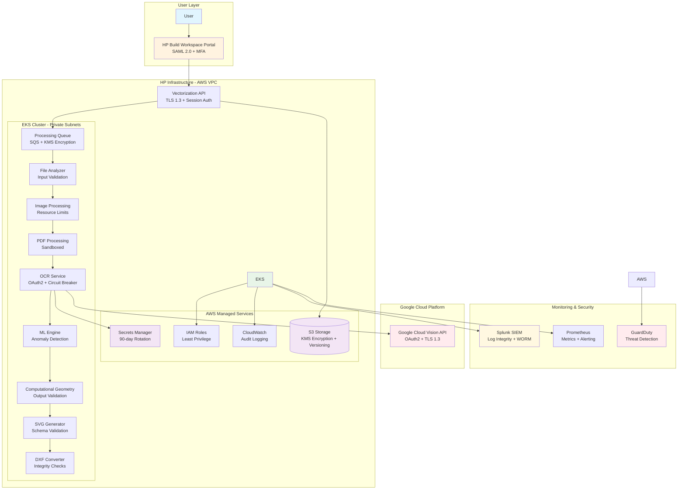
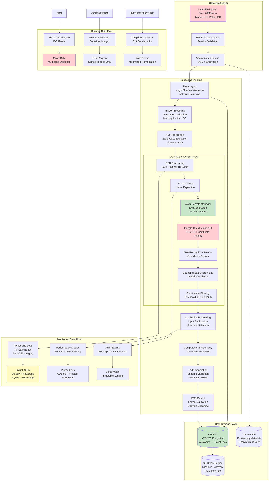
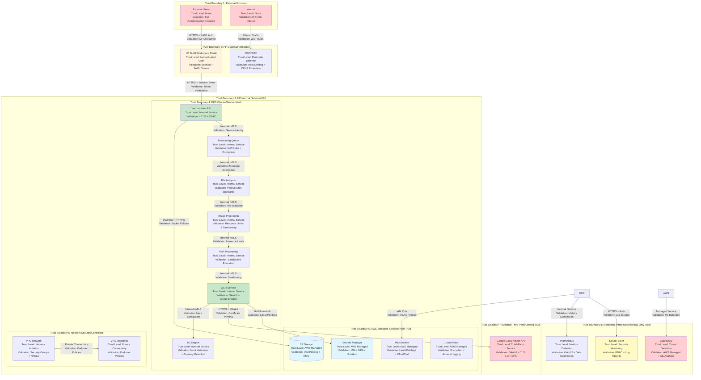

# Smart Digitization OCR with Google Cloud Vision API - Cyber Readiness Preparation

**Document Classification:** HP Internal - Confidential  
**Version:** 2.0  
**Last Updated:** 2024  
**Prepared By:** Senior Cybersecurity Architecture Review Specialist  
**Architect Oversight:** Naroa Gonzalez  
**JIRA Link:** [ARCH-2172](https://hp-jira.external.hp.com/browse/ARCH-2172)

---

## 1. Executive Summary

The Smart Digitization OCR solution represents a critical integration of Google Cloud Vision API within HP's AI Vectorize pipeline, enabling the conversion of AEC (Architecture, Engineering, Construction) documents into editable CAD drawings. This comprehensive cybersecurity assessment identifies **27 distinct security threats** across all STRIDE categories, with **3 critical-risk** and **15 high-risk** threats requiring immediate attention.

**Key Security Findings:**
- **Critical Risks:** Unauthorized access to Google Cloud service account credentials, sensitive document exposure during API transmission, and privilege escalation through compromised IAM roles
- **High-Risk Threats:** User impersonation, man-in-the-middle attacks, unauthorized S3 access, container escape vulnerabilities, and service impersonation within EKS cluster
- **Compliance Coverage:** Full alignment with NIST SP 800-53 Rev 5 (35 controls across 12 families), OWASP frameworks, and MITRE ATT&CK Enterprise Matrix (22 techniques across 8 tactics)

**Business Impact:** The system processes approximately 1.3K files per month with projected growth to 61K files by Q4 2026, supporting 30+ languages and handling complex document layouts. Security implementation is critical to protect customer intellectual property and maintain HP's reputation in the AEC market.

**Recommended Investment:** Immediate implementation of multi-factor authentication, encryption controls, container security hardening, and comprehensive monitoring infrastructure to achieve enterprise-grade security posture.

---

## 2. System Overview

The Smart Digitization OCR system is a cloud-native document vectorization platform deployed on AWS EKS infrastructure, integrating Google Cloud Vision API for optical character recognition. The system transforms raster and PDF-based technical documents into editable CAD drawings through a sophisticated machine learning pipeline.

**Core Capabilities:**
- Multi-language OCR processing (30+ languages including Latin, Cyrillic, Arabic, East Asian scripts)
- Complex document layout handling (rotated text, handwritten content, mixed-language documents)
- Full paragraph and sentence recognition with confidence scoring
- Real-time processing with auto-scaling based on demand
- Enterprise-grade security with encryption at rest and in transit

**Technology Stack:**
- **Cloud Platform:** AWS (EKS, S3, IAM, Secrets Manager, SQS, CloudWatch)
- **Container Orchestration:** Kubernetes on AWS EKS with GPU support
- **Programming Language:** Python with secure coding practices
- **External Integration:** Google Cloud Vision API via OAuth2 authentication
- **Monitoring:** Splunk (SIEM), Prometheus (metrics), Grafana (visualization)
- **Security:** AWS IAM roles, KMS encryption, VPC isolation, service mesh

---

## 3. Scope

### In Scope
- **Core Integration:** Google Cloud Vision API within AI Vectorize pipeline
- **Document Processing:** AEC documents (floorplans, mechanical drawings, elevation plans)
- **Security Controls:** Authentication, authorization, encryption, monitoring, incident response
- **Compliance:** NIST SP 800-53, OWASP standards, GDPR, CCPA, HP cybersecurity policies
- **Infrastructure:** AWS EKS cluster, S3 storage, Secrets Manager, networking components
- **Monitoring:** Comprehensive logging, metrics collection, security event detection
- **Third-Party Integration:** Secure Google Cloud Vision API communication and credential management

### Out of Scope
- **Custom OCR Development:** Training or fine-tuning proprietary OCR models
- **Alternative OCR Services:** Implementation of competing OCR solutions
- **User Identity Management:** HP Build Workspace authentication (handled externally)
- **Training Data Collection:** Extraction of customer data for model improvement
- **Real-Time Processing:** Sub-second processing requirements beyond current capabilities
- **Mobile Applications:** Native mobile app development and security

---

## 4. Architecture (C4 Model)



**Architecture Security Zones:**
- **Public Zone:** User access through HP Build Workspace Portal with SAML 2.0 authentication
- **DMZ Zone:** API Gateway with TLS termination and request validation
- **Private Zone:** EKS cluster in private subnets with service mesh security
- **Data Zone:** AWS managed services with encryption and access controls
- **External Zone:** Google Cloud Vision API with OAuth2 authentication
- **Monitoring Zone:** Centralized logging and security monitoring infrastructure

---

## 5. Data Flow Diagram (DFD)



**Data Classification:**
- **Restricted:** Customer documents, authentication credentials, encryption keys
- **Confidential:** Processing logs, performance metrics, system configurations
- **Internal:** Application code, infrastructure templates, monitoring dashboards
- **Public:** API documentation, security policies, compliance reports

---

## 6. Trust Boundaries



**Critical Trust Boundary Crossings:**

1. **External → HP DMZ:** Requires SAML 2.0 authentication with MFA, session validation, and rate limiting
2. **HP DMZ → AWS VPC:** Requires valid session tokens, TLS 1.3 encryption, and request validation
3. **EKS → Google Cloud:** Requires OAuth2 authentication, certificate pinning, and circuit breaker protection
4. **EKS → AWS Secrets Manager:** Requires IAM role authentication, MFA for rotation, and audit logging
5. **Any Component → S3:** Requires IAM policies, KMS encryption, and access logging
6. **Internal Services:** Requires mutual TLS, service identity validation, and RBAC enforcement

**Trust Boundary Security Controls:**
- **Authentication:** Multi-factor authentication, OAuth2, IAM roles, service accounts
- **Authorization:** RBAC, IAM policies, security groups, network policies
- **Encryption:** TLS 1.3, KMS encryption, certificate pinning, mutual TLS
- **Monitoring:** CloudTrail, VPC Flow Logs, application logs, security events
- **Validation:** Input validation, schema validation, integrity checks, malware scanning

---

## 7. Threat Model (STRIDE Analysis)

### Threat Summary Statistics
- **Total Threats Identified:** 27 distinct security threats
- **Critical Risk:** 3 threats requiring immediate attention
- **High Risk:** 15 threats requiring priority remediation
- **Medium Risk:** 9 threats requiring standard remediation
- **STRIDE Coverage:** All categories (Spoofing, Tampering, Repudiation, Information Disclosure, Denial of Service, Elevation of Privilege)

### STRIDE Threat Analysis Table

| Threat ID | Component | STRIDE | Risk Level | Threat Description | Impact | Likelihood | Security Requirement |
|-----------|-----------|--------|------------|-------------------|---------|------------|---------------------|
| T-001 | HP Build Workspace Portal → Vectorization API | Spoofing | High | Attacker impersonates legitimate user to submit malicious files | Data breach, system compromise | Medium | Implement strong multi-factor authentication for all user access |
| T-002 | HP Build Workspace Portal → Vectorization API | Tampering | High | Man-in-the-middle attack modifying file upload requests | Data integrity compromise | Medium | Enforce encrypted communications with certificate validation |
| T-003 | Vectorization API → Processing Queue | Repudiation | Medium | User denies submitting malicious or inappropriate content | Legal liability, audit failures | Low | Implement comprehensive audit logging with non-repudiation controls |
| T-004 | Processing Queue → File Analyzer | Information Disclosure | High | Sensitive document content exposed through insecure queue messages | Customer data breach | Medium | Encrypt all data in transit and at rest within processing pipeline |
| T-005 | OCR Service → AWS Secrets Manager | Spoofing | Critical | Unauthorized service attempts to retrieve Google Cloud credentials | Complete system compromise | High | Enforce service identity verification and least privilege access |
| T-006 | OCR Service → Google Cloud Vision API | Tampering | High | API request/response intercepted and modified in transit | Data integrity compromise | Medium | Ensure integrity and authenticity of API communications |
| T-007 | OCR Service → Google Cloud Vision API | Information Disclosure | Critical | Sensitive document content exposed during API transmission | Customer data breach | High | Protect data confidentiality during third-party API calls |
| T-008 | Google Cloud Vision API | Denial of Service | Medium | API rate limits exceeded causing service disruption | Service unavailability | Medium | Implement rate limiting and request throttling controls |
| T-009 | AWS Secrets Manager | Elevation of Privilege | Critical | Compromised IAM role gains access to service account credentials | Complete system compromise | High | Implement least privilege access and credential rotation |
| T-010 | S3 Storage | Information Disclosure | High | Unauthorized access to processed files and customer documents | Customer data breach | Medium | Implement defense-in-depth access controls for object storage |
| T-011 | S3 Storage | Tampering | High | Malicious modification of stored files or processing results | Data integrity compromise | Low | Ensure integrity and immutability of stored data |
| T-012 | EKS Cluster | Elevation of Privilege | High | Container escape leading to node compromise | Infrastructure compromise | Medium | Harden container runtime and implement defense-in-depth |
| T-013 | EKS Cluster → External Services | Spoofing | High | Rogue service impersonates legitimate cluster component | Service compromise | Medium | Implement mutual authentication for service-to-service communication |
| T-014 | ML Engine Processing | Tampering | Medium | Malicious input designed to poison ML model or extract training data | Model compromise, data extraction | Low | Implement input validation and ML security controls |
| T-015 | Splunk Logging | Repudiation | Medium | Logs tampered with to hide malicious activity | Audit trail compromise | Low | Ensure log integrity and immutability |
| T-016 | Prometheus Metrics | Information Disclosure | Medium | Sensitive operational data exposed through metrics endpoints | Information leakage | Medium | Secure monitoring endpoints and sanitize metrics |
| T-017 | User File Upload | Denial of Service | Medium | Large file uploads or malicious files causing resource exhaustion | Service unavailability | Medium | Implement file validation and resource limits |
| T-018 | OAuth2 Authentication Flow | Spoofing | High | Stolen or leaked service account credentials used for unauthorized API access | API abuse, data breach | Medium | Implement secure credential management and monitoring |
| T-019 | PDF Processing Component | Tampering | High | Malicious PDF exploiting parser vulnerabilities | Code execution, system compromise | Medium | Implement secure file processing with sandboxing |
| T-020 | Image Processing Component | Denial of Service | Medium | Image bombs or malicious images causing memory exhaustion | Service unavailability | Medium | Implement image validation and resource controls |
| T-021 | DXF Output Generation | Tampering | Medium | Malicious code injection into generated DXF files | Client-side compromise | Low | Ensure output integrity and prevent injection attacks |
| T-022 | Cross-Region Data Transfer | Information Disclosure | Medium | Data intercepted during S3 cross-region replication | Data breach | Low | Encrypt data during replication and transit |
| T-023 | API Rate Limiting | Denial of Service | High | Distributed attack bypassing rate limiting controls | Service unavailability | Medium | Implement multi-layer rate limiting and DDoS protection |
| T-024 | Kubernetes API Server | Elevation of Privilege | High | Unauthorized access to cluster management functions | Infrastructure compromise | Medium | Secure Kubernetes control plane access |
| T-025 | Container Registry | Tampering | High | Malicious container images deployed to production | Supply chain compromise | Medium | Implement container image security and supply chain controls |
| T-026 | Service-to-Service Communication | Spoofing | High | Internal service impersonation within EKS cluster | Lateral movement, privilege escalation | Medium | Implement zero-trust networking within cluster |
| T-027 | All Components | Information Disclosure | Medium | Sensitive data exposure through application logs or error messages | Information leakage | Medium | Implement secure logging practices and data sanitization |

### Risk Assessment Matrix

| Risk Level | Count | Percentage | Priority | Timeline |
|------------|-------|------------|----------|----------|
| Critical | 3 | 11% | P0 - Immediate | 0-30 days |
| High | 15 | 56% | P1 - Priority | 30-90 days |
| Medium | 9 | 33% | P2 - Standard | 90-180 days |
| Low | 0 | 0% | P3 - Future | 180+ days |

---

## 8. Attack Trees

### Attack Tree 1: Compromise Google Cloud Vision API Credentials

```mermaid
graph TD
    ROOT[Steal Google Cloud<br/>Service Account Credentials<br/>Impact: Complete API Access<br/>Likelihood: Medium]
    
    ROOT --> A1[Extract from AWS Secrets Manager<br/>Impact: High<br/>Likelihood: Low]
    ROOT --> A2[Intercept During API Call<br/>Impact: High<br/>Likelihood: Medium]
    ROOT --> A3[Compromise Source Code Repository<br/>Impact: High<br/>Likelihood: Low]
    ROOT --> A4[Social Engineering Attack<br/>Impact: High<br/>Likelihood: Medium]
    
    A1 --> B1[Exploit IAM Misconfiguration<br/>Control: IAM Policies + MFA]
    A1 --> B2[Compromise EKS Pod<br/>Control: Pod Security Standards]
    A1 --> B3[Steal IAM Role Credentials<br/>Control: IMDSv2 + Rotation]
    
    B1 --> C1[Overly Permissive IAM Policy<br/>Mitigation: Least Privilege]
    B1 --> C2[Missing MFA on Admin Accounts<br/>Mitigation: Enforce MFA]
    
    B2 --> C3[Container Escape Vulnerability<br/>Mitigation: gVisor/Kata Containers]
    B2 --> C4[Kubernetes RBAC Misconfiguration<br/>Mitigation: RBAC Review]
    
    B3 --> C5[EC2 Instance Metadata Service v1<br/>Mitigation: IMDSv2 Only]
    B3 --> C6[Stolen AWS Access Keys<br/>Mitigation: Temporary Credentials]
    
    A2 --> D1[Man-in-the-Middle Attack<br/>Control: Certificate Pinning]
    A2 --> D2[Network Sniffing<br/>Control: VPC Isolation]
    
    D1 --> E1[TLS Downgrade Attack<br/>Mitigation: TLS 1.3 Only]
    D1 --> E2[Certificate Validation Bypass<br/>Mitigation: Strict Validation]
    
    A3 --> F1[Credentials Committed to Git<br/>Control: Secrets Scanning]
    A3 --> F2[Compromise Developer Workstation<br/>Control: Endpoint Security]
    
    A4 --> G1[Phishing Attack on Admins<br/>Control: Security Training]
    A4 --> G2[Insider Threat<br/>Control: Background Checks + Monitoring]
    
    style ROOT fill:#ff6b6b,color:#fff
    style A1 fill:#ff9999
    style A2 fill:#ff9999
    style A3 fill:#ff9999
    style A4 fill:#ff9999
    style C1 fill:#ffcccc
    style C3 fill:#ffcccc
    style C5 fill:#ffcccc
```



### Attack Tree 2: Exfiltrate Sensitive Document Data

```mermaid
graph TD
    ROOT[Exfiltrate Customer<br/>Document Data<br/>Impact: Data Breach<br/>Likelihood: Medium]
    
    ROOT --> A1[Access S3 Buckets Directly<br/>Impact: High<br/>Likelihood: Medium]
    ROOT --> A2[Intercept API Communication<br/>Impact: High<br/>Likelihood: Low]
    ROOT --> A3[Compromise Processing Pipeline<br/>Impact: High<br/>Likelihood: Medium]
    ROOT --> A4[Exploit Logging/Monitoring<br/>Impact: Medium<br/>Likelihood: Low]
    
    A1 --> B1[Exploit S3 Bucket Misconfiguration<br/>Control: Bucket Policies + Block Public Access]
    A1 --> B2[Steal AWS Credentials<br/>Control: IAM Roles + MFA]
    A1 --> B3[Exploit S3 Access Logging Gap<br/>Control: CloudTrail + S3 Access Logs]
    
    B1 --> C1[Public Bucket Access<br/>Mitigation: S3 Block Public Access]
    B1 --> C2[Overly Permissive Bucket Policy<br/>Mitigation: Least Privilege Policies]
    
    B2 --> C3[Phishing Attack<br/>Mitigation: Security Awareness Training]
    B2 --> C4[Credential Stuffing<br/>Mitigation: MFA + Account Lockout]
    
    A2 --> D1[Man-in-the-Middle on User Upload<br/>Control: TLS 1.3 + HSTS]
    A2 --> D2[Intercept Google Cloud Vision API Call<br/>Control: Certificate Pinning]
    
    D1 --> E1[Compromise TLS Certificate<br/>Mitigation: Certificate Transparency]
    D1 --> E2[DNS Hijacking<br/>Mitigation: DNSSEC + Route 53]
    
    D2 --> E3[Network Tap in AWS VPC<br/>Mitigation: VPC Flow Logs + GuardDuty]
    D2 --> E4[Compromise VPC Flow Logs<br/>Mitigation: Log Integrity + Encryption]
    
    A3 --> F1[Inject Malicious Container<br/>Control: Image Signing + Scanning]
    A3 --> F2[Exploit Processing Component Vulnerability<br/>Control: Vulnerability Scanning]
    A3 --> F3[Compromise Kubernetes Secrets<br/>Control: External Secrets Operator]
    
    F1 --> G1[Supply Chain Attack<br/>Mitigation: SBOM + Provenance]
    F1 --> G2[Compromise Container Registry<br/>Mitigation: ECR Security + IAM]
    
    F2 --> G3[PDF Parser Vulnerability<br/>Mitigation: Sandboxing + Updates]
    F2 --> G4[Image Processing Buffer Overflow<br/>Mitigation: Memory Limits + Validation]
    
    A4 --> H1[Access Splunk Logs with Document Content<br/>Control: Log Sanitization]
    A4 --> H2[Exploit Prometheus Metrics Exposure<br/>Control: Authentication + Data Filtering]
    
    H1 --> I1[Stolen Splunk Credentials<br/>Mitigation: MFA + RBAC]
    H1 --> I2[Splunk Query Injection<br/>Mitigation: Input Validation]
    
    style ROOT fill:#ff6b6b,color:#fff
    style A1 fill:#ff9999
    style A2 fill:#ff9999
    style A3 fill:#ff9999
    style A4 fill:#ff9999
    style C1 fill:#ffcccc
    style C3 fill:#ffcccc
    style G1 fill:#ffcccc
```



### Attack Tree 3: Denial of Service Attack

```mermaid
graph TD
    ROOT[Disrupt OCR Processing Service<br/>Impact: Service Unavailability<br/>Likelihood: High]
    
    ROOT --> A1[Exhaust Google Cloud Vision API Quota<br/>Impact: High<br/>Likelihood: Medium]
    ROOT --> A2[Overwhelm EKS Cluster Resources<br/>Impact: High<br/>Likelihood: Medium]
    ROOT --> A3[Flood Processing Queue<br/>Impact: Medium<br/>Likelihood: High]
    ROOT --> A4[Exploit Application Vulnerabilities<br/>Impact: High<br/>Likelihood: Low]
    
    A1 --> B1[Bypass Rate Limiting<br/>Control: Multi-layer Rate Limiting]
    A1 --> B2[Distributed Request Attack<br/>Control: AWS WAF + Shield]
    A1 --> B3[Exhaust Monthly Budget<br/>Control: Budget Alerts + Quotas]
    
    B1 --> C1[Multiple User Accounts<br/>Mitigation: Account Verification]
    B1 --> C2[Stolen API Credentials<br/>Mitigation: Credential Rotation]
    
    B2 --> C3[Botnet Attack<br/>Mitigation: IP Reputation + CAPTCHA]
    B2 --> C4[Amplification Attack<br/>Mitigation: Rate Limiting + Filtering]
    
    A2
