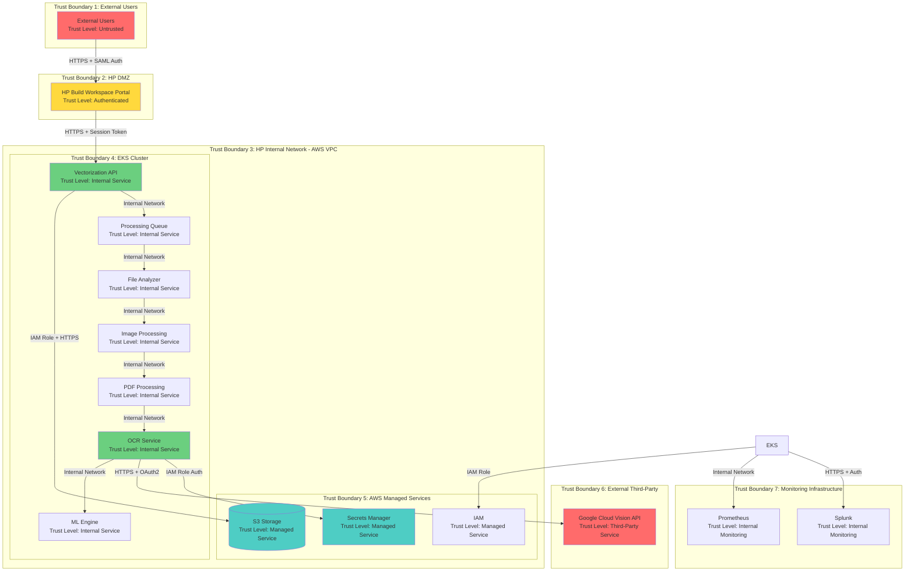
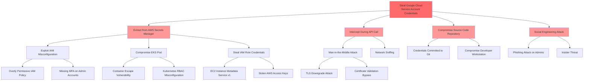

# STRIDE-Based Threat Modeling Analysis

## System Overview

The OCR Processing Service is a cloud-based document vectorization system that processes customer documents (images and PDFs) through optical character recognition (OCR) and machine learning to extract text and generate DXF outputs. The system is deployed on AWS EKS (Elastic Kubernetes Service) and integrates with Google Cloud Vision API for OCR processing. Users access the system through HP Build Workspace Portal using HP OneUID/SAML 2.0 authentication.

**Key Components:**
- HP Build Workspace Portal (User Interface)
- Vectorization API (Entry Point)
- Processing Queue (AWS SQS)
- File Analyzer, Image Processing, PDF Processing Services
- OCR Service with Google Cloud Vision API Integration
- ML Engine for Text Processing
- AWS S3 Storage for Document Storage
- AWS Secrets Manager for Credential Management
- Splunk and Prometheus for Monitoring

## Architecture and Components

### External Components
- **HP Build Workspace Portal**: Web-based user interface for file uploads, authenticated via HP OneUID/SAML 2.0
- **Google Cloud Vision API**: Third-party OCR service accessed via OAuth2 authentication

### AWS Infrastructure
- **EKS Cluster**: Kubernetes cluster hosting microservices architecture
- **S3 Storage**: Document storage with encryption at rest
- **AWS Secrets Manager**: Secure storage for Google Cloud service account credentials
- **IAM**: Identity and access management for service authentication
- **VPC**: Network isolation and security groups

### Application Services
- **Vectorization API**: REST API gateway for file upload and processing requests
- **Processing Queue**: Asynchronous job queue for file processing
- **File Analyzer**: File type detection and validation
- **Image Processing**: Image format conversion and optimization
- **PDF Processing**: PDF parsing and page extraction
- **OCR Service**: Integration with Google Cloud Vision API
- **ML Engine**: Machine learning-based text processing and vectorization

### Monitoring Infrastructure
- **Splunk**: Centralized logging and SIEM
- **Prometheus**: Metrics collection and monitoring

## Threat Analysis Summary

The threat model identified **27 distinct threats** across all STRIDE categories affecting multiple system components. The analysis revealed:

**Critical Risk Threats (3):**
- Unauthorized access to Google Cloud service account credentials
- Sensitive document content exposure during API transmission
- Elevation of privilege through compromised IAM roles

**High Risk Threats (15):**
- User impersonation and authentication bypass
- Man-in-the-middle attacks on data transmission
- Unauthorized S3 bucket access
- Container escape and privilege escalation
- Service impersonation within EKS cluster

**Medium Risk Threats (9):**
- Denial of service through resource exhaustion
- Log tampering and repudiation
- Metrics endpoint information disclosure
- Cross-region data interception

**Key Attack Vectors Identified:**
1. Credential theft targeting Google Cloud Vision API access
2. Data exfiltration through S3 bucket misconfiguration
3. Denial of service through API quota exhaustion
4. Container-based attacks within EKS cluster
5. Supply chain attacks through compromised container images

## Security Requirements Table

| Component | Threat ID | STRIDE Category | Threat Description | Security Requirement | Recommended Control |
|-----------|-----------|-----------------|-------------------|---------------------|---------------------|
| HP Build Workspace Portal → Vectorization API | T-001 | Spoofing | Attacker impersonates legitimate user to submit malicious files | Implement strong multi-factor authentication for all user access | Enforce HP OneUID/SAML 2.0 with mandatory MFA; implement adaptive authentication based on risk scoring; log all authentication attempts to Splunk |
| HP Build Workspace Portal → Vectorization API | T-002 | Tampering | Man-in-the-middle attack modifying file upload requests | Enforce encrypted communications with certificate validation | Implement TLS 1.3 for all communications; enable HSTS headers with 1-year max-age; implement certificate pinning for mobile clients; use AWS Certificate Manager for certificate lifecycle management |
| Vectorization API → Processing Queue | T-003 | Repudiation | User denies submitting malicious or inappropriate content | Implement comprehensive audit logging with non-repudiation controls | Log user identity, timestamp, source IP, file hash (SHA-256), and file metadata to Splunk; implement log integrity verification; maintain 90-day hot storage and 1-year cold storage; use write-once log storage |
| Processing Queue → File Analyzer | T-004 | Information Disclosure | Sensitive document content exposed through insecure queue messages | Encrypt all data in transit and at rest within processing pipeline | Enable AWS SQS encryption at rest using AWS KMS; encrypt message payloads before queuing; implement IAM policies restricting queue access to authorized services only; enable VPC endpoints for SQS |
| OCR Service → AWS Secrets Manager | T-005 | Spoofing | Unauthorized service attempts to retrieve Google Cloud credentials | Enforce service identity verification and least privilege access | Implement IAM role-based authentication with EKS service accounts; enable AWS CloudTrail logging for all Secrets Manager access; implement IP-based access restrictions; require MFA for manual credential access |
| OCR Service → Google Cloud Vision API | T-006 | Tampering | API request/response intercepted and modified in transit | Ensure integrity and authenticity of API communications | Enforce TLS 1.3 with certificate validation; implement request signing using OAuth2 tokens; validate response integrity using checksums; implement timeout controls (30 second max) |
| OCR Service → Google Cloud Vision API | T-007 | Information Disclosure | Sensitive document content exposed during API transmission | Protect data confidentiality during third-party API calls | Use TLS 1.3 encryption for all API calls; validate Google Cloud Vision API data handling policies and DPA compliance; implement data classification tagging; minimize data sent to API (send only necessary content) |
| Google Cloud Vision API | T-008 | Denial of Service | API rate limits exceeded causing service disruption | Implement rate limiting and request throttling controls | Enforce 1800 requests/minute limit; implement circuit breaker pattern with 5-minute cooldown; use exponential backoff (initial 1s, max 60s); implement queue-based processing with priority levels; monitor API quota usage with alerts at 80% threshold |
| AWS Secrets Manager | T-009 | Elevation of Privilege | Compromised IAM role gains access to service account credentials | Implement least privilege access and credential rotation | Enforce least privilege IAM policies with explicit deny for unauthorized actions; enable MFA for credential rotation operations; audit access logs daily; rotate credentials every 90 days automatically; implement break-glass procedures for emergency access |
| S3 Storage | T-010 | Information Disclosure | Unauthorized access to processed files and customer documents | Implement defense-in-depth access controls for object storage | Enforce S3 bucket policies with explicit deny-by-default; enable S3 access logging to dedicated audit bucket; implement VPC endpoints for S3 access; use pre-signed URLs with 15-minute expiration; enable S3 Block Public Access; implement bucket versioning |
| S3 Storage | T-011 | Tampering | Malicious modification of stored files or processing results | Ensure integrity and immutability of stored data | Enable S3 versioning with MFA delete protection; implement S3 Object Lock for critical files (compliance mode, 7-year retention); use S3 bucket encryption with AWS KMS customer-managed keys; enable CloudTrail for S3 data events; implement integrity checks using file hashes |
| EKS Cluster | T-012 | Elevation of Privilege | Container escape leading to node compromise | Harden container runtime and implement defense-in-depth | Implement Pod Security Standards (restricted profile); enforce non-root containers (runAsNonRoot: true); enable SELinux or AppArmor profiles; scan images with Trivy blocking HIGH/CRITICAL vulnerabilities; apply security patches within 7 days; implement seccomp profiles; use read-only root filesystems |
| EKS Cluster → External Services | T-013 | Spoofing | Rogue service impersonates legitimate cluster component | Implement mutual authentication for service-to-service communication | Deploy service mesh (Istio or Linkerd) with mutual TLS; use Kubernetes service accounts with token projection; enforce NetworkPolicies denying all traffic by default; implement pod identity with SPIFFE/SPIRE; validate service certificates |
| ML Engine Processing | T-014 | Tampering | Malicious input designed to poison ML model or extract training data | Implement input validation and ML security controls | Validate all inputs against expected schemas; implement confidence score thresholds (minimum 0.7); isolate ML processing in dedicated namespace; monitor for adversarial inputs using anomaly detection; implement model versioning and rollback capability; sanitize outputs before storage |
| Splunk Logging | T-015 | Repudiation | Logs tampered with to hide malicious activity | Ensure log integrity and immutability | Use write-once log storage with WORM compliance; implement cryptographic log integrity verification (SHA-256 hashing); enforce TLS 1.3 for log transmission; restrict log modification access to security team only; implement log forwarding redundancy; enable Splunk audit logging |
| Prometheus Metrics | T-016 | Information Disclosure | Sensitive operational data exposed through metrics endpoints | Secure monitoring endpoints and sanitize metrics | Implement authentication for Prometheus endpoints using OAuth2 or basic auth; sanitize metric labels removing PII and sensitive data; use Kubernetes NetworkPolicies restricting access to monitoring namespace; implement RBAC for Grafana dashboards; encrypt metrics in transit |
| User File Upload | T-017 | Denial of Service | Large file uploads or malicious files causing resource exhaustion | Implement file validation and resource limits | Enforce file size limits (20MB for images, 2000 pages for PDFs); validate file types using magic number verification; implement antivirus scanning with ClamAV; apply rate limiting per user (10 files/minute); implement resource quotas per namespace; use timeout controls (5 minutes max processing time) |
| OAuth2 Authentication Flow | T-018 | Spoofing | Stolen or leaked service account credentials used for unauthorized API access | Implement secure credential management and monitoring | Store credentials exclusively in AWS Secrets Manager with KMS encryption; implement automated 90-day credential rotation; monitor for unusual API usage patterns (>200% baseline triggers alert); use short-lived tokens (1-hour expiration); implement credential leak detection in code repositories; enable OAuth2 token revocation |
| PDF Processing Component | T-019 | Tampering | Malicious PDF exploiting parser vulnerabilities | Implement secure file processing with sandboxing | Process PDFs in sandboxed containers with gVisor or Kata Containers; validate PDF structure before processing; implement resource limits (2GB memory, 4 CPU cores max); scan with antivirus before processing; update PDF libraries (PyPDF2, pdfplumber) monthly; implement timeout controls (5 minutes max) |
| Image Processing Component | T-020 | Denial of Service | Image bombs or malicious images causing memory exhaustion | Implement image validation and resource controls | Validate image dimensions before processing (max 10000x10000 pixels); implement memory limits (1GB per container); process in isolated containers with resource quotas; implement 30-second timeout per image; validate image headers and structure; use ImageMagick with security policies enabled |
| DXF Output Generation | T-021 | Tampering | Malicious code injection into generated DXF files | Ensure output integrity and prevent injection attacks | Validate DXF output format against schema; sanitize all text content removing special characters; implement output scanning for malicious patterns; use secure serialization libraries (ezdxf with input validation); validate coordinate ranges; implement output size limits (50MB max) |
| Cross-Region Data Transfer | T-022 | Information Disclosure | Data intercepted during S3 cross-region replication | Encrypt data during replication and transit | Enable S3 replication with SSE-KMS encryption; implement S3 bucket versioning for replication tracking; use VPC endpoints for replication traffic; enable CloudWatch metrics for replication monitoring; validate replication encryption status; implement replication time control (RTC) |
| API Rate Limiting | T-023 | Denial of Service | Distributed attack bypassing rate limiting controls | Implement multi-layer rate limiting and DDoS protection | Implement per-user rate limiting (10 req/min), per-IP limiting (50 req/min), and global limiting (1000 req/min); deploy AWS WAF with rate-based rules; implement CAPTCHA for suspicious patterns (>5 failures); use AWS Shield Standard; implement geographic restrictions if applicable; enable CloudFront with DDoS protection |
| Kubernetes API Server | T-024 | Elevation of Privilege | Unauthorized access to cluster management functions | Secure Kubernetes control plane access | Enable RBAC with least privilege (no cluster-admin for applications); implement API server audit logging to CloudWatch; use private API endpoints (no public access); enable admission controllers (PodSecurityPolicy, ResourceQuota, LimitRanger); implement network policies restricting API server access; require client certificate authentication; enable encryption at rest for etcd |
| Container Registry | T-025 | Tampering | Malicious container images deployed to production | Implement container image security and supply chain controls | Sign container images using Docker Content Trust or Cosign; implement image scanning in CI/CD with Trivy or Snyk; use private ECR registry with IAM authentication; enable vulnerability scanning on push; implement image promotion workflow (dev→staging→prod); maintain image provenance and SBOM; block deployment of unsigned images |
| Service-to-Service Communication | T-026 | Spoofing | Internal service impersonation within EKS cluster | Implement zero-trust networking within cluster | Deploy service mesh (Istio/Linkerd) with mutual TLS for all service communication; use Kubernetes NetworkPolicies with default deny; enforce pod identity using service accounts; implement SPIFFE/SPIRE for workload identity; validate service certificates; implement authorization policies at service mesh layer; enable mTLS strict mode |
| All Components | T-027 | Information Disclosure | Sensitive data exposure through application logs or error messages | Implement secure logging practices and data sanitization | Sanitize logs removing PII, credentials, and sensitive data; implement structured logging with consistent format; use log levels appropriately (no sensitive data in INFO/DEBUG); implement error handling without stack trace exposure to users; encrypt logs in transit and at rest; implement log retention policies (90 days operational, 1 year security logs) |

## Security Control Categories

### Category 1: Identity and Access Management

**Requirements:**
- **REQ-IAM-001**: Implement multi-factor authentication (MFA) for all user access to HP Build Workspace Portal using HP OneUID/SAML 2.0
- **REQ-IAM-002**: Enforce least privilege IAM policies for all AWS services with explicit deny statements for unauthorized actions
- **REQ-IAM-003**: Implement role-based access control (RBAC) in Kubernetes with no cluster-admin privileges for application workloads
- **REQ-IAM-004**: Use IAM roles for service accounts (IRSA) in EKS for pod-level AWS service authentication
- **REQ-IAM-005**: Implement service account authentication for all Kubernetes workloads with token projection
- **REQ-IAM-006**: Enable AWS CloudTrail logging for all IAM role assumption and privilege escalation events
- **REQ-IAM-007**: Implement automated credential rotation every 90 days for all service accounts
- **REQ-IAM-008**: Require MFA for all administrative access to AWS console, EKS cluster, and Secrets Manager
- **REQ-IAM-009**: Implement session management with secure session tokens, 15-minute idle timeout, and 8-hour maximum session duration
- **REQ-IAM-010**: Deploy adaptive authentication with risk-based scoring considering user behavior, location, and device

**Recommended Controls:**
- Deploy AWS IAM Access Analyzer to identify overly permissive policies
- Implement AWS Organizations Service Control Policies (SCPs) for account-level guardrails
- Use AWS SSO for centralized identity management
- Deploy Kubernetes admission controllers (OPA/Gatekeeper) to enforce RBAC policies
- Implement just-in-time (JIT) access for administrative operations
- Use AWS IAM Policy Simulator for policy testing before deployment
- Deploy HashiCorp Vault or AWS Secrets Manager for dynamic credential generation
- Implement privileged access management (PAM) solution for break-glass scenarios

### Category 2: API Security

**Requirements:**
- **REQ-API-001**: Implement OAuth2 authentication for Google Cloud Vision API access using service account credentials
- **REQ-API-002**: Enforce TLS 1.3 for all API communications with strong cipher suites only
- **REQ-API-003**: Implement comprehensive input validation for all API endpoints using schema validation
- **REQ-API-004**: Deploy multi-layer rate limiting: per-user (10 req/min), per-IP (50 req/min), global (1000 req/min)
- **REQ-API-005**: Implement API request signing and response integrity verification
- **REQ-API-006**: Enforce file size limits: 20MB for images, 2000 pages for PDFs
- **REQ-API-007**: Implement API timeout controls: 30 seconds for external API calls, 5 minutes for file processing
- **REQ-API-008**: Deploy circuit breaker pattern for Google Cloud Vision API with 5-minute cooldown after 5 consecutive failures
- **REQ-API-009**: Implement exponential backoff for API retries (initial 1s, max 60s)
- **REQ-API-010**: Use pre-signed URLs for S3 access with 15-minute expiration
- **REQ-API-011**: Implement API versioning with deprecation notices 6 months in advance
- **REQ-API-012**: Deploy API gateway with request/response logging and correlation IDs

**Recommended Controls:**
- Deploy AWS API Gateway with AWS WAF integration for DDoS protection
- Implement OWASP API Security Top 10 controls
- Use AWS Shield Standard for DDoS protection
- Deploy rate limiting at multiple layers (application, API gateway, WAF)
- Implement CAPTCHA challenges for suspicious request patterns
- Use AWS CloudFront for geographic distribution and DDoS mitigation
- Deploy API security testing tools (Burp Suite, OWASP ZAP) in CI/CD pipeline
- Implement API abuse detection using machine learning anomaly detection
- Use GraphQL query complexity analysis if applicable
- Deploy API documentation with security requirements (OpenAPI/Swagger)

### Category 3: Data Protection

**Requirements:**
- **REQ-DATA-001**: Enforce TLS 1.3 encryption for all data in transit with HSTS headers (1-year max-age)
- **REQ-DATA-002**: Implement encryption at rest for all S3 buckets using AWS KMS customer-managed keys
- **REQ-DATA-003**: Enable encryption at rest for AWS SQS queues using AWS KMS
- **REQ-DATA-004**: Encrypt all queue message payloads before submission to processing queue
- **REQ-DATA-005**: Implement data classification tagging for all stored documents (Public, Internal, Confidential, Restricted)
- **REQ-DATA-006**: Enable S3 versioning with MFA delete protection for all document storage buckets
- **REQ-DATA-007**: Implement S3 Object Lock in compliance mode with 7-year retention for audit-critical documents
- **REQ-DATA-008**: Use AWS KMS automatic key rotation (annual) for all encryption keys
- **REQ-DATA-009**: Implement file integrity verification using SHA-256 hashing for all stored documents
- **REQ-DATA-010**: Enable S3 cross-region replication with encryption for disaster recovery
- **REQ-DATA-011**: Implement secure key management with separation of duties for key administration
- **REQ-DATA-012**: Deploy data loss prevention (DLP) controls to prevent unauthorized data exfiltration
- **REQ-DATA-013**: Implement data retention policies: 90 days for operational data, 1 year for security logs, 7 years for compliance data
- **REQ-DATA-014**: Enable S3 Block Public Access at account and bucket levels

**Recommended Controls:**
- Deploy AWS Macie for sensitive data discovery and classification
- Implement AWS KMS key policies with least privilege access
- Use AWS Certificate Manager for TLS certificate lifecycle management
- Deploy certificate transparency monitoring
- Implement database encryption at rest for any RDS instances
- Use AWS Secrets Manager for encryption key storage
- Deploy AWS CloudHSM for FIPS 140-2 Level 3 compliance if required
- Implement tokenization for sensitive data elements
- Use AWS S3 Intelligent-Tiering for cost-optimized storage with encryption
- Deploy data masking for non-production environments

### Category 4: Network Security

**Requirements:**
- **REQ-NET-001**: Implement VPC network segmentation with separate subnets for public, private, and data tiers
- **REQ-NET-002**: Deploy security groups with least privilege rules (deny-by-default, explicit allow)
- **REQ-NET-003**: Implement Kubernetes NetworkPolicies with default deny for all namespaces
- **REQ-NET-004**: Use VPC endpoints for all AWS service access (S3, Secrets Manager, SQS, CloudWatch)
- **REQ-NET-005**: Deploy service mesh (Istio or Linkerd) with mutual TLS for all service-to-service communication
- **REQ-NET-006**: Enable VPC Flow Logs for all VPCs with logging to S3 and analysis in Splunk
- **REQ-NET-007**: Implement network intrusion detection using AWS GuardDuty
- **REQ-NET-008**: Deploy AWS WAF with managed rule sets (Core Rule Set, Known Bad Inputs, SQL Injection)
- **REQ-NET-009**: Implement private EKS API endpoints (no public access)
- **REQ-NET-010**: Use AWS PrivateLink for secure third-party service access where available
- **REQ-NET-011**: Implement egress filtering with explicit allow lists for external destinations
- **REQ-NET-012**: Deploy bastion hosts with session recording for administrative access

**Recommended Controls:**
- Deploy AWS Network Firewall for stateful inspection
- Implement AWS Transit Gateway for hub-and-spoke network architecture
- Use AWS Security Hub for centralized security findings
- Deploy Suricata or Snort for network intrusion detection
- Implement DNS security with Route 53 Resolver DNS Firewall
- Use AWS Shield Advanced for enhanced DDoS protection
- Deploy VPC traffic mirroring for deep packet inspection
- Implement zero-trust network architecture with continuous verification
- Use AWS Network Access Analyzer for network path analysis
- Deploy Cilium for advanced Kubernetes network policies with eBPF

### Category 5: Container and Kubernetes Security

**Requirements:**
- **REQ-K8S-001**: Implement Pod Security Standards with restricted profile enforcement
- **REQ-K8S-002**: Enforce non-root containers (runAsNonRoot: true) for all workloads
- **REQ-K8S-003**: Enable SELinux or AppArmor profiles for all containers
- **REQ-K8S-004**: Implement read-only root filesystems for all containers where possible
- **REQ-K8S-005**: Deploy seccomp profiles restricting system calls to minimum required set
- **REQ-K8S-006**: Scan all container images with Trivy blocking HIGH and CRITICAL vulnerabilities
- **REQ-K8S-007**: Sign all container images using Docker Content Trust or Cosign
- **REQ-K8S-008**: Implement resource quotas and limit ranges for all namespaces
- **REQ-K8S-009**: Enable Kubernetes audit logging with forwarding to CloudWatch and Splunk
- **REQ-K8S-010**: Deploy admission controllers: PodSecurityPolicy, ResourceQuota, LimitRanger, ImagePolicyWebhook
- **REQ-K8S-011**: Implement network policies isolating namespaces and restricting pod-to-pod communication
- **REQ-K8S-012**: Use private container registry (AWS ECR) with IAM authentication
- **REQ-K8S-013**: Enable vulnerability scanning on image push to ECR
- **REQ-K8S-014**: Implement image promotion workflow (dev→staging→prod) with security gates
- **REQ-K8S-015**: Deploy runtime security monitoring with Falco or Sysdig

**Recommended Controls:**
- Deploy gVisor or Kata Containers for enhanced container isolation
- Implement OPA/Gatekeeper for policy-as-code enforcement
- Use Kubernetes RBAC with least privilege service accounts
- Deploy Kubernetes secrets encryption at rest using AWS KMS
- Implement pod identity with SPIFFE/SPIRE
- Use Kubernetes external secrets operator for AWS Secrets Manager integration
- Deploy Kyverno for Kubernetes policy management
- Implement container image provenance tracking with SBOM generation
- Use Kubernetes ValidatingAdmissionWebhook for custom security policies
- Deploy Aqua Security or Prisma Cloud for comprehensive container security

### Category 6: Logging and Monitoring

**Requirements:**
- **REQ-LOG-001**: Implement centralized logging to Splunk for all application, infrastructure, and security logs
- **REQ-LOG-002**: Log all authentication attempts (success and failure) with user identity, timestamp, source IP, and session ID
- **REQ-LOG-003**: Log all Google Cloud Vision API calls with file hash, timestamp, response time, and confidence scores
- **REQ-LOG-004**: Enable AWS CloudTrail for all API calls with log file validation
- **REQ-LOG-005**: Implement structured logging in JSON format with consistent timestamp format (ISO 8601)
- **REQ-LOG-006**: Deploy write-once log storage with cryptographic integrity verification (SHA-256)
- **REQ-LOG-007**: Implement log retention: 90-day hot storage, 1-year cold storage for security logs
- **REQ-LOG-008**: Enable S3 access logging to dedicated audit bucket
- **REQ-LOG-009**: Deploy security event monitoring with automated alerting for critical events
- **REQ-LOG-010**: Implement audit trails for all privileged operations with non-repudiation controls
- **REQ-LOG-011**: Log all failed authorization attempts with resource accessed and user context
- **REQ-LOG-012**: Implement log sanitization removing PII, credentials, and sensitive data
- **REQ-LOG-013**: Deploy real-time security dashboards in Splunk displaying authentication rates, API errors, and security events
- **REQ-LOG-014**: Enable CloudWatch Logs for EKS control plane and application logs
- **REQ-LOG-015**: Implement correlation rules in Splunk for multi-stage attack detection

**Recommended Controls:**
- Deploy Splunk Enterprise Security (ES) for advanced threat detection
- Implement user behavior analytics (UBA) for anomaly detection
- Use AWS CloudWatch Insights for log analysis and querying
- Deploy AWS Security Hub for aggregated security findings
- Implement automated incident response with PagerDuty integration
- Use AWS EventBridge for event-driven security automation
- Deploy Prometheus and Grafana for metrics visualization
- Implement log forwarding redundancy for high availability
- Use AWS Kinesis Data Firehose for real-time log streaming
- Deploy ELK stack (Elasticsearch, Logstash, Kibana) as backup logging solution

### Category 7: Application Security

**Requirements:**
- **REQ-APP-001**: Implement comprehensive input validation for all user inputs using schema validation
- **REQ-APP-002**: Validate file types using magic number verification (not file extension)
- **REQ-APP-003**: Deploy antivirus scanning with ClamAV for all uploaded files before processing
- **REQ-APP-004**: Implement output encoding to prevent injection attacks in generated DXF files
- **REQ-APP-005**: Use parameterized queries for all database operations (if applicable)
- **REQ-APP-006**: Implement secure error handling without exposing stack traces or system information to users
- **REQ-APP-007**: Deploy static application security testing (SAST) in CI/CD pipeline with quality gates
- **REQ-APP-008**: Implement dynamic application security testing (DAST) in staging environment
- **REQ-APP-009**: Deploy software composition analysis (SCA) for dependency vulnerability scanning
- **REQ-APP-010**: Implement secrets scanning in code repositories using git-secrets or TruffleHog
- **REQ-APP-011**: Use secure coding standards (OWASP Secure Coding Practices)
- **REQ-APP-012**: Implement Content Security Policy (CSP) headers for web applications
- **REQ-APP-013**: Deploy security headers: X-Frame-Options, X-Content-Type-Options, X-XSS-Protection
- **REQ-APP-014**: Implement CORS policies with explicit origin whitelisting
- **REQ-APP-015**: Use secure session management with HttpOnly and Secure cookie flags

**Recommended Controls:**
- Deploy Veracode or Checkmarx for SAST scanning
- Implement OWASP ZAP or Burp Suite for DAST scanning
- Use Snyk or Dependabot for dependency scanning
- Deploy SonarQube for code quality and security analysis
- Implement security champions program for development teams
- Use secure development lifecycle (SDL) methodology
- Deploy threat modeling in design phase for all new features
- Implement security code review process with checklist
- Use OWASP Dependency-Check for vulnerable component identification
- Deploy security training for developers (OWASP Top 10, Secure Coding)

### Category 8: Secrets Management

**Requirements:**
- **REQ-SEC-001**: Store all credentials exclusively in AWS Secrets Manager with KMS encryption
- **REQ-SEC-002**: Implement automated credential rotation every 90 days for all service accounts
- **REQ-SEC-003**: Use short-lived tokens with 1-hour expiration for OAuth2 authentication
- **REQ-SEC-004**: Implement credential leak detection in code repositories and public sources
- **REQ-SEC-005**: Enable OAuth2 token revocation capability for compromised credentials
- **REQ-SEC-006**: Implement break-glass procedures for emergency credential access with audit logging
- **REQ-SEC-007**: Use IAM roles instead of long-lived credentials where possible
- **REQ-SEC-008**: Implement secrets encryption at rest using AWS KMS customer-managed keys
- **REQ-SEC-009**: Deploy secrets scanning in CI/CD pipeline blocking commits with exposed secrets
- **REQ-SEC-010**: Implement least privilege access to Secrets Manager with explicit deny policies
- **REQ-SEC-011**: Enable CloudTrail logging for all Secrets Manager access with alerting on unusual patterns
- **REQ-SEC-012**: Implement secrets versioning with rollback capability

**Recommended Controls:**
- Deploy HashiCorp Vault for dynamic secrets generation
- Implement AWS Secrets Manager automatic rotation for RDS credentials
- Use Kubernetes External Secrets Operator for secrets synchronization
- Deploy AWS Systems Manager Parameter Store for non-sensitive configuration
- Implement secrets baseline scanning in container images
- Use AWS KMS key policies with separation of duties
- Deploy credential stuffing detection for authentication endpoints
- Implement password complexity requirements (minimum 16 characters, complexity rules)
- Use AWS Secrets Manager VPC endpoints for private access
- Deploy secrets management training for development and operations teams

### Category 9: Incident Response and Forensics

**Requirements:**
- **REQ-IR-001**: Implement automated alerting for critical security events with PagerDuty integration
- **REQ-IR-002**: Deploy incident response playbooks for common attack scenarios
- **REQ-IR-003**: Maintain 90-day hot storage and 1-year cold storage for forensic analysis
- **REQ-IR-004**: Implement automated incident response for high-confidence threats (account lockout, IP blocking)
- **REQ-IR-005**: Deploy security orchestration, automation, and response (SOAR) platform
- **REQ-IR-006**: Implement evidence collection and chain of custody procedures
- **REQ-IR-007**: Enable AWS CloudTrail Insights for anomalous API activity detection
- **REQ-IR-008**: Deploy AWS GuardDuty for threat detection with automated response
- **REQ-IR-009**: Implement security incident classification and severity rating system
- **REQ-IR-010**: Conduct quarterly incident response tabletop exercises

**Recommended Controls:**
- Deploy AWS Security Hub for centralized incident management
- Implement TheHive or Cortex for incident response case management
- Use AWS Lambda for automated incident response actions
- Deploy AWS Step Functions for incident response workflow orchestration
- Implement forensic instance isolation using AWS Systems Manager
- Use AWS Backup for point-in-time recovery capability
- Deploy memory forensics tools (Volatility, Rekall) for container forensics
- Implement network packet capture for forensic analysis
- Use AWS Detective for security investigation and analysis
- Deploy threat intelligence feeds integration with Splunk

### Category 10: Compliance and Governance

**Requirements:**
- **REQ-COMP-001**: Implement GDPR compliance controls including data minimization and right to erasure
- **REQ-COMP-002**: Deploy CCPA compliance controls including data disclosure and opt-out mechanisms
- **REQ-COMP-003**: Maintain compliance with HP cybersecurity standards and policies
- **REQ-COMP-004**: Implement data processing agreements (DPA) with Google Cloud Vision API
- **REQ-COMP-005**: Deploy automated compliance scanning using AWS Config Rules
- **REQ-COMP-006**: Implement CIS Kubernetes Benchmark compliance validation
- **REQ-COMP-007**: Deploy PCI DSS controls if processing payment card data
- **REQ-COMP-008**: Implement SOC 2 Type II controls for service organization
- **REQ-COMP-009**: Deploy automated compliance reporting for quarterly audits
- **REQ-COMP-010**: Implement data sovereignty controls for geographic data restrictions

**Recommended Controls:**
- Deploy AWS Config for continuous compliance monitoring
- Implement AWS Audit Manager for compliance framework mapping
- Use AWS Control Tower for multi-account governance
- Deploy Terraform Compliance for infrastructure-as-code policy enforcement
- Implement Open Policy Agent (OPA) for policy-as-code
- Use AWS Organizations for centralized policy management
- Deploy compliance dashboards with real-time status
- Implement automated remediation for compliance violations
- Use AWS License Manager for software license compliance
- Deploy privacy impact assessments (PIA) for new features

## Security Implementation Recommendations

### 1. Authentication and Authorization Implementation

**Multi-Factor Authentication (MFA):**
- Deploy HP OneUID/SAML 2.0 integration with mandatory MFA for all users
- Implement adaptive authentication using AWS Cognito or Okta with risk scoring based on:
  - User location (geolocation and IP reputation)
  - Device fingerprinting and trusted device registration
  - Time-based access patterns (unusual access times trigger additional verification)
  - Behavioral biometrics (typing patterns, mouse movements)
- Configure MFA methods: authenticator apps (preferred), SMS (backup), hardware tokens (privileged users)
- Implement MFA bypass procedures for emergency access with enhanced logging and approval workflow

**IAM Role-Based Access Control:**
- Design IAM policies using least privilege principle with explicit deny statements
- Implement service control policies (SCPs) at AWS Organizations level for account-level guardrails
- Use IAM roles for service accounts (IRSA) in EKS for pod-level AWS authentication
- Deploy IAM Access Analyzer to identify overly permissive policies and unused access
- Implement time-bound IAM roles with automatic expiration for temporary access
- Use AWS SSO for centralized identity management across multiple AWS accounts

**Kubernetes RBAC:**
- Create namespace-specific service accounts with minimal required permissions
- Implement role bindings at namespace level (avoid cluster-wide permissions)
- Use Kubernetes admission controllers (OPA/Gatekeeper) to enforce RBAC policies
- Deploy pod security policies restricting privileged container execution
- Implement service mesh authorization policies for fine-grained access control

**Session Management:**
- Configure session timeout: 15-minute idle timeout, 8-hour maximum session duration
- Implement secure session token generation using cryptographically secure random number generators
- Use HttpOnly and Secure flags for all session cookies
- Implement session fixation protection with token regeneration after authentication
- Deploy concurrent session limits (maximum 3 active sessions per user)
- Implement session revocation capability for compromised accounts

### 2. API Security Implementation

**OAuth2 Implementation for Google Cloud Vision API:**
- Store service account credentials exclusively in AWS Secrets Manager with KMS encryption
- Implement automated credential rotation every 90 days with zero-downtime rotation
- Use short-lived access tokens (1-hour expiration) with automatic refresh
- Implement token caching to minimize token generation requests
- Deploy credential leak detection scanning code repositories and public sources
- Enable OAuth2 token revocation for compromised credentials
- Implement service account impersonation with audit logging for administrative operations

**API Rate Limiting Strategy:**
- Implement multi-layer rate limiting:
  - **User-level**: 10 requests/minute per authenticated user
  - **IP-level**: 50 requests/minute per source IP address
  - **Global**: 1000 requests/minute across all users
- Deploy AWS WAF with rate-based rules for DDoS protection
- Implement token bucket algorithm for smooth rate limiting
- Use Redis for distributed rate limiting state across multiple API instances
- Implement rate limit headers in API responses (X-RateLimit-Limit, X-RateLimit-Remaining, X-RateLimit-Reset)
- Deploy CAPTCHA challenges for users exceeding rate limits
- Implement exponential backoff guidance in API documentation

**API Gateway Configuration:**
- Deploy AWS API Gateway with request/response logging
- Implement API key management for internal service-to-service communication
- Use API Gateway usage plans for tiered access control
- Enable API Gateway caching for frequently accessed endpoints (5-minute TTL)
- Implement request validation using JSON Schema at API Gateway level
- Deploy API Gateway custom authorizers for fine-grained authorization
- Enable AWS X-Ray for distributed tracing and performance analysis

**Circuit Breaker Implementation:**
- Implement circuit breaker for Google Cloud Vision API calls:
  - **Closed state**: Normal operation, all requests pass through
  - **Open state**: After 5 consecutive failures, block all requests for 5 minutes
  - **Half-open state**: After cooldown, allow 3 test requests to check service recovery
- Use Hystrix or Resilience4j library for circuit breaker implementation
- Implement fallback mechanisms for circuit breaker open state (queue for retry, return cached results)
- Deploy circuit breaker metrics to Prometheus for monitoring
- Implement circuit breaker dashboard showing state transitions and failure rates

### 3. Data Protection Implementation

**Encryption at Rest:**
- Enable S3 bucket encryption using AWS KMS customer-managed keys (CMK)
- Configure KMS key policies with least privilege access and separation of duties
- Enable automatic KMS key rotation (annual rotation)
- Implement S3 bucket policies enforcing encryption (deny unencrypted uploads)
- Enable encryption for EBS volumes attached to EKS nodes
- Deploy AWS Secrets Manager with KMS encryption for all credentials
- Enable encryption at rest for SQS queues using AWS KMS
- Implement encryption for RDS databases if applicable (AES-256)

**Encryption in Transit:**
- Enforce TLS 1.3 for all communications with strong cipher suites:
  - TLS_AES_256_GCM_SHA384
  - TLS_AES_128_GCM_SHA256
  - TLS_CHACHA20_POLY1305_SHA256
- Disable TLS 1.0, 1.1, and weak cipher suites (RC4, DES, 3DES)
- Implement HSTS headers with 1-year max-age and includeSubDomains directive
- Deploy certificate pinning for mobile clients to prevent MITM attacks
- Use AWS Certificate Manager for TLS certificate lifecycle management
- Implement certificate transparency monitoring for unauthorized certificate issuance
- Enable TLS for all internal service-to-service communication using service mesh

**Key Management:**
- Implement key hierarchy: master keys in AWS KMS, data encryption keys (DEKs) generated per object
- Use envelope encryption for large data objects
- Deploy key usage auditing with CloudTrail logging
- Implement key access policies with explicit deny for unauthorized principals
- Use separate KMS keys for different data classifications (Public, Internal, Confidential, Restricted)
- Implement key deletion protection with 30-day waiting period
- Deploy AWS CloudHSM for FIPS 140-2 Level 3 compliance if required

**Data Classification and Handling:**
- Implement data classification tagging for all S3 objects:
  - **Public**: No restrictions, can be shared externally
  - **Internal**: HP internal use only, no external sharing
  - **Confidential**: Restricted to authorized personnel, encryption required
  - **Restricted**: Highest sensitivity, additional access controls and audit logging
- Deploy AWS Macie for automated sensitive data discovery (PII, PHI, financial data)
- Implement data loss prevention (DLP) controls to prevent unauthorized exfiltration
- Use S3 Object Lock in compliance mode for immutable storage of audit-critical documents
- Implement data retention policies with automated deletion after retention period
- Deploy data masking for non-production environments

### 4. Network Security Implementation

**VPC Architecture:**
- Implement three-tier network architecture:
  - **Public subnet**: Load balancers and NAT gateways (no application workloads)
  - **Private subnet**: Application workloads (EKS nodes, application containers)
  - **Data subnet**: Data stores (RDS, ElastiCache) with no internet access
- Deploy separate VPCs for production, staging, and development environments
- Implement VPC peering or AWS Transit Gateway for cross-VPC communication
- Use VPC endpoints for AWS service access (S3, Secrets Manager, SQS, CloudWatch)
- Enable VPC Flow Logs for all VPCs with analysis in Splunk

**Security Groups and Network ACLs:**
- Implement security groups with least privilege rules (deny-by-default, explicit allow)
- Use separate security groups for each application tier (web, application, data)
- Implement network ACLs as additional defense layer with stateless rules
- Deploy security group rules referencing other security groups (not IP addresses)
- Implement egress filtering with explicit allow lists for external destinations
- Use AWS Security Group Analyzer to identify overly permissive rules

**Kubernetes Network Policies:**
- Implement default deny NetworkPolicies for all namespaces
- Create namespace-specific NetworkPolicies allowing only required pod-to-pod communication
- Deploy NetworkPolicies restricting egress traffic to specific external destinations
- Use Calico or Cilium for advanced network policy capabilities
- Implement NetworkPolicies isolating monitoring namespace from application namespaces
- Deploy NetworkPolicies restricting access to Kubernetes API server

**Service Mesh Implementation:**
- Deploy Istio or Linkerd service mesh for mutual TLS (mTLS) between services
- Configure mTLS in strict mode (reject plaintext connections)
- Implement service mesh authorization policies for fine-grained access control
- Deploy service mesh observability with distributed tracing (Jaeger)
- Use service mesh for traffic management (canary deployments, circuit breaking)
- Implement service mesh rate limiting and retry policies
- Deploy service mesh ingress gateway for external traffic management

**DDoS Protection:**
- Enable AWS Shield Standard (automatic, no cost) for basic DDoS protection
- Deploy AWS WAF with managed rule sets:
  - AWS Managed Rules Core Rule Set (CRS)
  - AWS Managed Rules Known Bad Inputs
  - AWS Managed Rules SQL Injection
  - AWS Managed Rules Linux Operating System
- Implement rate-based rules in AWS WAF (block IPs exceeding 2000 requests in 5 minutes)
- Use AWS CloudFront for geographic distribution and DDoS mitigation
- Deploy AWS Shield Advanced for enhanced DDoS protection (if required)
- Implement DDoS response runbook with escalation procedures

### 5. Container Security Implementation

**Container Image Security:**
- Implement container image scanning in CI/CD pipeline using Trivy or Snyk
- Block deployment of images with HIGH or CRITICAL vulnerabilities
- Sign all container images using Docker Content Trust or Cosign
- Implement image promotion workflow: dev→staging→prod with security gates at each stage
- Use minimal base images (Alpine, Distroless) to reduce attack surface
- Deploy private container registry (AWS ECR) with IAM authentication
- Enable vulnerability scanning on image push to ECR
- Implement image provenance tracking with Software Bill of Materials (SBOM)

**Pod Security Standards:**
- Implement Pod Security Standards with restricted profile:
  - Disallow privileged containers
  - Require non-root user (runAsNonRoot: true)
  - Disallow privilege escalation (allowPrivilegeEscalation: false)
  - Require read-only root filesystem where possible
  - Drop all capabilities, add only required capabilities
  - Disallow host namespaces (hostNetwork, hostPID, hostIPC)
  - Restrict volume types (no hostPath volumes)
- Deploy Pod Security Admission controller to enforce policies
- Use OPA/Gatekeeper for custom policy enforcement
- Implement seccomp profiles restricting system calls
- Enable SELinux or AppArmor profiles for all containers

**Runtime Security:**
- Deploy Falco or Sysdig for runtime security monitoring
- Implement runtime policies detecting:
  - Unexpected process execution in containers
  - Unauthorized file system modifications
  - Suspicious network connections
  - Privilege escalation attempts
  - Container escape attempts
- Deploy runtime security alerts to Splunk with automated response
- Implement container isolation using gVisor or Kata Containers for high-risk workloads
- Use Kubernetes audit logging to track container lifecycle events

**Resource Management:**
- Implement resource quotas for all namespaces:
  - CPU limits: 4 cores per pod, 16 cores per namespace
  - Memory limits: 2GB per pod, 8GB per namespace
  - Storage limits: 10GB per PVC, 50GB per namespace
- Deploy LimitRanger admission controller to enforce default resource limits
- Implement horizontal pod autoscaling (HPA) based on CPU/memory utilization
- Use vertical pod autoscaling (VPA) for right-sizing recommendations
- Deploy cluster autoscaler for node-level scaling
- Implement pod disruption budgets (PDB) for high availability

### 6. Logging and Monitoring Implementation

**Centralized Logging Architecture:**
- Deploy Fluentd or Fluent Bit as log aggregators on each EKS node
- Forward all logs to Splunk using HEC (HTTP Event Collector) over TLS
- Implement structured logging in JSON format with consistent fields:
  - timestamp (ISO 8601 format)
  - severity (DEBUG, INFO, WARN, ERROR, CRITICAL)
  - service_name
  - correlation_id (for request tracing)
  - user_id (for authenticated requests)
  - event_type
  - message
- Deploy log parsing and enrichment in Splunk (GeoIP, threat intelligence)
- Implement log retention: 90-day hot storage in Splunk, 1-year cold storage in S3

**Security Event Monitoring:**
- Implement SIEM correlation rules in Splunk for multi-stage attack detection:
  - Failed authentication followed by successful authentication from different IP
  - Credential access followed by unusual API activity
  - Multiple failed S3 access attempts followed by successful access
  - Container escape indicators followed by privilege escalation
- Deploy automated alerting for critical security events:
  - Multiple failed authentication attempts (>5 in 5 minutes)
  - Privilege escalation attempts
  - Unauthorized Secrets Manager access
  - Unusual API usage patterns (>200% baseline)
  - Container escape indicators
  - Suspicious network connections
- Integrate Splunk with PagerDuty for automated incident creation
- Implement security dashboards displaying real-time security metrics

**Application Performance Monitoring:**
- Deploy Prometheus for metrics collection from all services
- Implement custom metrics for business logic monitoring:
  - Files processed per hour
  - Average processing time per file
  - OCR confidence score distribution
  - API error rates and latency percentiles (p50, p95, p99)
  - Queue depth and processing lag
- Deploy Grafana for metrics visualization with pre-built dashboards
- Implement alerting rules in Prometheus for performance degradation
- Use AWS CloudWatch for AWS service metrics (EKS, S3, SQS)
- Deploy distributed tracing with Jaeger or AWS X-Ray

**Audit Logging:**
- Enable AWS CloudTrail for all API calls with log file validation
- Implement CloudTrail Insights for anomalous API activity detection
- Enable Kubernetes audit logging with forwarding to CloudWatch and Splunk
- Log all authentication events with user identity, timestamp, source IP, and result
- Log all authorization failures with resource accessed and user context
- Implement audit trails for privileged operations with non-repudiation controls
- Deploy write-once log storage with cryptographic integrity verification

**Anomaly Detection:**
- Implement user behavior analytics (UBA) in Splunk for detecting unusual patterns
- Deploy machine learning models for anomaly detection:
  - Unusual file upload volumes or patterns
  - Abnormal API usage (volume, timing, error rates)
  - Suspicious authentication patterns (impossible travel, unusual locations)
  - Data exfiltration indicators (large downloads, unusual access patterns)
- Implement baseline profiling for normal behavior patterns
- Deploy automated response for high-confidence anomalies (account lockout, IP blocking)
- Use AWS GuardDuty for threat detection with machine learning

### 7. Secure Development and Deployment

**CI/CD Security:**
- Implement security scanning in CI/CD pipeline:
  - Static Application Security Testing (SAST) with Veracode or Checkmarx
  - Software Composition Analysis (SCA) with Snyk or Dependabot
  - Container image scanning with Trivy or Aqua
  - Secrets scanning with git-secrets or TruffleHog
  - Infrastructure-as-Code scanning with Checkov or tfsec
- Deploy quality gates blocking deployment with security findings:
  - Block on HIGH or CRITICAL vulnerabilities
  - Block on exposed secrets
  - Block on unsigned container images
- Implement automated security testing in staging environment (DAST)
- Use GitOps workflow with pull request reviews for all changes
- Deploy branch protection rules requiring security review approval

**Infrastructure as Code (IaC):**
- Use Terraform for infrastructure provisioning with version control
- Implement Terraform state encryption and remote state storage in S3
- Deploy Terraform Cloud or Atlantis for automated plan/apply workflow
- Implement policy-as-code with Terraform Sentinel or OPA
- Use Terraform modules for reusable, secure infrastructure patterns
- Deploy infrastructure testing with Terratest
- Implement drift detection with Terraform Cloud or AWS Config

**Secure Configuration Management:**
- Use AWS Systems Manager Parameter Store for non-sensitive configuration
- Implement configuration validation before deployment
- Deploy configuration drift detection with AWS Config
- Use Kubernetes ConfigMaps for application configuration (not secrets)
- Implement configuration versioning with rollback capability
- Deploy configuration change approval workflow for production
- Use AWS AppConfig for feature flag management

**Deployment Strategy:**
- Implement blue-green deployments for zero-downtime updates
- Use canary deployments for gradual rollout with automated rollback
- Deploy feature flags for controlled feature enablement
- Implement automated rollback on deployment failures or performance degradation
- Use Kubernetes rolling updates with health checks
- Deploy chaos engineering practices for resilience testing
- Implement disaster recovery testing quarterly

### 8. Third-Party Integration Security

**Google Cloud Vision API Integration:**
- Validate Google Cloud Vision API security controls and compliance certifications
- Implement data processing agreement (DPA) with Google Cloud
- Minimize data sent to API (send only necessary content, not full documents)
- Implement data residency controls if required (use regional API endpoints)
- Deploy API usage monitoring with cost tracking and budget alerts
- Implement API error handling with graceful degradation
- Use API versioning with deprecation monitoring
- Deploy API health checks with automated failover to backup OCR service if available

**Vendor Security Assessment:**
- Conduct annual vendor security assessments for Google Cloud
- Review vendor security certifications (SOC 2, ISO 27001, PCI DSS)
- Validate vendor incident response procedures and SLA commitments
- Implement vendor risk scoring and continuous monitoring
- Deploy vendor security questionnaire with annual updates
- Review vendor data handling and privacy policies
- Implement vendor access controls and audit logging

**API Security Best Practices:**
- Implement API authentication using OAuth2 with short-lived tokens
- Use API request signing for integrity verification
- Deploy API response validation to detect tampering
- Implement API timeout controls (30 seconds maximum)
- Use exponential backoff for API retries (initial 1s, max 60s)
- Deploy circuit breaker pattern for API resilience
- Implement API usage analytics for cost optimization

### 9. Incident Response Procedures

**Incident Detection:**
- Deploy automated alerting for critical security events with severity classification
- Implement 24/7 security monitoring with on-call rotation
- Use AWS GuardDuty for threat detection with automated response
- Deploy AWS Security Hub for centralized security findings
- Implement threat intelligence feed integration with Splunk
- Use AWS Detective for security investigation and analysis

**Incident Response Workflow:**
1. **Detection**: Automated alert triggers incident creation in PagerDuty
2. **Triage**: On-call engineer assesses severity and impact within 15 minutes
3. **Containment**: Implement immediate containment actions (account lockout, IP blocking, service isolation)
4. **Investigation**: Collect evidence, analyze logs, identify root cause
5. **Eradication**: Remove threat, patch vulnerabilities, rotate credentials
6. **Recovery**: Restore services, validate security controls, monitor for recurrence
7. **Post-Incident**: Conduct post-mortem, document lessons learned, update runbooks

**Incident Response Playbooks:**
- **Compromised Credentials**: Rotate credentials, revoke tokens, audit access logs, identify unauthorized access
- **Data Breach**: Isolate affected systems, preserve evidence, notify stakeholders, conduct forensic analysis
- **DDoS Attack**: Enable AWS Shield Advanced, implement rate limiting, block malicious IPs, scale infrastructure
- **Container Escape**: Isolate affected node, terminate compromised pods, analyze container logs, patch vulnerabilities
- **Malware Detection**: Quarantine affected systems, scan for indicators of compromise (IOCs), remove malware, restore from backup

**Forensic Capabilities:**
- Maintain 90-day hot storage and 1-year cold storage for forensic analysis
- Implement evidence collection procedures with chain of custody
- Deploy memory forensics tools (Volatility, Rekall) for container forensics
- Use AWS CloudTrail for API call forensics
- Implement network packet capture for forensic analysis
- Deploy disk imaging for compromised instances
- Use AWS Backup for point-in-time recovery

**Incident Communication:**
- Implement incident communication plan with stakeholder notification procedures
- Deploy status page for customer communication during incidents
- Use Slack or Microsoft Teams for internal incident coordination
- Implement escalation procedures for critical incidents
- Deploy post-incident communication with root cause analysis and remediation steps

### 10. Compliance and Governance

**GDPR Compliance:**
- Implement data minimization (collect only necessary data)
- Deploy right to erasure capability (delete user data on request)
- Implement data portability (export user data in machine-readable format)
- Deploy consent management for data processing
- Implement data breach notification procedures (72-hour notification requirement)
- Use data processing agreements (DPA) with third-party processors
- Deploy privacy impact assessments (PIA) for new features
- Implement data protection by design and by default

**CCPA Compliance:**
- Implement data disclosure capability (provide user data on request)
- Deploy opt-out mechanisms for data sale (if applicable)
- Implement consumer rights request workflow
- Deploy privacy policy with data collection disclosure
- Implement data retention and deletion policies
- Use service provider agreements with third parties
- Deploy consumer rights verification procedures

**Compliance Monitoring:**
- Deploy AWS Config for continuous compliance monitoring
- Implement compliance rules for CIS AWS Foundations Benchmark
- Use AWS Audit Manager for compliance framework mapping
- Deploy automated compliance reporting for quarterly audits
- Implement compliance dashboards with real-time status
- Use AWS Security Hub for compliance standard validation (PCI DSS, HIPAA, CIS)
- Deploy automated remediation for compliance violations

**Policy Management:**
- Implement policy-as-code using OPA or AWS Config Rules
- Deploy policy enforcement at multiple layers (IAM, Kubernetes, application)
- Use AWS Organizations for centralized policy management
- Implement policy versioning with change tracking
- Deploy policy testing before production deployment
- Use policy exceptions with approval workflow and expiration
- Implement policy compliance reporting

**Security Governance:**
- Establish security governance committee with quarterly reviews
- Implement security metrics and KPIs (MTTR, vulnerability density, compliance score)
- Deploy security training program for all employees
- Implement security champions program for development teams
- Use threat modeling for all new features and architecture changes
- Deploy security architecture review board for major changes
- Implement security budget planning and tracking

---

## Appendix: Trust Boundaries Diagram

**Trust Boundary Descriptions:**

1. **External Users (Untrusted)**: Public internet users accessing the system through HP Build Workspace Portal. All input must be validated and authenticated.

2. **HP DMZ (Authenticated)**: HP Build Workspace Portal with user authentication via HP OneUID/SAML 2.0. Users are authenticated but not fully trusted.

3. **HP Internal Network - AWS VPC (Internal)**: AWS Virtual Private Cloud hosting the application infrastructure. Protected by security groups and network ACLs.

4. **EKS Cluster (Internal Service)**: Kubernetes cluster running application containers. Services communicate internally with service mesh security.

5. **AWS Managed Services (Managed Service)**: AWS-managed services (S3, Secrets Manager, IAM) with AWS security controls and HP-configured policies.

6. **External Third-Party (Third-Party Service)**: Google Cloud Vision API operated by Google. Data leaves HP control boundary.

7. **Monitoring Infrastructure (Internal Monitoring)**: Logging and monitoring systems with read-only access to application data.

**Critical Trust Boundary Crossings:**
- User → HP Portal: Authentication required
- HP Portal → AWS VPC: Session validation required
- EKS → Google Cloud: OAuth2 authentication + TLS encryption required
- EKS → AWS Secrets Manager: IAM role authentication required
- Any component → S3: IAM policies + encryption required

## Appendix: Attack Trees

### Attack Tree 1: Compromise Google Cloud Vision API Credentials

### Attack Tree 2: Exfiltrate Sensitive Document Data

```mermaid
graph TD
    ROOT[Exfiltrate Customer<br/>Document Data]
    
    ROOT --> A1[Access S3 Buckets Directly]
    ROOT --> A2[Intercept API Communication]
    ROOT --> A3[Compromise Processing Pipeline]
    ROOT --> A4[Exploit Logging/Monitoring]
    
    A1 --> B1[Exploit S3 Bucket Misconfiguration]
    A1 --> B2[Steal AWS Credentials]
    A1 --> B3[Exploit S3 Access Logging Gap]
    
    B1 --> C1[Public Bucket Access]
    B1 --> C2[Overly Permissive Bucket Policy]
    
    B2 --> C3[Phishing Attack]
    B2 --> C4[Credential Stuffing]
    
    A2 --> D1[Man-in-the-Middle on User Upload]
    A2 --> D2[Intercept Google Cloud Vision API Call]
    
    D1 --> E1[Compromise TLS Certificate]
    D1 --> E2[DNS Hijacking]
    
    D2 --> E3[Network Tap in AWS VPC]
    D2 --> E4[Compromise VPC Flow Logs]
    
    A3 --> F1[Inject Malicious Container]
    A3 --> F2[Exploit Processing Component Vulnerability]
    A3 --> F3[Compromise Kubernetes Secrets]
    
    F1 --> G1[Supply Chain Attack]
    F1 --> G2[Compromise Container Registry]
    
    F2 --> G3[PDF Parser Vulnerability]
    F2 --> G4[Image Processing Buffer Overflow]
    
    A4 --> H1[Access Splunk Logs with Document Content]
    A4 --> H2[Exploit Prometheus Metrics Exposure]
    
    H1 --> I1[Stolen Splunk Credentials]
    H1 --> I2[Splunk Query Injection]
    
    style ROOT fill:#ff6b6b
    style A1 fill:#ff9999
    style A2 fill:#ff9999
    style A3 fill:#ff9999
    style A4 fill:#ff9999
```

### Attack Tree 3: Denial of Service Attack

```mermaid
graph TD
    ROOT[Disrupt OCR Processing Service]
    
    ROOT --> A1[Exhaust Google Cloud Vision API Quota]
    ROOT --> A2[Overwhelm EKS Cluster Resources]
    ROOT --> A3[Flood Processing Queue]
    ROOT --> A4[Exploit Application Vulnerabilities]
    
    A1 --> B1[Bypass Rate Limiting]
    A1 --> B2[Distributed Request Attack]
    A1 --> B3[Exhaust Monthly Budget]
    
    B1 --> C1[Multiple User Accounts]
    B1 --> C2[Stolen API Credentials]
    
    B2 --> C3[Botnet Attack]
    B2 --> C4[Amplification Attack]
    
    A2 --> D1[Resource Exhaustion Attack]
    A2 --> D2[Container Bomb Attack]
    
    D1 --> E1[Large File Upload Attack]
    D1 --> E2[Memory Leak Exploitation]
    
    D2 --> E3[Zip Bomb in PDF]
    D2 --> E4[Image Bomb Attack]
    
    A3 --> F1[Queue Flooding]
    A3 --> F2[Poison Message Attack]
    
    F1 --> G1[Automated Script Attack]
    F1 --> G2[Compromised User Account]
    
    F2 --> G3[Malformed Message Causing Crash]
    F2 --> G4[Infinite Processing Loop]
    
    A4 --> H1[Exploit PDF Processing Vulnerability]
    A4 --> H2[Exploit ML Engine Vulnerability]
    A4 --> H3[Kubernetes API Server DoS]
    
    H1 --> I1[Malicious PDF Structure]
    H1 --> I2[PDF Parser Crash]
    
    H2 --> I3[Adversarial Input Attack]
    H2 --> I4[Model Inference Slowdown]
    
    style ROOT fill:#ff6b6b
    style A1 fill:#ff9999
    style A2 fill:#ff9999
    style A3 fill:#ff9999
    style A4 fill:#ff9999
```

---

**Document Version**: 2.0  
**Last Updated**: 2024  
**Prepared By**: Senior Cybersecurity Security Controls and Requirements Specialist  
**Review Status**: Security Requirements Added - Pending Implementation Review  
**Next Review Date**: Quarterly or upon significant architecture changes

**Document Control:**
- **Classification**: HP Internal - Confidential
- **Distribution**: Security Team, Development Team, Architecture Team, Compliance Team
- **Approval Required**: CISO, Security Architecture Lead, Development Manager
- **Change History**: 
  - v1.0: Initial threat model with STRIDE analysis and attack trees
  - v2.0: Added comprehensive security requirements, controls, and implementation recommendations
