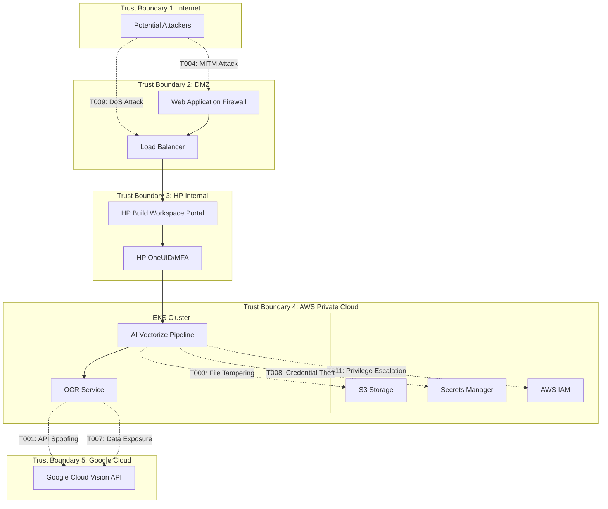
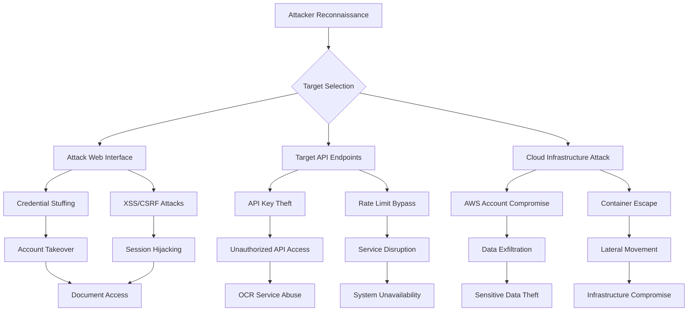

# threat-model.md

## System Components Summary

The Smart Digitization OCR system integrates Google Cloud Vision API with HP's AI Vectorize solution to process AEC documents. Key components include:

- **HP Build Workspace Portal**: User interface for AEC professionals
- **AI Vectorize Pipeline**: Orchestration service on AWS EKS
- **OCR Service**: Text extraction coordination layer
- **Google Cloud Vision API**: External OCR processing engine
- **AWS Infrastructure**: EKS cluster, S3 storage, Secrets Manager, IAM
- **Monitoring Systems**: Splunk, Prometheus, DynamoDB for tracking and logging

## Trust Boundaries

1. **Internet → DMZ**: Untrusted internet traffic filtered through WAF and load balancer
2. **DMZ → HP Internal Network**: External users authenticated via HP OneUID/Ping MFA
3. **HP Network → AWS Private Cloud**: Internal services accessing AWS VPC with IAM controls
4. **AWS → Google Cloud**: Cross-cloud API calls using OAuth2 authentication
5. **EKS Cluster Internal**: Pod-to-pod communication within Kubernetes cluster
6. **AWS Services**: S3, Secrets Manager, and other AWS services with IAM boundaries

## STRIDE Threat Analysis Table

| Threat ID | Component | STRIDE Category | Threat Description | Risk Level | Suggested Mitigation |
|-----------|-----------|-----------------|-------------------|------------|---------------------|
| T001 | Google Cloud Vision API | Spoofing | Attacker impersonates legitimate service account | Medium | OAuth2 authentication, service account key rotation |
| T002 | OCR Service | Spoofing | Malicious service impersonates OCR endpoint | Medium | Mutual TLS, certificate validation |
| T003 | S3 Storage | Tampering | Unauthorized modification of stored documents | Medium | File integrity checks, versioning, IAM policies |
| T004 | API Communications | Tampering | Man-in-the-middle attacks on API calls | High | TLS 1.2+, certificate pinning |
| T005 | Audit Logs | Repudiation | Users deny file processing activities | Low | Comprehensive logging, digital signatures |
| T006 | Processing Pipeline | Repudiation | System actions cannot be traced | Low | Detailed audit trails, immutable logs |
| T007 | Document Content | Information Disclosure | Sensitive AEC documents exposed | High | Encryption at rest/transit, access controls |
| T008 | API Credentials | Information Disclosure | Service account keys compromised | High | Secrets Manager, key rotation, least privilege |
| T009 | Google Vision API | Denial of Service | API rate limiting or service unavailability | Medium | Rate limiting, circuit breakers, fallback mechanisms |
| T010 | EKS Cluster | Denial of Service | Resource exhaustion attacks | Medium | Resource quotas, auto-scaling, monitoring |
| T011 | AWS IAM | Elevation of Privilege | Unauthorized access to AWS resources | Medium | Least privilege, regular access reviews |
| T012 | Container Runtime | Elevation of Privilege | Container escape to host system | Medium | Security contexts, runtime protection, scanning |

## Threat Model Diagram

## Attack Flow Diagram

## Risk Severity Table

| Risk Level | Likelihood | Impact | Threats | Priority |
|------------|------------|--------|---------|----------|
| **Critical** | High | High | - | Immediate |
| **High** | Medium | High | T004: API Tampering, T007: Data Disclosure, T008: Credential Exposure | 1-7 days |
| **Medium** | Low-Medium | Medium-High | T001: API Spoofing, T002: Service Spoofing, T003: File Tampering, T009: DoS, T011: Privilege Escalation, T012: Container Escape | 15-30 days |
| **Low** | Low | Low-Medium | T005: Activity Repudiation, T006: Action Traceability, T010: Resource Exhaustion | 30-60 days |
